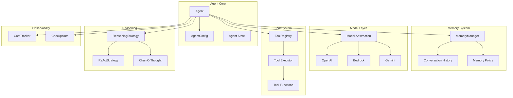
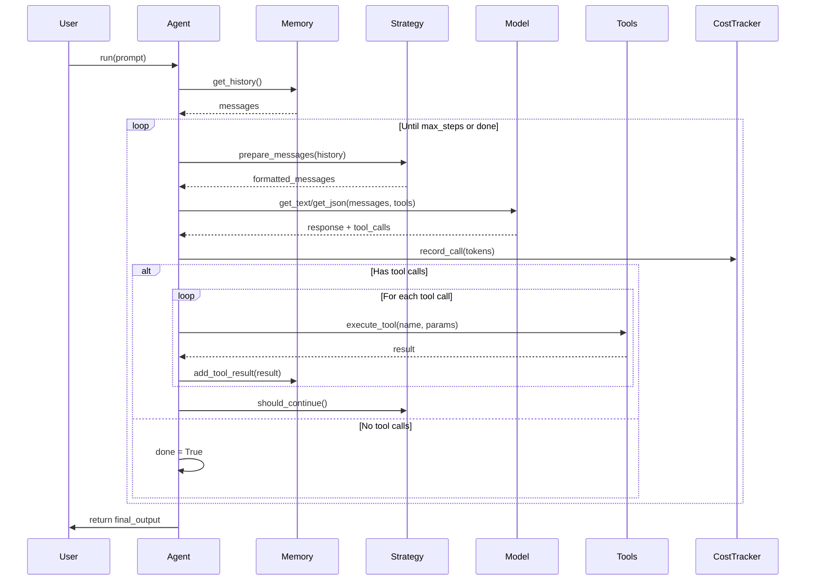
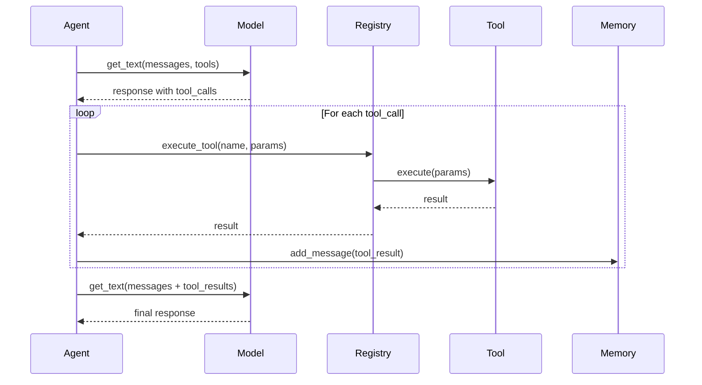
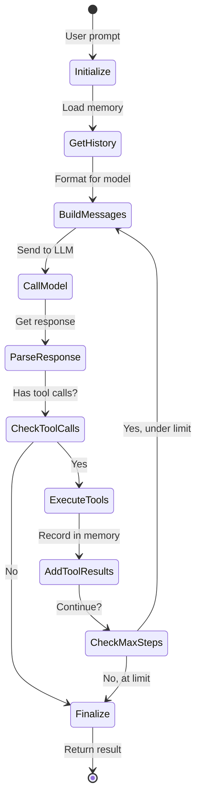

# Agent System Architecture

## Overview

The Agent system provides production-ready autonomous LLM-powered agents with advanced capabilities including tool calling, multi-turn conversations, reasoning strategies, cost tracking, and checkpointing. The architecture emphasizes reliability, extensibility, and observability.

## Design Philosophy

### Agent as Orchestrator

An agent orchestrates multiple components:

```
┌─────────────────────────────────────────────────────────┐
│                    Agent (Orchestrator)                  │
│                                                          │
│  ┌──────────────┐  ┌────────────┐  ┌─────────────┐     │
│  │ Memory       │  │ Model      │  │ Tools       │     │
│  │ Manager      │  │ Abstraction│  │ Registry    │     │
│  └──────────────┘  └────────────┘  └─────────────┘     │
│                                                          │
│  ┌──────────────┐  ┌────────────┐  ┌─────────────┐     │
│  │ Reasoning    │  │ Cost       │  │ Checkpoint  │     │
│  │ Strategy     │  │ Tracker    │  │ System      │     │
│  └──────────────┘  └────────────┘  └─────────────┘     │
└─────────────────────────────────────────────────────────┘
```

The agent coordinates these components to create an autonomous execution loop.

### Separation of Concerns

**Clear Boundaries**:
- **Agent**: Orchestration, control flow, conversation management
- **Model**: LLM API interaction, prompt formatting, response parsing
- **Tools**: Function execution, schema generation, result formatting
- **Memory**: Conversation history, pruning, summarization
- **Strategy**: Reasoning patterns, thought structuring
- **Cost Tracker**: Token/cost accounting, statistics

This separation enables:
- Independent testing of each component
- Swapping implementations (different models, strategies)
- Reuse across different agent types
- Clear responsibility boundaries

## Agent Architecture

### Core Components



### Agent Execution Loop



## Memory Management

### MemoryManager Design

```python
class MemoryManager:
    def __init__(self, policy: MemoryPolicy):
        self._messages: List[Message] = []
        self._policy = policy

    def add_message(self, message: Message) -> None:
        """Add message to history."""
        self._messages.append(message)
        self._apply_policy()

    def get_messages(self) -> List[Message]:
        """Get conversation history."""
        return self._messages.copy()

    def clear(self) -> None:
        """Clear conversation history."""
        self._messages.clear()

    def _apply_policy(self) -> None:
        """Apply memory policy (pruning, summarization)."""
        if self._policy.max_messages:
            self._messages = self._messages[-self._policy.max_messages:]

        if self._policy.max_tokens:
            # Prune oldest messages until under token limit
            while self._estimate_tokens() > self._policy.max_tokens:
                if len(self._messages) <= 1:
                    break
                self._messages.pop(0)
```

### Memory Policy

```python
@dataclass
class MemoryPolicy:
    max_messages: Optional[int] = None      # Max conversation turns
    max_tokens: Optional[int] = None        # Max token budget
    summarize_after: Optional[int] = None   # Summarize after N messages
    keep_system: bool = True                # Always keep system message
```

**Policy Application**:
- **Sliding Window**: Keep last N messages
- **Token Budget**: Prune oldest to stay under token limit
- **Summarization**: Replace old messages with summary
- **System Message Pinning**: Always preserve system prompt

### Memory as Single Source of Truth

**Design Decision**: Memory manager is the single source of truth for conversation history.

**Implications**:
- Agent never manipulates message list directly
- All message additions go through memory manager
- Policy applied consistently on every addition
- No divergence between agent and memory state

**Rationale**:
- Prevents state synchronization bugs
- Ensures policy compliance
- Simplifies debugging (one place to inspect)
- Enables consistent checkpointing

## Model Integration

### Model Abstraction Layer

```python
class Model(ABC):
    @abstractmethod
    async def get_text(
        self,
        messages: Messages,
        system_prompt: Optional[str] = None,
        tool_specs: Optional[List[ToolSpec]] = None,
        **kwargs
    ) -> str:
        """Get text completion from model."""
        pass

    @abstractmethod
    async def get_json(
        self,
        messages: Messages,
        system_prompt: Optional[str] = None,
        tool_specs: Optional[List[ToolSpec]] = None,
        **kwargs
    ) -> Dict[str, Any]:
        """Get structured JSON output from model."""
        pass

    @abstractmethod
    def update_config(self, **kwargs) -> None:
        """Update model configuration."""
        pass
```

**Unified Interface Benefits**:
- Agent code agnostic to provider (OpenAI, Bedrock, Gemini)
- Easy to swap models without changing agent logic
- Consistent error handling across providers
- Testable with mock models

### Message Format Standardization

**Common Format** (across all providers):
```python
messages = [
    {
        "role": "user",
        "content": [{"text": "Hello"}]
    },
    {
        "role": "assistant",
        "content": [
            {"text": "I'll help with that."},
            {
                "toolUse": {
                    "toolUseId": "1",
                    "name": "search",
                    "input": {"query": "spark"}
                }
            }
        ]
    },
    {
        "role": "user",
        "content": [
            {
                "toolResult": {
                    "toolUseId": "1",
                    "content": [{"text": "Search results..."}]
                }
            }
        ]
    }
]
```

**Design Decision**: Use a single message format based on Claude's API format, with adapters for other providers.

**Rationale**:
- Simplifies agent logic (no format conversion)
- Handles complex tool calling patterns
- Extensible content blocks (text, images, tool use, etc.)
- Provider adapters handle translation

### Response Caching

**Architecture**:
```python
class Model:
    def __init__(self, enable_cache: bool = False,
                 cache_ttl_seconds: int = 86400):
        self.enable_cache = enable_cache
        self.cache_ttl = cache_ttl_seconds
        self.cache_manager = CacheManager.get_instance()

    async def get_text(self, messages, **kwargs):
        if not self.enable_cache:
            return await self._call_api(messages, **kwargs)

        # Generate cache key
        cache_key = self._generate_cache_key(messages, kwargs)

        # Check cache
        cached = self.cache_manager.get(cache_key)
        if cached and not self._is_expired(cached):
            return cached['response']

        # Call API and cache
        response = await self._call_api(messages, **kwargs)
        self.cache_manager.set(cache_key, {
            'response': response,
            'timestamp': time.time()
        })
        return response
```

**Cache Key Generation**:
```python
def _generate_cache_key(self, messages, kwargs) -> str:
    """Generate deterministic cache key."""
    components = [
        self.provider,
        self.model_id,
        json.dumps(messages, sort_keys=True),
        json.dumps(kwargs, sort_keys=True)
    ]
    return hashlib.sha256(''.join(components).encode()).hexdigest()
```

**Trade-offs**:
- **Pro**: 100-500x faster for repeated calls, cost savings
- **Con**: Stale responses if prompt/data changes subtly
- **Mitigation**: Disabled by default, configurable TTL, cache invalidation API

## Tool Execution Pipeline

### Tool Registration

```python
class ToolRegistry:
    def __init__(self):
        self._tools: Dict[str, BaseTool] = {}
        self._tool_specs: Dict[str, ToolSpec] = {}

    def process_tools(self, tools: List[Union[Callable, BaseTool]]) -> None:
        """Register tools from list."""
        for tool in tools:
            if isinstance(tool, BaseTool):
                self._register_tool(tool)
            elif callable(tool):
                # Decorated function
                wrapped_tool = tool._spark_tool
                self._register_tool(wrapped_tool)

    def _register_tool(self, tool: BaseTool) -> None:
        """Register single tool."""
        self._tools[tool.tool_name] = tool
        self._tool_specs[tool.tool_name] = tool.tool_spec

    def get_all_tool_specs(self) -> List[ToolSpec]:
        """Get specs for all registered tools."""
        return list(self._tool_specs.values())

    async def execute_tool(self, name: str, params: Dict[str, Any]) -> Any:
        """Execute tool by name."""
        if name not in self._tools:
            raise ToolNotFoundError(f"Tool {name} not registered")

        tool = self._tools[name]
        return await tool.execute(params)
```

### Tool Execution Flow



### Parallel Tool Execution

**Design Decision**: Support parallel execution of independent tool calls.

**Configuration**:
```python
AgentConfig(
    parallel_tool_execution=True  # Execute tools concurrently
)
```

**Implementation**:
```python
async def _execute_tools(self, tool_calls: List[ToolCall]) -> List[ToolResult]:
    """Execute tool calls (parallel or sequential)."""
    if self.config.parallel_tool_execution:
        # Execute concurrently
        tasks = [
            self._execute_single_tool(tc)
            for tc in tool_calls
        ]
        results = await asyncio.gather(*tasks, return_exceptions=True)

        # Handle exceptions gracefully
        return [
            r if not isinstance(r, Exception)
            else ToolResult(error=str(r))
            for r in results
        ]
    else:
        # Execute sequentially
        results = []
        for tc in tool_calls:
            result = await self._execute_single_tool(tc)
            results.append(result)
        return results
```

**Benefits**:
- Faster execution when multiple tools called
- Better resource utilization
- Automatic error isolation

**Trade-offs**:
- More complex debugging (concurrent execution)
- Potential resource contention
- Need to handle partial failures

## Reasoning Strategy Pattern

### Strategy Interface

```python
class ReasoningStrategy(ABC):
    @abstractmethod
    async def process_step(
        self,
        parsed_output: Dict[str, Any],
        tool_result_blocks: List[Dict],
        state: Dict[str, Any],
        context: Optional[Dict] = None
    ) -> None:
        """Process reasoning step and update state."""
        pass

    @abstractmethod
    def should_continue(self, parsed_output: Dict[str, Any]) -> bool:
        """Determine if reasoning should continue."""
        pass

    @abstractmethod
    def get_history(self, state: Dict[str, Any]) -> List[Dict[str, Any]]:
        """Get reasoning history for next prompt."""
        pass
```

### Strategy Implementations

#### NoOpStrategy

**Purpose**: Simple agents without structured reasoning.

```python
class NoOpStrategy(ReasoningStrategy):
    async def process_step(self, parsed_output, tool_results, state, context):
        pass  # No reasoning tracking

    def should_continue(self, parsed_output):
        return False  # Single-turn

    def get_history(self, state):
        return []  # No history
```

#### ReActStrategy

**Purpose**: Reasoning + Acting pattern with thought tracking.

```python
class ReActStrategy(ReasoningStrategy):
    def __init__(self, verbose: bool = False):
        self.verbose = verbose

    async def process_step(self, parsed_output, tool_results, state, context):
        """Track thought → action → observation pattern."""
        state.setdefault('react_history', []).append({
            'thought': parsed_output.get('thought', ''),
            'action': parsed_output.get('action', ''),
            'observation': tool_results
        })

        if self.verbose:
            self._print_step(parsed_output, tool_results)

    def should_continue(self, parsed_output):
        """Continue if not done and has more actions."""
        return not parsed_output.get('done', False)

    def get_history(self, state):
        """Return thought history for context."""
        return state.get('react_history', [])
```

**ReAct Loop**:
```
1. Thought: "I need to search for information"
2. Action: search("spark ADK")
3. Observation: "Spark is a Python framework..."
4. Thought: "I have enough information now"
5. Done: true
```

#### ChainOfThoughtStrategy

**Purpose**: Step-by-step reasoning for complex problems.

```python
class ChainOfThoughtStrategy(ReasoningStrategy):
    async def process_step(self, parsed_output, tool_results, state, context):
        """Track reasoning steps."""
        state.setdefault('cot_steps', []).append({
            'step': parsed_output.get('step', ''),
            'reasoning': parsed_output.get('reasoning', ''),
            'conclusion': parsed_output.get('conclusion', '')
        })

    def should_continue(self, parsed_output):
        """Continue until final conclusion."""
        return not parsed_output.get('final', False)

    def get_history(self, state):
        """Return reasoning chain."""
        return state.get('cot_steps', [])
```

### Strategy Selection

**Decision Criteria**:

| Strategy | Best For | Output Mode | Complexity |
|----------|----------|-------------|------------|
| NoOp | Simple Q&A | Text | Low |
| ReAct | Multi-step tasks with tools | JSON | Medium |
| CoT | Mathematical/logical reasoning | JSON | Medium |
| Custom | Domain-specific patterns | Any | High |

### Template Re-rendering

**Design Feature**: Strategies can modify prompts between iterations.

```python
class Agent:
    async def run(self, prompt: str):
        for step in range(self.config.max_steps):
            # Get reasoning history from strategy
            history = self.strategy.get_history(self.state)

            # Re-render template with history
            if self.config.user_template:
                rendered = self.config.user_template.render(
                    prompt=prompt,
                    history=history
                )
                messages = self._build_messages(rendered)
            else:
                messages = self.memory.get_messages()

            # Call model
            response = await self.model.get_json(messages, tools=tools)

            # Process with strategy
            await self.strategy.process_step(response, tool_results, self.state)

            if not self.strategy.should_continue(response):
                break
```

## Cost Tracking Architecture

### CostTracker Design

```python
class CostTracker:
    def __init__(self, pricing_config_path: Optional[str] = None):
        self._calls: List[ModelCall] = []
        self._pricing = self._load_pricing(pricing_config_path)

    def record_call(
        self,
        model_id: str,
        input_tokens: int,
        output_tokens: int,
        timestamp: Optional[float] = None
    ) -> None:
        """Record API call for cost tracking."""
        call = ModelCall(
            model_id=model_id,
            input_tokens=input_tokens,
            output_tokens=output_tokens,
            timestamp=timestamp or time.time(),
            cost=self._calculate_cost(model_id, input_tokens, output_tokens)
        )
        self._calls.append(call)

    def _calculate_cost(self, model_id: str, input_tokens: int,
                        output_tokens: int) -> float:
        """Calculate cost based on pricing database."""
        pricing = self._pricing.get(model_id, self._pricing['default'])
        input_cost = (input_tokens / 1_000_000) * pricing['input']
        output_cost = (output_tokens / 1_000_000) * pricing['output']
        return input_cost + output_cost

    def get_statistics(self) -> CostStatistics:
        """Get aggregated statistics."""
        if not self._calls:
            return CostStatistics(
                total_calls=0,
                total_tokens=0,
                total_cost=0.0,
                by_model={}
            )

        return CostStatistics(
            total_calls=len(self._calls),
            total_tokens=sum(c.input_tokens + c.output_tokens for c in self._calls),
            total_cost=sum(c.cost for c in self._calls),
            by_model=self._aggregate_by_model()
        )

    def reset(self) -> None:
        """Reset tracking (new session)."""
        self._calls.clear()
```

### Pricing Configuration

**Search Path**:
1. `SPARK_PRICING_CONFIG` environment variable
2. `./model_pricing.json` (current directory)
3. `~/.spark/model_pricing.json` (user home)
4. `spark/agents/model_pricing.json` (package default)
5. Hardcoded fallback

**Format**:
```json
{
  "openai": {
    "gpt-4o": {"input": 5.00, "output": 15.00},
    "gpt-4o-mini": {"input": 0.15, "output": 0.60}
  },
  "anthropic": {
    "claude-3-opus": {"input": 15.00, "output": 75.00},
    "claude-3-sonnet": {"input": 3.00, "output": 15.00}
  },
  "default": {"input": 5.00, "output": 15.00}
}
```

**Pricing Updates**: Users can provide custom pricing files to track actual costs.

### Integration with Agent

**Automatic Recording**:
```python
class Agent:
    async def run(self, prompt: str):
        response = await self.model.get_text(messages)

        # Automatically record if model provides usage
        if hasattr(response, 'usage'):
            self.cost_tracker.record_call(
                model_id=self.model.model_id,
                input_tokens=response.usage.input_tokens,
                output_tokens=response.usage.output_tokens
            )
```

**Query Interface**:
```python
# Get statistics
stats = agent.get_cost_stats()
print(f"Total: ${stats.total_cost:.4f}")

# Get formatted summary
print(agent.get_cost_summary())

# Reset for new session
agent.reset_cost_tracking()
```

## Agent Checkpointing

### Checkpoint Structure

```python
@dataclass
class AgentCheckpoint:
    version: str = "1.0"
    timestamp: float = field(default_factory=time.time)

    # Configuration
    config: AgentConfig

    # Conversation state
    conversation_history: List[Message]

    # Agent state
    state: Dict[str, Any]  # Strategy state, custom state
    tool_traces: List[ToolTrace]
    last_result: Optional[str]
    last_error: Optional[str]
    last_output: Optional[Dict[str, Any]]

    # Cost tracking
    cost_calls: List[ModelCall]
    cost_statistics: CostStatistics

    # Metadata
    metadata: Dict[str, Any]
```

### Checkpointing API

```python
class Agent:
    def checkpoint(self) -> AgentCheckpoint:
        """Create checkpoint of current agent state."""
        return AgentCheckpoint(
            config=self.config,
            conversation_history=self.memory.get_messages(),
            state=self.state.copy(),
            tool_traces=self.tool_traces.copy(),
            last_result=self.last_result,
            last_error=self.last_error,
            last_output=self.last_output,
            cost_calls=self.cost_tracker._calls.copy(),
            cost_statistics=self.cost_tracker.get_statistics(),
            metadata={}
        )

    @classmethod
    def restore(cls, checkpoint: AgentCheckpoint, config: AgentConfig) -> 'Agent':
        """Restore agent from checkpoint."""
        agent = cls(config=config)

        # Restore conversation history
        for message in checkpoint.conversation_history:
            agent.memory.add_message(message)

        # Restore state
        agent.state = checkpoint.state.copy()
        agent.tool_traces = checkpoint.tool_traces.copy()
        agent.last_result = checkpoint.last_result
        agent.last_error = checkpoint.last_error
        agent.last_output = checkpoint.last_output

        # Restore cost tracking
        agent.cost_tracker._calls = checkpoint.cost_calls.copy()

        return agent

    def save_checkpoint(self, path: str) -> None:
        """Save checkpoint to file."""
        checkpoint = self.checkpoint()
        with open(path, 'w') as f:
            json.dump(asdict(checkpoint), f, indent=2)

    @classmethod
    def load_checkpoint(cls, path: str, config: AgentConfig) -> 'Agent':
        """Load agent from checkpoint file."""
        with open(path, 'r') as f:
            data = json.load(f)
        checkpoint = AgentCheckpoint(**data)
        return cls.restore(checkpoint, config)
```

### Use Cases

**1. Long-Running Workflows**:
```python
agent = Agent(config)

# Periodic checkpointing
for i, task in enumerate(tasks):
    agent.run(task)
    if i % 10 == 0:
        agent.save_checkpoint(f'checkpoint_{i}.json')
```

**2. Error Recovery**:
```python
try:
    agent.run(complex_task)
except Exception:
    # Restore from last good state
    agent = Agent.load_checkpoint('last_good.json', config)
    agent.run(recovery_task)
```

**3. Debugging**:
```python
# Save state at interesting point
agent.save_checkpoint('debug_state.json')

# Later: inspect and reproduce
agent = Agent.load_checkpoint('debug_state.json', config)
```

**4. Cost Analysis**:
```python
# Accumulate costs across sessions
checkpoint = agent.checkpoint()
total_cost = checkpoint.cost_statistics.total_cost
```

## Multi-Turn Conversation Flow

### Conversation Loop



### Max Steps Protection

**Design Decision**: Limit conversation turns to prevent infinite loops.

```python
class AgentConfig:
    max_steps: int = 10  # Maximum reasoning iterations

class Agent:
    async def run(self, prompt: str):
        for step in range(self.config.max_steps):
            response = await self._agent_step()

            if self._is_done(response):
                break

            if step == self.config.max_steps - 1:
                logger.warning("Max steps reached")
                break

        return self.last_output
```

**Rationale**:
- Prevents runaway costs (API calls)
- Catches logic errors (agent stuck in loop)
- Provides deterministic execution bounds
- Can be adjusted per use case

## Error Handling

### Exception Hierarchy

```python
AgentException                  # Base
├── ConfigurationError         # Invalid config
├── ToolExecutionError         # Tool call failed
│   ├── ToolNotFoundError     # Tool not registered
│   └── ToolTimeoutError      # Tool exceeded timeout
├── ModelError                 # LLM API error
│   ├── RateLimitError        # Rate limit hit
│   └── ContextWindowError    # Context too large
├── StrategyError             # Reasoning strategy error
└── MemoryError               # Memory management error
```

### Error Recovery

**Tool Execution Errors**:
```python
async def _execute_tool(self, tool_call: ToolCall) -> ToolResult:
    try:
        result = await self.registry.execute_tool(
            tool_call.name,
            tool_call.params
        )
        return ToolResult(success=True, result=result)

    except Exception as e:
        # Return error to model for recovery
        return ToolResult(
            success=False,
            error=str(e),
            error_type=type(e).__name__
        )
```

**Model Errors**:
```python
async def _agent_step(self):
    try:
        response = await self.model.get_text(messages)
        return response

    except RateLimitError as e:
        # Exponential backoff and retry
        await asyncio.sleep(self._calculate_backoff())
        return await self._agent_step()

    except ContextWindowError as e:
        # Prune memory and retry
        self.memory.prune_to_token_limit(e.max_tokens)
        return await self._agent_step()
```

## Performance Considerations

### Memory Overhead

**Per-Agent**:
- Config: ~1KB
- Memory manager: Message count * ~500 bytes
- Tool registry: Tool count * ~1KB
- Cost tracker: Call count * ~100 bytes
- Strategy state: Varies by strategy

**Optimization**:
- Use memory policies to limit history size
- Clear cost tracker between sessions if not needed
- Lazy-load tools (register on demand)

### Execution Overhead

**Per Turn**:
- Memory lookup: ~10µs
- Strategy processing: ~50µs
- Tool execution: Variable (depends on tool)
- Model call: 500ms - 5s (network + inference)

**Optimization**:
- Parallel tool execution (when independent)
- Response caching (for repeated prompts)
- Batch tool calls when possible

### Scalability

**Concurrent Agents**:
- Agents are independent (no shared state)
- Can run thousands of agents concurrently
- Limited by model API rate limits

**Long Conversations**:
- Memory policies prevent unbounded growth
- Summarization for very long conversations
- Context window limits enforced

## Summary

The Agent system provides:

1. **Orchestration**: Coordinates model, tools, memory, and reasoning
2. **Memory Management**: Single source of truth with policies
3. **Model Abstraction**: Provider-agnostic interface
4. **Tool Execution**: Registry-based with parallel support
5. **Reasoning Strategies**: Pluggable thought patterns
6. **Cost Tracking**: Automatic token/cost accounting
7. **Checkpointing**: Save/restore complete agent state
8. **Error Handling**: Comprehensive recovery strategies

These architectural choices enable building production-ready autonomous agents with reliability, observability, and extensibility.
