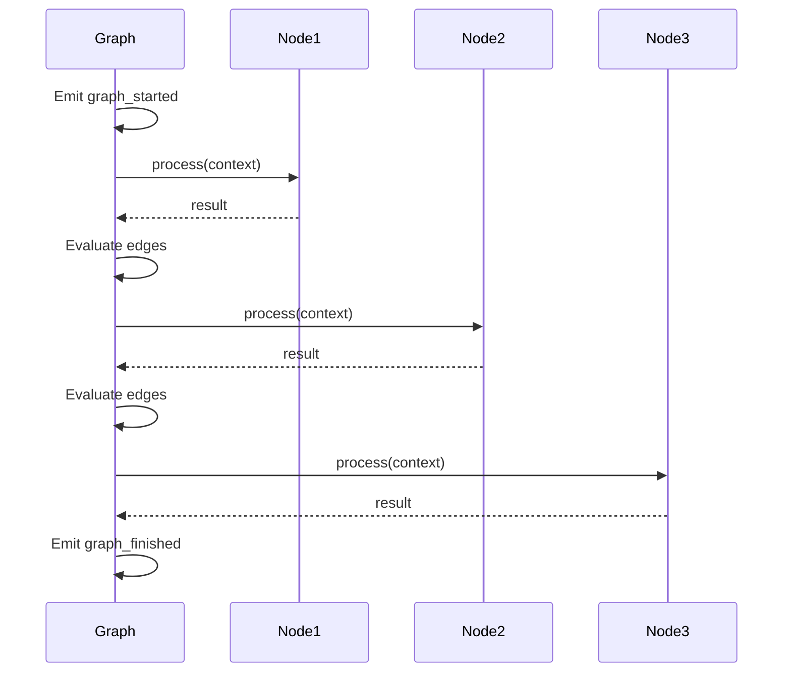
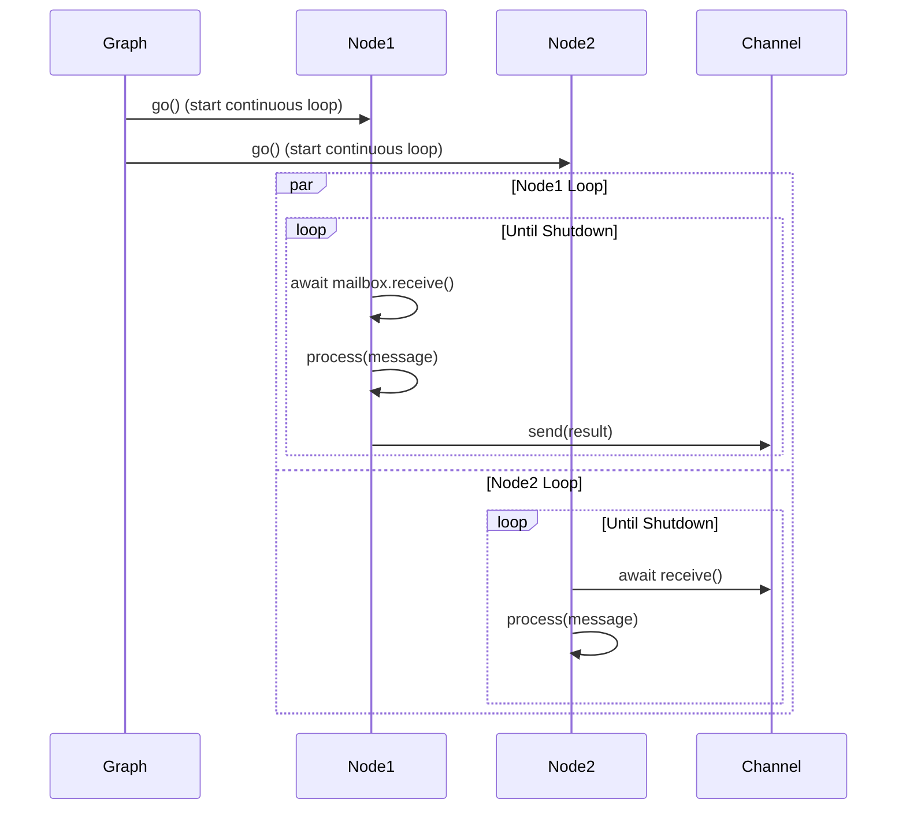

# Graph System Architecture

## Overview

The Graph system orchestrates node execution, managing control flow, state, events, and lifecycle. It transforms a collection of connected nodes into a coordinated workflow with deterministic execution, comprehensive observability, and fault tolerance.

## Design Philosophy

### Graph as Orchestrator

The Graph acts as a coordinator that:
- Discovers nodes through traversal
- Sequences node execution based on edges
- Manages shared state across nodes
- Emits lifecycle events for observability
- Handles errors and recovery
- Supports both sequential and concurrent execution modes

**Design Decision**: Graph does not execute nodes directly; it orchestrates their execution by preparing contexts and evaluating control flow. This separation enables distributed execution where nodes run on different machines.

### Declarative Composition

Graphs are defined declaratively by connecting nodes:

```python
# Nodes are connected via edges
start_node >> processing_node >> end_node

# Graph auto-discovers topology
graph = Graph(start=start_node)
```

This approach provides:
- **Clear Intent**: Workflow structure visible in code
- **Composability**: Nodes and subgraphs are first-class
- **Analyzability**: Graph structure can be inspected and validated
- **Serialization**: Declarative structure maps to JSON specs

## Graph Hierarchy

### Class Structure

```python
BaseGraph (Abstract)
    ├── Graph discovery via BFS
    ├── Event bus management
    └── Abstract run() method

Graph (Concrete)
    ├── Extends BaseGraph
    ├── Sequential execution (standard mode)
    ├── Concurrent execution (long-running mode)
    ├── Task and budget management
    ├── Graph state management
    ├── Telemetry integration
    └── Checkpoint/recovery
```

### BaseGraph Design

**Purpose**: Minimal interface and shared logic for graph implementations.

**Responsibilities**:
- Node discovery through breadth-first search
- Event bus initialization and management
- Lifecycle hook definitions

```python
class BaseGraph(ABC):
    def __init__(self, start: BaseNode, enable_event_bus: bool = True):
        self.start_node = start
        self.event_bus = GraphEventBus() if enable_event_bus else None
        self.nodes: List[BaseNode] = []
        self._discover_nodes()

    def _discover_nodes(self):
        """BFS traversal to discover all reachable nodes."""
        visited = set()
        queue = deque([self.start_node])

        while queue:
            node = queue.popleft()
            if node.node_id in visited:
                continue

            visited.add(node.node_id)
            self.nodes.append(node)

            for edge in node.outgoing_edges:
                if edge.target.node_id not in visited:
                    queue.append(edge.target)
```

**Auto-Discovery Rationale**:
- Users only specify `start` node and edges
- Framework discovers full topology automatically
- Simplifies API (no manual node registration)
- Enables validation (detect unreachable nodes, cycles)

### Graph Design

**Purpose**: Production-ready graph with state, telemetry, and multiple execution modes.

**Additional Responsibilities**:
- Manage graph state (shared across nodes)
- Integrate telemetry for tracing
- Handle task budgets (time, tokens)
- Support both sequential and long-running execution
- Checkpoint and restore capability

## Graph Discovery and Traversal

### Breadth-First Search

**Algorithm**:
```python
def _discover_nodes(self) -> List[BaseNode]:
    """Discover all reachable nodes via BFS."""
    visited = set()
    queue = deque([self.start_node])
    discovered = []

    while queue:
        node = queue.popleft()

        if node.node_id in visited:
            continue

        visited.add(node.node_id)
        discovered.append(node)

        # Add all downstream nodes
        for edge in node.outgoing_edges:
            if edge.target.node_id not in visited:
                queue.append(edge.target)

    return discovered
```

**Why BFS over DFS?**:
- Finds shortest path from start to any node
- Natural ordering for sequential execution
- Consistent node discovery order
- Easier to reason about for cycles

### Cycle Detection

**Validation During Discovery**:
```python
def _validate_graph(self):
    """Detect cycles using DFS."""
    visited = set()
    rec_stack = set()

    def has_cycle(node: BaseNode) -> bool:
        if node.node_id in rec_stack:
            return True  # Cycle detected

        if node.node_id in visited:
            return False

        visited.add(node.node_id)
        rec_stack.add(node.node_id)

        for edge in node.outgoing_edges:
            if has_cycle(edge.target):
                return True

        rec_stack.remove(node.node_id)
        return False

    if has_cycle(self.start_node):
        raise CyclicGraphError("Graph contains cycle")
```

**Design Trade-off**:
- Cycles are allowed (intentional loops for iterative workflows)
- Detection helps identify unintentional infinite loops
- Framework provides cycle detection as opt-in validation
- Budget system (max_seconds, max_tokens) prevents runaway execution

### Unreachable Node Detection

```python
def _find_unreachable_nodes(self) -> List[BaseNode]:
    """Find nodes defined but not reachable from start."""
    # In practice, this requires tracking all nodes created
    # Framework logs warnings for unreachable nodes
    pass
```

## Execution Modes

### Standard Mode (Sequential)

**Characteristics**:
- Nodes execute one at a time
- Current node completes before next starts
- Control flow determined by edge conditions
- Simplest mental model

**Execution Flow**:


**Implementation**:
```python
async def run(self, task: Optional[Task] = None) -> NodeMessage:
    """Sequential execution mode."""
    # Initialize
    current_node = self.start_node
    context = self._create_initial_context(task)

    self.event_bus.emit(GraphEvent.GRAPH_STARTED, {
        'graph_id': self.graph_id,
        'trace_id': context.trace_id
    })

    # Execute nodes sequentially
    while current_node and not self._budget_exceeded(context):
        # Execute node
        self.event_bus.emit(GraphEvent.NODE_STARTED, {
            'node_id': current_node.node_id
        })

        try:
            result = await current_node.process(context)

            self.event_bus.emit(GraphEvent.NODE_FINISHED, {
                'node_id': current_node.node_id,
                'result': result
            })

            # Update context for next node
            context = self._update_context(context, result)

            # Find next node based on edge conditions
            current_node = self._find_next_node(current_node)

        except Exception as e:
            self.event_bus.emit(GraphEvent.NODE_FAILED, {
                'node_id': current_node.node_id,
                'error': str(e)
            })
            raise

    self.event_bus.emit(GraphEvent.GRAPH_FINISHED, {
        'graph_id': self.graph_id
    })

    return NodeMessage(content=context.outputs)
```

### Long-Running Mode (Concurrent)

**Characteristics**:
- All nodes start simultaneously
- Nodes run continuously in loops
- Communication via channels
- Enables streaming, event-driven patterns

**Execution Flow**:


**Implementation**:
```python
async def run(self, task: Optional[Task] = None) -> NodeMessage:
    """Long-running execution mode."""
    if task.type == TaskType.LONG_RUNNING:
        return await self._run_long_running(task)

async def _run_long_running(self, task: Task) -> NodeMessage:
    """Execute all nodes concurrently."""
    # Prepare channels and mailboxes
    self._prepare_long_running()

    # Start all nodes concurrently
    node_tasks = [
        asyncio.create_task(node.go())
        for node in self.nodes
    ]

    # Send initial message to start node
    await self.start_node.mailbox.send(
        ChannelMessage(payload=task.inputs)
    )

    # Wait for completion or timeout
    try:
        done, pending = await asyncio.wait(
            node_tasks,
            timeout=task.budget.max_seconds,
            return_when=asyncio.FIRST_COMPLETED
        )

        # Shutdown all nodes
        await self._shutdown_nodes()

        # Wait for all to finish
        await asyncio.gather(*pending, return_exceptions=True)

    except asyncio.TimeoutError:
        await self._shutdown_nodes()
        raise BudgetExceededError("Time budget exceeded")

    return NodeMessage(content={})  # Result collected from nodes
```

**Channel Setup**:
```python
def _prepare_long_running(self):
    """Initialize mailboxes and connect channels."""
    # Create mailbox for each node
    for node in self.nodes:
        node.mailbox = InMemoryChannel()

    # Connect nodes via edges
    for node in self.nodes:
        downstream_channels = [
            edge.target.mailbox
            for edge in node.outgoing_edges
        ]

        if len(downstream_channels) == 1:
            # Single downstream: direct connection
            node.downstream_channel = downstream_channels[0]
        elif len(downstream_channels) > 1:
            # Multiple downstream: use forwarding channel
            node.downstream_channel = ForwardingChannel(downstream_channels)
```

### Mode Selection

**Decision Criteria**:

| Use Standard Mode When | Use Long-Running Mode When |
|------------------------|----------------------------|
| Sequential logic | Event-driven workflows |
| Simple workflows | Streaming data |
| Debugging | Real-time processing |
| Deterministic execution | High concurrency needed |
| State management priority | Throughput priority |

## Task and Budget Management

### Task Structure

```python
@dataclass
class Task:
    inputs: NodeMessage                    # Initial inputs
    type: TaskType = TaskType.STANDARD     # Execution mode
    budget: Budget = field(default_factory=Budget)
    metadata: Dict[str, Any] = field(default_factory=dict)
```

### Budget Structure

```python
@dataclass
class Budget:
    max_seconds: Optional[float] = None    # Time limit
    max_tokens: Optional[int] = None       # Token limit (LLM)
    max_cost: Optional[float] = None       # Cost limit (USD)
```

### Budget Enforcement

**Time Budget**:
```python
async def _enforce_time_budget(self, task: Task):
    """Enforce time budget using asyncio timeout."""
    if task.budget.max_seconds:
        try:
            result = await asyncio.wait_for(
                self._execute_graph(),
                timeout=task.budget.max_seconds
            )
            return result
        except asyncio.TimeoutError:
            raise BudgetExceededError("Time budget exceeded")
```

**Token Budget**:
```python
def _check_token_budget(self, context: ExecutionContext):
    """Check if token budget exceeded."""
    if context.metadata.get('total_tokens', 0) > task.budget.max_tokens:
        raise BudgetExceededError("Token budget exceeded")
```

**Cost Budget**:
```python
def _check_cost_budget(self, context: ExecutionContext):
    """Check if cost budget exceeded."""
    if context.metadata.get('total_cost', 0) > task.budget.max_cost:
        raise BudgetExceededError("Cost budget exceeded")
```

**Design Decision**: Budget checks happen between nodes, not during node execution. This prevents incomplete operations but allows current node to finish.

## Graph State Management

### Graph State vs. Node State

**Architectural Distinction**:

```
┌────────────────────────────────────────────┐
│           Graph State (Shared)             │
│  - Counters, aggregations, coordination    │
│  - Accessible to all nodes                 │
│  - Thread-safe with locking               │
└────────────────────────────────────────────┘
                    ▲
                    │
        ┌───────────┼───────────┐
        │           │           │
┌───────▼────┐ ┌────▼─────┐ ┌──▼───────┐
│ Node State │ │Node State│ │Node State│
│ (Isolated) │ │(Isolated)│ │(Isolated)│
└────────────┘ └──────────┘ └──────────┘
```

### GraphState Design

```python
class GraphState:
    def __init__(self, initial_state: Dict[str, Any] = None,
                 enable_locking: bool = False):
        self._state: Dict[str, Any] = initial_state or {}
        self._lock: Optional[asyncio.Lock] = (
            asyncio.Lock() if enable_locking else None
        )

    async def get(self, key: str, default=None) -> Any:
        """Get value from state."""
        if self._lock:
            async with self._lock:
                return self._state.get(key, default)
        return self._state.get(key, default)

    async def set(self, key: str, value: Any) -> None:
        """Set value in state."""
        if self._lock:
            async with self._lock:
                self._state[key] = value
        else:
            self._state[key] = value

    async def update(self, updates: Dict[str, Any]) -> None:
        """Update multiple keys atomically."""
        if self._lock:
            async with self._lock:
                self._state.update(updates)
        else:
            self._state.update(updates)

    @asynccontextmanager
    async def transaction(self):
        """Atomic read-modify-write transaction."""
        if self._lock:
            async with self._lock:
                yield self._state
        else:
            yield self._state
```

### Locking Strategy

**Standard Mode**: No locking (sequential execution, single thread of control)

**Long-Running Mode**: Automatic locking (concurrent access from multiple nodes)

```python
class Graph:
    def __init__(self, start: BaseNode,
                 initial_state: Dict[str, Any] = None,
                 enable_graph_state: bool = True):
        if enable_graph_state:
            self.graph_state = GraphState(
                initial_state=initial_state,
                enable_locking=False  # Set to True in long-running mode
            )

    async def run(self, task: Task):
        if task.type == TaskType.LONG_RUNNING:
            # Enable locking for concurrent access
            self.graph_state._lock = asyncio.Lock()

        return await self._execute(task)
```

**Trade-off**: Locking adds overhead but ensures correctness. Sequential mode avoids overhead since only one node accesses state at a time.

### State Initialization and Reset

```python
class Graph:
    def __init__(self, start: BaseNode, initial_state: Dict[str, Any] = None):
        self.initial_state = initial_state or {}
        self.graph_state = GraphState(initial_state=self.initial_state.copy())

    def reset_state(self, new_state: Dict[str, Any] = None):
        """Reset graph state to initial or new values."""
        if new_state is not None:
            self.initial_state = new_state
        self.graph_state = GraphState(initial_state=self.initial_state.copy())

    async def get_state(self, key: str, default=None):
        """Get state value from outside graph execution."""
        return await self.graph_state.get(key, default)

    def get_state_snapshot(self) -> Dict[str, Any]:
        """Get full state snapshot."""
        return self.graph_state._state.copy()
```

**Persistence**: Graph state persists across multiple `run()` calls unless explicitly reset. This enables multi-run workflows where state accumulates.

## Event Bus Architecture

### Event System Design

```python
class GraphEventBus:
    def __init__(self, replay_buffer_size: int = 0):
        self._subscribers: Dict[str, List[Callable]] = defaultdict(list)
        self._replay_buffer: deque = deque(maxlen=replay_buffer_size)

    def subscribe(self, event_type: str, handler: Callable) -> None:
        """Subscribe to event type."""
        self._subscribers[event_type].append(handler)

    def emit(self, event_type: str, data: Dict[str, Any]) -> None:
        """Emit event to all subscribers."""
        event = GraphEvent(type=event_type, data=data, timestamp=time.time())

        # Add to replay buffer
        if self._replay_buffer.maxlen:
            self._replay_buffer.append(event)

        # Notify subscribers
        for handler in self._subscribers[event_type]:
            try:
                handler(event)
            except Exception as e:
                logger.error(f"Event handler failed: {e}")

    def replay(self, topic: str = '*') -> List[GraphEvent]:
        """Replay buffered events."""
        if topic == '*':
            return list(self._replay_buffer)
        return [e for e in self._replay_buffer if e.type == topic]
```

### Event Types

```python
class GraphEvent:
    GRAPH_STARTED = "graph_started"
    GRAPH_FINISHED = "graph_finished"
    GRAPH_FAILED = "graph_failed"

    NODE_STARTED = "node_started"
    NODE_FINISHED = "node_finished"
    NODE_FAILED = "node_failed"

    CHECKPOINT_CREATED = "checkpoint_created"
    CHECKPOINT_RESTORED = "checkpoint_restored"
```

### Event Replay Buffer

**Purpose**: Store recent events for debugging and monitoring.

**Use Cases**:
- Debugging: Replay events to understand execution flow
- Testing: Verify event sequence
- Monitoring: Query recent events for dashboard

**Trade-off**: Buffer size vs. memory usage. Default is 0 (disabled) for minimal overhead.

## Checkpoint and Recovery

### Checkpoint Design

**What's Saved**:
```python
@dataclass
class GraphCheckpoint:
    graph_id: str
    timestamp: float
    current_node_id: str
    graph_state: Dict[str, Any]
    node_states: Dict[str, NodeState]
    execution_context: ExecutionContext
    metadata: Dict[str, Any]
```

### Checkpointing Strategy

**When to Checkpoint**:
1. After each node execution (fine-grained)
2. After N nodes (coarse-grained, lower overhead)
3. On demand (user-triggered)
4. Before risky operations

**Implementation**:
```python
class Graph:
    async def run(self, task: Task, enable_checkpoints: bool = False):
        """Execute with optional checkpointing."""
        while current_node:
            result = await current_node.process(context)

            if enable_checkpoints:
                checkpoint = self._create_checkpoint(current_node, context)
                self._save_checkpoint(checkpoint)

            current_node = self._find_next_node(current_node)

    def _create_checkpoint(self, node: BaseNode,
                          context: ExecutionContext) -> GraphCheckpoint:
        """Create checkpoint at current execution point."""
        return GraphCheckpoint(
            graph_id=self.graph_id,
            timestamp=time.time(),
            current_node_id=node.node_id,
            graph_state=self.graph_state.get_state_snapshot(),
            node_states={n.node_id: n.state for n in self.nodes},
            execution_context=context,
            metadata={}
        )

    async def restore_from_checkpoint(self,
                                     checkpoint: GraphCheckpoint) -> NodeMessage:
        """Restore and resume from checkpoint."""
        # Restore graph state
        self.reset_state(checkpoint.graph_state)

        # Restore node states
        for node in self.nodes:
            if node.node_id in checkpoint.node_states:
                node.state = checkpoint.node_states[node.node_id]

        # Find node to resume from
        current_node = next(
            n for n in self.nodes
            if n.node_id == checkpoint.current_node_id
        )

        # Resume execution
        return await self.run(
            task=Task(inputs=checkpoint.execution_context.inputs)
        )
```

### Recovery Strategies

**1. Retry from Checkpoint**: Resume from last good state
**2. Rewind and Replay**: Go back N steps and replay
**3. Skip and Continue**: Skip failed node and continue
**4. Abort and Report**: Stop execution and report failure

## Subgraph Composition

### SubgraphNode Design

```python
class SubgraphNode(Node):
    def __init__(self, graph: Graph, config: Optional[NodeConfig] = None):
        super().__init__(config=config)
        self.subgraph = graph

    async def work(self, context: ExecutionContext):
        """Execute subgraph as a single node."""
        task = Task(
            inputs=context.inputs,
            type=TaskType.STANDARD,
            metadata=context.metadata
        )

        result = await self.subgraph.run(task)
        return result.content
```

### State Isolation

**Design Decision**: Subgraphs have isolated graph state by default.

```python
# Subgraph has its own state
subgraph = Graph(start=sub_start, initial_state={'counter': 0})
subgraph_node = SubgraphNode(subgraph)

# Parent graph has separate state
parent_graph = Graph(start=subgraph_node, initial_state={'total': 0})
```

**Rationale**:
- Encapsulation: Subgraph internals hidden from parent
- Reusability: Same subgraph can be used in multiple contexts
- Safety: Prevents accidental state corruption

**Sharing State** (if needed):
```python
class SharedStateSubgraphNode(SubgraphNode):
    async def work(self, context: ExecutionContext):
        # Pass parent state to subgraph
        self.subgraph.graph_state = context.graph_state
        result = await self.subgraph.run(...)
        return result.content
```

## Performance Considerations

### Memory Management

**Per-Graph Overhead**:
- Event bus: ~1KB + subscribers
- Graph state: Size of state dict
- Checkpoint: Size of state + node states
- Event replay buffer: Buffer size * event size

**Optimization Strategies**:
- Disable event bus if not needed
- Disable graph state if not needed
- Limit checkpoint frequency
- Set small replay buffer or disable

### Execution Overhead

**Per-Node Execution**:
- Context creation: ~10µs
- Event emission: ~50µs per event
- State access: ~5µs (no locking), ~50µs (with locking)
- Edge evaluation: ~20µs per edge

**Optimization**:
- Sequential mode avoids locking overhead
- Disable events for hot paths
- Batch state updates using transactions

### Scalability

**Vertical Scaling**:
- Thousands of nodes in single graph
- Limited by memory and event loop

**Horizontal Scaling**:
- Use RpcNode to distribute nodes across machines
- Each machine runs independent event loop
- Communication via network adds latency

## Summary

The Graph system provides:

1. **Auto-Discovery**: BFS traversal discovers topology from start node
2. **Dual Execution Modes**: Sequential for simplicity, concurrent for performance
3. **Budget Management**: Time, token, and cost limits
4. **Shared State**: Thread-safe coordination across nodes
5. **Event System**: Comprehensive lifecycle observability
6. **Checkpointing**: Save/restore for fault tolerance
7. **Subgraph Composition**: Hierarchical workflow construction

These architectural choices enable building complex, observable, and reliable AI workflows with both simplicity (sequential mode) and power (concurrent mode).
