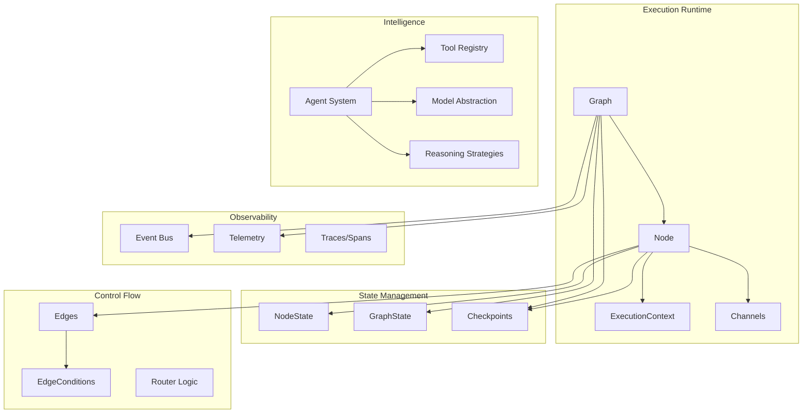
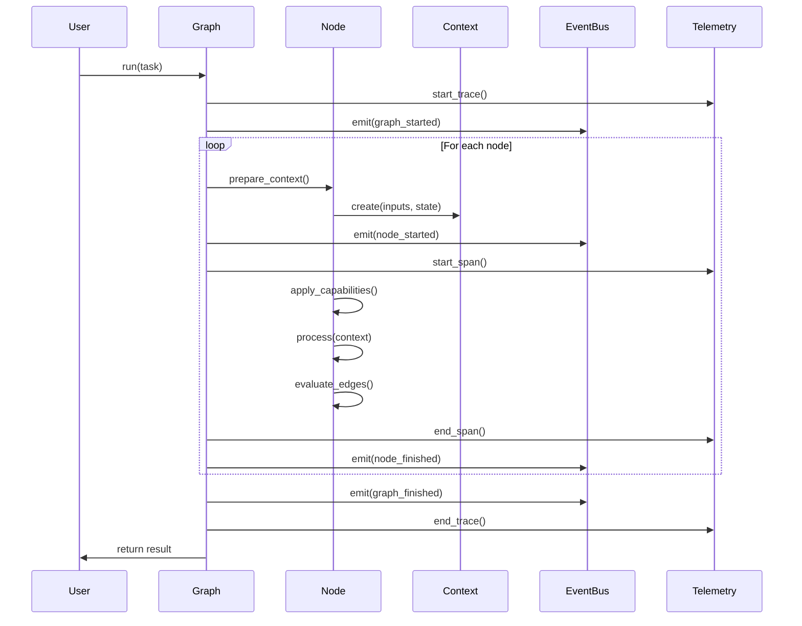
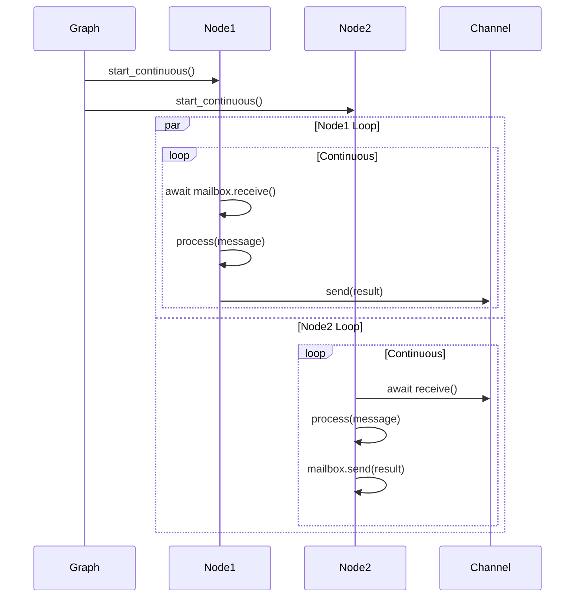

# System Architecture

## Design Philosophy

### Actor Model Foundation

Spark implements the Actor Model as its core concurrency primitive. Each node is an independent actor with:

- **Isolated State**: Nodes maintain their own state, preventing shared mutable state bugs
- **Message Passing**: Communication occurs exclusively through message passing via channels
- **Asynchronous Execution**: All operations are async-first, enabling high concurrency
- **Location Transparency**: Nodes can run locally or be distributed across machines via RPC

This design choice provides several benefits:
- Natural fault isolation (one node failure doesn't cascade)
- Straightforward distributed execution model
- Easy to reason about concurrency (no locks, no shared memory)
- Scalable to many concurrent operations

### Immutability and Versioning

The system favors immutability for key data structures:

- **Execution Contexts**: Immutable snapshots of node inputs/outputs
- **Graph Specifications**: Immutable graph definitions enabling version control
- **Message Payloads**: Immutable data passed between nodes
- **RSI Graph Versions**: New versions created rather than in-place modification

Trade-offs:
- **Pro**: Easier debugging, time-travel debugging, safe concurrent access
- **Con**: Higher memory usage for large data structures
- **Mitigation**: Copy-on-write semantics, reference counting for shared data

### Separation of Concerns

The architecture cleanly separates different responsibilities:

```
┌─────────────────────────────────────────────────────────────┐
│                    Application Layer                         │
│  (User-defined nodes, custom graphs, domain logic)          │
└─────────────────────────────────────────────────────────────┘
                            ▲
                            │
┌─────────────────────────────────────────────────────────────┐
│                   Orchestration Layer                        │
│  (Graph execution, task management, event coordination)     │
└─────────────────────────────────────────────────────────────┘
                            ▲
                            │
┌─────────────────────────────────────────────────────────────┐
│                    Execution Layer                           │
│  (Node lifecycle, capability application, state mgmt)       │
└─────────────────────────────────────────────────────────────┘
                            ▲
                            │
┌─────────────────────────────────────────────────────────────┐
│                 Infrastructure Layer                         │
│  (Channels, telemetry, serialization, RPC transport)        │
└─────────────────────────────────────────────────────────────┘
```

Each layer has well-defined interfaces and dependencies flow downward only.

## Component Architecture

### Core Components



### Component Interactions

#### Standard Execution Flow



#### Long-Running Mode Flow



## Data Flow Patterns

### Message Flow

Messages flow through the system following these patterns:

1. **Sequential Flow**: Standard execution where outputs of Node N become inputs of Node N+1
2. **Broadcast**: One node sends to multiple downstream nodes via ForwardingChannel
3. **Fan-in**: Multiple nodes send to one node, which processes messages as they arrive
4. **Request-Reply**: Node sends message and awaits response (synchronous over async)

### State Flow

State management follows a dual-layer approach:

**Node-Level State** (per-node isolation):
- Stored in `NodeState` object
- Contains execution history, pending inputs, processing flags
- Persists across multiple executions via `keep_in_state` config
- Isolated from other nodes (no cross-talk)

**Graph-Level State** (shared coordination):
- Stored in `GraphState` object
- Accessible to all nodes via `context.graph_state`
- Thread-safe with automatic locking in long-running mode
- Used for counters, aggregations, coordination flags

Trade-off: Graph state introduces shared mutable state (against actor model purity) but provides pragmatic solution for common coordination needs with minimal overhead.

### Context Propagation

`ExecutionContext` is the primary data carrier:

```python
@dataclass
class ExecutionContext:
    inputs: NodeMessage          # From previous node
    outputs: Dict[str, Any]      # Accumulated outputs
    state: NodeState             # Node's persistent state
    graph_state: GraphState      # Shared graph state
    metadata: Dict[str, Any]     # Execution metadata
    trace_id: str                # For distributed tracing
    span_id: str                 # Current span
```

Context is immutable once created and passed to `process()`. Nodes return a dict which becomes the next node's inputs.

## Concurrency Model

### Async/Await Architecture

Spark is async-first but accommodates synchronous code:

**Design Decision**: Use asyncio as the concurrency primitive rather than threads or processes.

**Rationale**:
- Efficient for I/O-bound operations (LLM calls, network, database)
- Lower overhead than threads (thousands of concurrent nodes possible)
- Easier to reason about than preemptive multithreading
- Native support in Python 3.12+

**Synchronous Compatibility**:
```python
def wrap_sync_method(method):
    """Wrap sync method to be async-compatible."""
    if asyncio.iscoroutinefunction(method):
        return method

    async def async_wrapper(*args, **kwargs):
        return method(*args, **kwargs)

    return async_wrapper
```

This allows users to write simple synchronous `process()` methods while the framework handles them asynchronously.

### Execution Modes

**Standard Mode** (sequential):
- Graph executes nodes one at a time
- Current node completes before next starts
- Simplest mental model, easiest debugging
- No locking needed for graph state

**Long-Running Mode** (concurrent):
- All nodes start simultaneously and run continuously
- Nodes communicate via channels
- Enables streaming, event-driven architectures
- Graph state automatically enables locking

Trade-off: Long-running mode requires more complex programming model but enables real-time, reactive workflows.

## Error Handling Strategy

### Layered Error Handling

```
┌──────────────────────────────────────────────┐
│   User-Level Error Handling                  │
│   (try/catch in process(), custom recovery)  │
└──────────────────────────────────────────────┘
                    ▼
┌──────────────────────────────────────────────┐
│   Capability-Level Error Handling            │
│   (RetryCapability, CircuitBreaker)          │
└──────────────────────────────────────────────┘
                    ▼
┌──────────────────────────────────────────────┐
│   Framework-Level Error Handling             │
│   (Exception capture, event emission)        │
└──────────────────────────────────────────────┘
                    ▼
┌──────────────────────────────────────────────┐
│   Graph-Level Error Handling                 │
│   (Rollback, checkpoint restore)             │
└──────────────────────────────────────────────┘
```

### Exception Hierarchy

```python
SparkException                    # Base for all Spark exceptions
├── GraphException               # Graph-level errors
│   ├── CyclicGraphError        # Infinite loops detected
│   ├── NodeNotFoundError       # Invalid node reference
│   └── GraphStateError         # State management issues
├── NodeException               # Node-level errors
│   ├── ProcessingError         # Error in process() method
│   ├── CapabilityError         # Capability application failed
│   └── TimeoutError            # Execution timeout
├── AgentException              # Agent-level errors
│   ├── ToolExecutionError      # Tool call failed
│   ├── ModelError              # LLM API error
│   └── StrategyError           # Reasoning strategy error
└── RSIException                # RSI system errors
    ├── ValidationError         # Change validation failed
    ├── TestingError            # A/B test failed
    └── DeploymentError         # Deployment failed
```

### Error Recovery Strategies

1. **Retry with Backoff**: RetryCapability handles transient failures
2. **Circuit Breaking**: CircuitBreakerCapability prevents cascade failures
3. **Checkpoint Restore**: Graph can restore from last good state
4. **Graceful Degradation**: Nodes can return partial results on error
5. **Human Intervention**: HumanNode allows manual recovery

## Extension Points

### Plugin Architecture

Spark provides several extension mechanisms:

**1. Custom Nodes** (most common):
```python
class MyNode(Node):
    async def process(self, context):
        # Custom logic
        pass
```

**2. Custom Capabilities**:
```python
class CustomCapability(Capability):
    async def apply(self, func, *args, **kwargs):
        # Wrap node execution
        pass
```

**3. Custom Telemetry Backends**:
```python
class CustomBackend(TelemetryBackend):
    async def export_traces(self, traces):
        # Export to custom system
        pass
```

**4. Custom Reasoning Strategies**:
```python
class CustomStrategy(ReasoningStrategy):
    async def process_step(self, parsed_output, tool_results, state):
        # Custom reasoning logic
        pass
```

**5. Custom Channel Implementations**:
```python
class RedisChannel(BaseChannel):
    async def send(self, message):
        # Use Redis pub/sub
        pass
```

### Configuration System

Configuration follows a hierarchical pattern:

```
Global Config (defaults)
    ↓
Graph Config (graph-specific settings)
    ↓
Node Config (node-specific overrides)
    ↓
Runtime Config (passed at execution time)
```

All config classes use Pydantic for validation with `extra="allow"` to support custom fields.

## Performance Considerations

### Memory Management

**Design Decisions**:
- Use weak references for event bus subscriptions (prevent memory leaks)
- Limit message queue sizes to prevent unbounded growth
- Implement telemetry buffering with configurable buffer sizes
- Support sampling for telemetry to reduce overhead

**Memory Pressure Handling**:
```python
class NodeState:
    pending_inputs: deque  # Bounded queue

    def __init__(self, max_pending=1000):
        self.pending_inputs = deque(maxlen=max_pending)
        # Oldest messages dropped when full
```

### Execution Overhead

**Framework Overhead Per Node**:
- Context creation: ~10µs
- Event emission: ~50µs (if subscribers present)
- Telemetry recording: ~100µs (with buffering)
- State persistence: ~200µs (in-memory)

**Optimization Techniques**:
- Lazy initialization of optional components
- Disable telemetry for ultra-low-latency paths
- Batch event emissions
- Use sampling for telemetry in production

### Scalability

**Vertical Scaling** (single machine):
- Thousands of nodes in memory
- Hundreds of concurrent node executions
- Limited by asyncio event loop and Python GIL

**Horizontal Scaling** (distributed):
- RPC nodes enable cross-machine distribution
- Each machine runs independent event loop
- Limited by network latency and serialization overhead

## Security Model

### Principle of Least Privilege

- Nodes have no access to filesystem by default
- Tool execution requires explicit capability grant
- RPC nodes support authentication hooks
- Policy engine enables fine-grained access control

### Trust Boundaries

```
┌─────────────────────────────────────┐
│  Untrusted (User Input, External)  │
│  - Validation required              │
│  - Sanitization required            │
└─────────────────────────────────────┘
              ▼
┌─────────────────────────────────────┐
│  Semi-Trusted (Framework)           │
│  - Input validation enforced        │
│  - Capability checks enforced       │
└─────────────────────────────────────┘
              ▼
┌─────────────────────────────────────┐
│  Trusted (Core Components)          │
│  - Assumptions validated            │
│  - Invariants maintained            │
└─────────────────────────────────────┘
```

### Sandboxing

- Tool execution (UnsafePythonTool, ShellTool) should run in containers
- RPC nodes can run in separate processes/machines
- Agent tool calls can be restricted via policy engine

## Evolution and Compatibility

### Versioning Strategy

- **Semantic Versioning**: Major.Minor.Patch
- **Breaking Changes**: Reserved for major versions
- **Deprecation Policy**: 2 minor versions warning before removal
- **Graph Spec Versioning**: Specs include format version for migration

### Backward Compatibility

**Guaranteed Stable APIs**:
- Node.process() signature
- Graph.run() signature
- Core message format
- Graph spec format (with version field)

**Evolution Mechanisms**:
- Optional parameters with defaults
- Feature flags for experimental features
- Adapter pattern for API changes
- Schema migration for spec format changes

## Summary

Spark's architecture prioritizes:

1. **Simplicity**: Actor model provides simple concurrency primitives
2. **Composability**: Small nodes compose into complex workflows
3. **Observability**: Built-in telemetry and event system
4. **Safety**: Immutability, validation, error handling at every layer
5. **Extensibility**: Plugin points at every major component
6. **Performance**: Async-first, efficient resource usage
7. **Distributed**: RPC enables transparent distribution

These architectural decisions enable building production-ready AI workflows that are maintainable, debuggable, and scalable.
