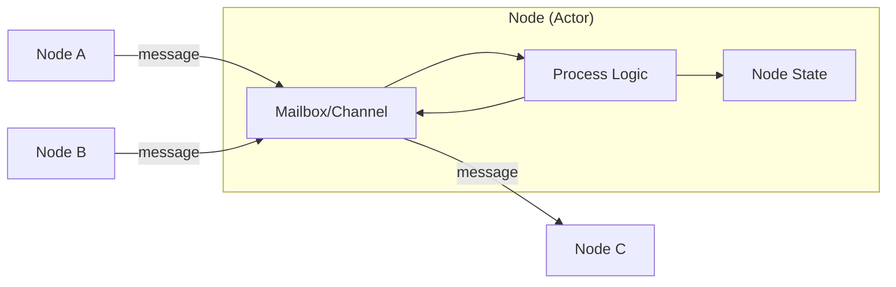
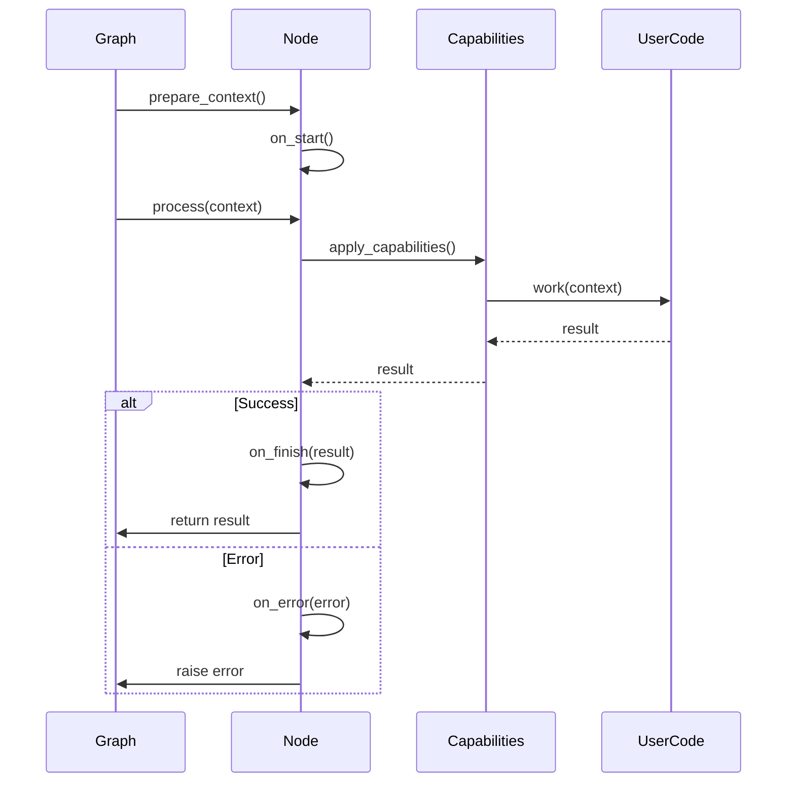
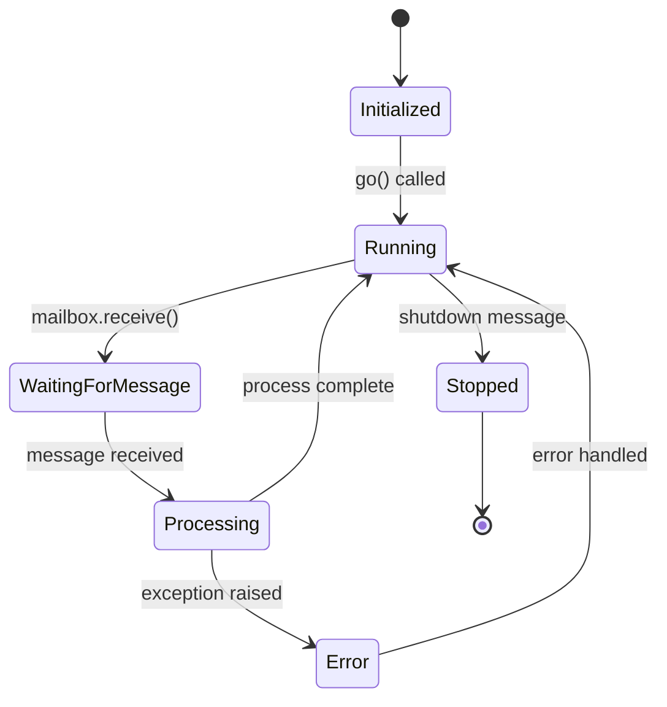
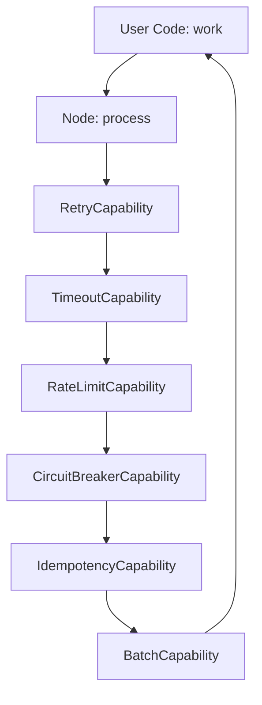

# Node System Architecture

## Overview

The Node system is the foundational execution unit in Spark. Each node is an independent actor that processes inputs, maintains state, and produces outputs. This document details the architecture, lifecycle, state management, and extension mechanisms of the node system.

## Actor Model Implementation

### Core Principles

Spark's node system implements the Actor Model with these characteristics:

1. **Encapsulation**: Each node encapsulates its own state and behavior
2. **Message Passing**: Nodes communicate exclusively via immutable messages
3. **Asynchronous Processing**: All node operations are asynchronous
4. **Isolation**: Node failures don't affect other nodes

### Node as Actor



**Key Properties**:
- **Single-threaded execution**: Each node processes one message at a time
- **No shared state**: Nodes communicate only through messages
- **Location transparency**: Nodes can be local or remote (via RPC)

## Node Hierarchy

### Class Structure

```python
BaseNode (Abstract)
    ├── Defines interface and lifecycle hooks
    ├── Handles edge management
    └── Manages basic state

Node (Concrete)
    ├── Extends BaseNode
    ├── Adds capability system
    ├── Implements continuous execution (go() method)
    ├── Adds configuration support
    └── Implements retry, timeout, rate limiting

RpcNode (Concrete)
    ├── Extends Node
    ├── JSON-RPC 2.0 server implementation
    ├── HTTP/WebSocket transport
    └── Request/response + notifications

RemoteRpcProxyNode (Concrete)
    ├── Extends Node
    ├── Proxies calls to remote RPC nodes
    └── Transparent remote execution
```

### BaseNode Design

**Purpose**: Provide minimal, stable interface for node implementations.

**Responsibilities**:
- Edge management (goto, on methods)
- Lifecycle hook definition
- State container management
- Abstract process() method

**Design Decision**: Keep BaseNode minimal to enable diverse node implementations (agents, subgraphs, RPC nodes, etc.) without constraining them.

```python
class BaseNode(ABC):
    def __init__(self):
        self.outgoing_edges: List[Edge] = []
        self.incoming_edges: List[Edge] = []
        self.mailbox: Optional[BaseChannel] = None
        self.state: NodeState = NodeState()
        self.node_id: str = generate_id()

    @abstractmethod
    async def process(self, context: Optional[ExecutionContext] = None):
        """Core processing logic - must be implemented by subclass."""
        pass

    # Lifecycle hooks (optional overrides)
    async def on_start(self): pass
    async def on_finish(self, result): pass
    async def on_error(self, error): pass
```

### Node Design

**Purpose**: Production-ready node with capabilities, configuration, and continuous execution.

**Additional Responsibilities**:
- Apply capabilities (retry, timeout, rate limit, etc.)
- Support configuration via NodeConfig
- Implement continuous execution mode (go() method)
- Handle work/process separation

**Design Decision**: Separate "work" (user logic) from "process" (framework orchestration) to enable capability wrapping.

```python
class Node(BaseNode):
    def __init__(self, config: Optional[NodeConfig] = None):
        super().__init__()
        self.config = config or NodeConfig()
        self.capabilities = self._initialize_capabilities()

    async def process(self, context: Optional[ExecutionContext] = None):
        """Framework orchestration layer."""
        # Apply capabilities around work()
        result = await self._apply_capabilities(self.work, context)
        return result

    async def work(self, context: Optional[ExecutionContext] = None):
        """User-defined logic - override this in subclasses."""
        pass

    async def go(self):
        """Continuous execution mode - runs until stopped."""
        while True:
            message = await self.mailbox.receive()
            if message.shutdown:
                break
            await self.process(message.payload)
```

## Node Lifecycle

### Standard Execution Lifecycle



### Lifecycle Hooks

**on_start()**:
- Called once before first execution
- Use for initialization (connections, resources, etc.)
- Async to support I/O operations
- Failures abort node execution

**on_finish(result)**:
- Called after successful execution
- Receives the result from process()
- Use for cleanup, metrics, logging
- Cannot modify result (already returned)

**on_error(error)**:
- Called when process() raises exception
- Receives the exception object
- Use for cleanup, error reporting
- Cannot suppress error (will be re-raised)

**Design Rationale**:
- Hooks are optional (default no-op) for simplicity
- Hooks cannot affect control flow (separation of concerns)
- Hooks are async-first (consistent with node model)

### Continuous Execution Lifecycle



**Key Differences from Standard**:
- Node runs in infinite loop
- Waits on mailbox for messages
- Processes messages as they arrive
- Stops only on explicit shutdown message

## Execution Context Design

### Context Structure

```python
@dataclass
class ExecutionContext:
    # Primary data flow
    inputs: NodeMessage              # Input from previous node
    outputs: Dict[str, Any]          # Accumulated outputs

    # State management
    state: NodeState                 # Node-specific state
    graph_state: Optional[GraphState] # Shared graph state

    # Metadata
    metadata: Dict[str, Any]         # Execution metadata
    node_id: str                     # Current node ID
    trace_id: str                    # Distributed trace ID
    span_id: str                     # Current span ID
    parent_span_id: Optional[str]    # Parent span

    # Graph reference (for subgraphs, etc.)
    graph: Optional['Graph']         # Reference to graph
```

### Design Decisions

**Immutability**: Context is frozen after creation to prevent accidental mutation.
- **Pro**: Easier debugging, safe concurrent access
- **Con**: Can't modify context in-place
- **Mitigation**: Return dict from process() becomes new context

**Flat Structure**: All fields at top level rather than nested.
- **Pro**: Easy access, no deep navigation
- **Con**: Potential naming conflicts
- **Mitigation**: Clear naming conventions

**Optional Graph State**: Graph state can be None if disabled.
- **Pro**: Zero overhead when not needed
- **Con**: Requires null checks
- **Mitigation**: Clear documentation, helper methods

### Context Propagation

```python
# Graph creates initial context
context = ExecutionContext(
    inputs=task.inputs,
    outputs={},
    state=node.state,
    graph_state=self.graph_state,
    metadata={'execution_id': uuid.uuid4()},
    trace_id=trace_id,
    span_id=span_id
)

# Node processes and returns dict
result = await node.process(context)

# Graph creates new context for next node
next_context = ExecutionContext(
    inputs=NodeMessage(content=result),  # Previous outputs
    outputs={**context.outputs, **result},  # Accumulated
    state=next_node.state,
    graph_state=context.graph_state,  # Shared
    metadata=context.metadata,  # Propagated
    trace_id=context.trace_id,  # Propagated
    span_id=new_span_id
)
```

## Node State Management

### NodeState Structure

```python
@dataclass
class NodeState:
    # Execution tracking
    context_snapshot: Optional[ExecutionContext] = None
    processing: bool = False
    process_count: int = 0

    # Message queue
    pending_inputs: deque = field(default_factory=lambda: deque(maxlen=1000))

    # Custom state (user-defined)
    custom: Dict[str, Any] = field(default_factory=dict)
```

### State Persistence

**keep_in_state Configuration**:
```python
class NodeConfig:
    keep_in_state: List[str] = []  # Keys to persist across executions

# Example
config = NodeConfig(keep_in_state=['counter', 'cache'])

class MyNode(Node):
    async def work(self, context):
        # Read persisted state
        counter = context.state.custom.get('counter', 0)

        # Modify and persist
        context.state.custom['counter'] = counter + 1

        return {'count': counter + 1}
```

**State Isolation**:
- Each node has independent state
- No cross-node state access (enforced by design)
- Graph state used for shared coordination

**State Lifecycle**:
1. Created with node initialization
2. Persisted across multiple process() calls
3. Snapshot saved in context_snapshot
4. Cleared on node reset

### State vs. Outputs

**Design Distinction**:

| Aspect | State | Outputs |
|--------|-------|---------|
| **Purpose** | Internal node memory | Data flow to next node |
| **Scope** | Private to node | Visible to downstream nodes |
| **Lifetime** | Persists across runs | Exists for single execution |
| **Mutability** | Mutable within node | Immutable once returned |
| **Use Case** | Counters, caches, flags | Computation results |

## Capabilities System

### Architecture



### Capability Interface

```python
class Capability(ABC):
    @abstractmethod
    async def apply(self, func: Callable, *args, **kwargs) -> Any:
        """Wrap function execution with capability logic."""
        pass
```

### Capability Composition

**Design Pattern**: Decorator/Wrapper pattern with async support.

```python
async def _apply_capabilities(self, func, *args, **kwargs):
    """Apply capabilities in configured order."""
    wrapped = func

    for capability in reversed(self.capabilities):
        original = wrapped
        wrapped = lambda *a, **kw: capability.apply(original, *a, **kw)

    return await wrapped(*args, **kwargs)
```

**Execution Order**:
1. RetryCapability (outermost - retries entire chain)
2. TimeoutCapability (enforces time limit)
3. RateLimitCapability (throttles execution)
4. CircuitBreakerCapability (prevents cascading failures)
5. IdempotencyCapability (deduplicates)
6. BatchCapability (batches multiple calls)
7. User code (innermost)

### Built-in Capabilities

#### RetryCapability

**Purpose**: Handle transient failures with configurable retry logic.

**Configuration**:
```python
NodeConfig(
    retry=RetryConfig(
        max_attempts=3,
        delay=1.0,
        backoff_factor=2.0,
        exceptions=(NetworkError, TimeoutError)
    )
)
```

**Implementation Strategy**: Exponential backoff with jitter.

#### TimeoutCapability

**Purpose**: Prevent runaway node executions.

**Implementation**: Uses `asyncio.wait_for()` to enforce timeout.

#### RateLimitCapability

**Purpose**: Throttle operations per resource.

**Strategy**: Token bucket algorithm per resource key.

#### CircuitBreakerCapability

**Purpose**: Prevent cascading failures in distributed systems.

**States**: Closed → Open → Half-Open → Closed

#### IdempotencyCapability

**Purpose**: Prevent duplicate operations.

**Strategy**: Hash-based deduplication with configurable key function.

#### BatchCapability

**Purpose**: Batch multiple operations for efficiency.

**Strategies**:
- Time-based: Batch within time window
- Size-based: Batch when size threshold reached
- Hybrid: Whichever comes first

## Channel and Messaging

### Channel Abstraction

```python
class BaseChannel(ABC):
    @abstractmethod
    async def send(self, message: ChannelMessage) -> None:
        """Send message to channel."""
        pass

    @abstractmethod
    async def receive(self) -> ChannelMessage:
        """Receive message from channel (blocking)."""
        pass

    @abstractmethod
    async def close(self) -> None:
        """Close channel."""
        pass
```

### Channel Message Format

```python
@dataclass
class ChannelMessage:
    payload: Any                          # Message content
    metadata: Dict[str, Any]              # Optional metadata
    ack_callback: Optional[Callable]      # Acknowledgment callback
    shutdown: bool = False                # Shutdown signal
```

**Design Decisions**:
- **Ack callback**: Enables request-reply patterns over async channels
- **Shutdown flag**: Graceful termination without special message types
- **Metadata**: Extensibility for routing, tracing, etc.

### InMemoryChannel

**Purpose**: Default channel implementation for local execution.

**Implementation**: Wraps `asyncio.Queue` with bounded size.

```python
class InMemoryChannel(BaseChannel):
    def __init__(self, maxsize: int = 1000):
        self._queue = asyncio.Queue(maxsize=maxsize)

    async def send(self, message: ChannelMessage):
        await self._queue.put(message)

    async def receive(self) -> ChannelMessage:
        return await self._queue.get()
```

**Bounded Queue Rationale**:
- Prevents unbounded memory growth
- Backpressure on fast producers
- Trade-off: Can block senders if full

### ForwardingChannel

**Purpose**: Broadcast messages to multiple downstream channels.

**Use Case**: One node sends to multiple downstream nodes.

```python
class ForwardingChannel(BaseChannel):
    def __init__(self, downstream_channels: List[BaseChannel]):
        self.downstream = downstream_channels

    async def send(self, message: ChannelMessage):
        # Send to all downstream channels concurrently
        await asyncio.gather(*[
            ch.send(message) for ch in self.downstream
        ])
```

### Mailbox Pattern

Each node has a `mailbox` attribute (channel) for receiving messages:

```python
class Node:
    def __init__(self):
        self.mailbox: Optional[BaseChannel] = None
```

**Initialization**: Graph sets up mailboxes during preparation:

```python
# In Graph._prepare_long_running()
for node in self.nodes:
    node.mailbox = InMemoryChannel()

# Connect nodes via edges
for edge in source_node.outgoing_edges:
    # Target node's mailbox becomes downstream of source
    target_node = edge.target
    if isinstance(source_node.mailbox, ForwardingChannel):
        source_node.mailbox.downstream.append(target_node.mailbox)
```

## Edge Management

### Edge Structure

```python
@dataclass
class Edge:
    source: BaseNode
    target: BaseNode
    condition: Optional[EdgeCondition] = None
    metadata: Dict[str, Any] = field(default_factory=dict)
```

### Edge Creation API

**Programmatic API**:
```python
# Using >> operator (unconditional edge)
node1 >> node2

# Using .on() method (conditional edge with shorthand)
node1.on(status='success') >> node2
node1.on(status='failure') >> error_handler

# Using .goto() method (conditional edge with lambda)
node1.goto(
    node2,
    condition=EdgeCondition(lambda n: n.outputs.get('score', 0) > 0.8)
)
```

**Implementation**:
```python
class BaseNode:
    def __rshift__(self, other: 'BaseNode') -> 'BaseNode':
        """Implement >> operator for unconditional edges."""
        self.outgoing_edges.append(Edge(source=self, target=other))
        other.incoming_edges.append(Edge(source=self, target=other))
        return other

    def on(self, **conditions) -> EdgeBuilder:
        """Create conditional edge with shorthand syntax."""
        return EdgeBuilder(source=self, conditions=conditions)

    def goto(self, target: 'BaseNode', condition: EdgeCondition):
        """Create conditional edge with lambda condition."""
        edge = Edge(source=self, target=target, condition=condition)
        self.outgoing_edges.append(edge)
        target.incoming_edges.append(edge)
```

### Edge Condition Evaluation

**Condition Interface**:
```python
@dataclass
class EdgeCondition:
    predicate: Callable[[BaseNode], bool]

    def evaluate(self, node: BaseNode) -> bool:
        """Evaluate condition against node outputs."""
        return self.predicate(node)
```

**Evaluation in Graph**:
```python
async def _find_next_node(self, current_node: BaseNode) -> Optional[BaseNode]:
    """Find next node based on edge conditions."""
    for edge in current_node.outgoing_edges:
        if edge.condition is None or edge.condition.evaluate(current_node):
            return edge.target
    return None
```

**Shorthand Expansion**:
```python
# User writes:
node.on(status='success', score__gt=0.8) >> next_node

# Framework expands to:
EdgeCondition(lambda n: (
    n.outputs.get('status') == 'success' and
    n.outputs.get('score', 0) > 0.8
))
```

## No-Arg Process Pattern

### Design Rationale

Allow simple nodes without boilerplate:

```python
class SimpleNode(Node):
    async def work(self):  # No context parameter
        return {'result': 42}
```

### Implementation

**Detection**:
```python
import inspect

def _requires_context(method) -> bool:
    """Check if method expects context parameter."""
    sig = inspect.signature(method)
    params = list(sig.parameters.values())
    return len(params) > 1  # More than just 'self'
```

**Conditional Passing**:
```python
async def process(self, context: ExecutionContext):
    if self._requires_context(self.work):
        return await self.work(context)
    else:
        return await self.work()
```

**Trade-off**: Adds reflection overhead but improves ergonomics.

## Performance Considerations

### Memory Footprint

Per-node overhead:
- NodeState: ~1KB
- Edge list: ~100 bytes per edge
- Mailbox: ~1KB + queue size * message size
- Capabilities: ~500 bytes per capability

**Optimization**: Lazy initialization of optional components.

### Execution Overhead

Per-execution overhead:
- Context creation: ~10µs
- Capability application: ~5µs per capability
- State snapshot: ~50µs

**Optimization**: Capability composition happens once during init.

### Concurrency

**Single Node**: Processes one message at a time (actor model).

**Multiple Nodes**: Can run concurrently in long-running mode.

**Scaling**: Asyncio event loop can handle thousands of concurrent nodes.

## Summary

The Node system provides:

1. **Actor Model**: Clean concurrency with message passing
2. **Lifecycle Hooks**: Extension points for initialization and cleanup
3. **Capabilities**: Composable wrappers for cross-cutting concerns
4. **State Management**: Isolated per-node state + shared graph state
5. **Channel Abstraction**: Flexible messaging with multiple implementations
6. **Edge Management**: Declarative control flow with conditions
7. **Continuous Execution**: Support for long-running, event-driven nodes

These design decisions enable building complex, reliable, and maintainable AI workflows with predictable behavior and excellent observability.
