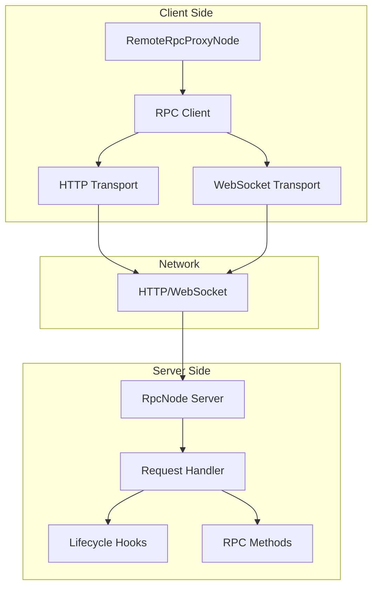

# RPC Architecture

## Overview

The RPC system enables distributed Spark workflows by exposing nodes as JSON-RPC 2.0 services and providing transparent remote node invocation. The architecture emphasizes standards compliance, multiple transport protocols, bidirectional communication, and seamless integration with the graph system.

## Design Philosophy

### Standards-Based

**Design Decision**: Implement JSON-RPC 2.0 specification exactly.

**Rationale**:
- Industry standard protocol (language-agnostic)
- Well-defined request/response format
- Error handling specification
- Batch request support
- Tooling and client library ecosystem

**Alternative Considered**: gRPC with Protocol Buffers
- **Rejected**: More complex, requires code generation, less debuggable
- **Trade-off**: JSON-RPC has larger payloads but simpler debugging

### Transport Agnostic

The RPC system abstracts transport from protocol:

```
┌──────────────────────────────────────┐
│       JSON-RPC 2.0 Protocol          │
│  (Request/Response, Notifications)   │
└──────────────────────────────────────┘
                 ▲
                 │
    ┌────────────┼────────────┐
    │            │            │
┌───▼────┐  ┌───▼────┐  ┌───▼────┐
│  HTTP  │  │  WS    │  │ Future │
│        │  │        │  │ (QUIC?)│
└────────┘  └────────┘  └────────┘
```

**Supported Transports**:
- **HTTP**: Request/response pattern, stateless
- **WebSocket**: Bidirectional, stateful, server push
- **Future**: QUIC, gRPC-over-HTTP3, custom

### Location Transparency

**Goal**: Remote nodes should be indistinguishable from local nodes in graph composition.

```python
# Local node
local_node = ProcessingNode()

# Remote node (transparent proxy)
remote_node = RemoteRpcProxyNode(
    config=RemoteRpcProxyConfig(endpoint="http://server:8000")
)

# Same composition syntax
local_node >> remote_node >> another_local_node

# Graph doesn't care which nodes are local/remote
graph = Graph(start=local_node)
```

This enables:
- Gradual migration (local → distributed)
- Testing (mock remote with local)
- Deployment flexibility (colocate or distribute)

## Architecture Components

### Component Overview



## RpcNode (Server-Side)

### Core Design

```python
class RpcNode(Node):
    """JSON-RPC 2.0 server node."""

    def __init__(
        self,
        host: str = "0.0.0.0",
        port: int = 8000,
        ssl_certfile: Optional[str] = None,
        ssl_keyfile: Optional[str] = None,
        config: Optional[NodeConfig] = None
    ):
        super().__init__(config=config)
        self.host = host
        self.port = port
        self.ssl_certfile = ssl_certfile
        self.ssl_keyfile = ssl_keyfile
        self._server: Optional[uvicorn.Server] = None
        self._websocket_clients: Dict[str, WebSocket] = {}

    async def start_server(self) -> None:
        """Start the RPC server."""
        app = self._create_app()
        config = uvicorn.Config(
            app,
            host=self.host,
            port=self.port,
            ssl_certfile=self.ssl_certfile,
            ssl_keyfile=self.ssl_keyfile
        )
        self._server = uvicorn.Server(config)
        await self._server.serve()

    def _create_app(self) -> Starlette:
        """Create Starlette application."""
        return Starlette(
            routes=[
                Route("/", self._handle_http, methods=["POST"]),
                Route("/health", self._handle_health, methods=["GET"]),
                WebSocketRoute("/ws", self._handle_websocket)
            ]
        )
```

### Method Routing

**Convention**: Methods named `rpc_<name>` handle RPC calls.

```python
class MyRpcNode(RpcNode):
    async def rpc_add(self, params, context):
        """Handle 'add' RPC method."""
        a = params.get('a', 0)
        b = params.get('b', 0)
        return {'sum': a + b}

    async def rpc_getData(self, params, context):
        """Handle 'getData' RPC method."""
        data_id = params['id']  # Required parameter
        data = await self._fetch_data(data_id)
        return {'data': data}
```

**Method Discovery**:
```python
def _discover_rpc_methods(self) -> Dict[str, Callable]:
    """Discover all RPC methods via introspection."""
    methods = {}
    for name in dir(self):
        if name.startswith('rpc_'):
            method = getattr(self, name)
            if callable(method):
                # Convert rpc_add → add, rpc_getData → getData
                rpc_name = name[4:]  # Strip 'rpc_' prefix
                methods[rpc_name] = method
    return methods
```

**Naming Flexibility**:
```python
# Handle dotted names: user.create
async def rpc_user_create(self, params, context):
    pass

# Handle dashed names: get-data
async def rpc_get_data(self, params, context):
    pass

# Framework maps: user.create → user_create, get-data → get_data
```

### Request Handling

**HTTP POST Handler**:
```python
async def _handle_http(self, request: Request) -> Response:
    """Handle HTTP POST with JSON-RPC payload."""
    try:
        body = await request.json()

        # Handle batch or single request
        if isinstance(body, list):
            results = await self._handle_batch(body)
            return JSONResponse(results)
        else:
            result = await self._handle_single(body)
            return JSONResponse(result)

    except json.JSONDecodeError:
        return JSONResponse(self._error_response(
            None, -32700, "Parse error"
        ))
    except Exception as e:
        return JSONResponse(self._error_response(
            None, -32603, f"Internal error: {e}"
        ))
```

**Request Validation**:
```python
def _validate_request(self, request: Dict) -> Optional[Dict]:
    """Validate JSON-RPC 2.0 request format."""
    # Check required fields
    if 'jsonrpc' not in request or request['jsonrpc'] != '2.0':
        return self._error_response(None, -32600, "Invalid Request")

    if 'method' not in request:
        return self._error_response(None, -32600, "Missing method")

    # Notifications don't require 'id'
    if 'id' not in request and request.get('method') != 'notify':
        return self._error_response(None, -32600, "Missing id")

    return None  # Valid
```

**Method Execution**:
```python
async def _handle_single(self, request: Dict) -> Dict:
    """Handle single RPC request."""
    # Validate format
    error = self._validate_request(request)
    if error:
        return error

    method = request['method']
    params = request.get('params', {})
    request_id = request.get('id')

    # Lifecycle hook: before_request
    await self.before_request(method, params, request_id)

    # Find and execute method
    if method not in self._methods:
        return self._error_response(
            request_id, -32601, f"Method not found: {method}"
        )

    try:
        context = RpcContext(
            request_id=request_id,
            method=method,
            metadata={}
        )

        result = await self._methods[method](params, context)

        # Lifecycle hook: after_request
        await self.after_request(method, params, result)

        # Notification: no response
        if request_id is None:
            return None

        return {
            'jsonrpc': '2.0',
            'result': result,
            'id': request_id
        }

    except Exception as e:
        return self._error_response(
            request_id,
            -32603,
            f"Internal error: {str(e)}"
        )
```

### Batch Requests

**Support for Batching**:
```python
async def _handle_batch(self, requests: List[Dict]) -> List[Dict]:
    """Handle batch of RPC requests."""
    # Execute all requests concurrently
    tasks = [self._handle_single(req) for req in requests]
    results = await asyncio.gather(*tasks, return_exceptions=True)

    # Filter out None (notifications)
    return [r for r in results if r is not None]
```

**Example Batch**:
```json
[
  {"jsonrpc": "2.0", "method": "add", "params": {"a": 1, "b": 2}, "id": 1},
  {"jsonrpc": "2.0", "method": "multiply", "params": {"a": 3, "b": 4}, "id": 2},
  {"jsonrpc": "2.0", "method": "log", "params": {"msg": "Hello"}}  // Notification
]
```

**Response**:
```json
[
  {"jsonrpc": "2.0", "result": {"sum": 3}, "id": 1},
  {"jsonrpc": "2.0", "result": {"product": 12}, "id": 2}
  // No response for notification
]
```

### WebSocket Support

**Connection Handling**:
```python
async def _handle_websocket(self, websocket: WebSocket) -> None:
    """Handle WebSocket connection."""
    await websocket.accept()

    client_id = str(uuid.uuid4())
    self._websocket_clients[client_id] = websocket

    # Lifecycle hook
    await self.on_websocket_connect(client_id, websocket)

    try:
        while True:
            # Receive JSON-RPC request
            message = await websocket.receive_text()
            request = json.loads(message)

            # Handle request
            response = await self._handle_single(request)

            # Send response (if not notification)
            if response:
                await websocket.send_text(json.dumps(response))

    except WebSocketDisconnect:
        await self.on_websocket_disconnect(client_id)
    finally:
        del self._websocket_clients[client_id]
```

**Server-Initiated Notifications**:
```python
class RpcNode:
    async def send_notification_to_client(
        self,
        client_id: str,
        method: str,
        params: Dict[str, Any]
    ) -> None:
        """Send notification to specific WebSocket client."""
        if client_id not in self._websocket_clients:
            raise ValueError(f"Client {client_id} not connected")

        websocket = self._websocket_clients[client_id]
        notification = {
            'jsonrpc': '2.0',
            'method': method,
            'params': params
        }

        await websocket.send_text(json.dumps(notification))

    async def broadcast_notification(
        self,
        method: str,
        params: Dict[str, Any]
    ) -> None:
        """Broadcast notification to all WebSocket clients."""
        tasks = [
            self.send_notification_to_client(client_id, method, params)
            for client_id in self._websocket_clients.keys()
        ]
        await asyncio.gather(*tasks, return_exceptions=True)
```

**Use Case**: Real-time updates, progress notifications, alerts.

### Lifecycle Hooks

```python
class RpcNode:
    async def before_request(
        self,
        method: str,
        params: Dict[str, Any],
        request_id: Optional[str]
    ) -> None:
        """Called before processing request."""
        # Use for: authentication, rate limiting, logging
        pass

    async def after_request(
        self,
        method: str,
        params: Dict[str, Any],
        result: Any
    ) -> None:
        """Called after successful request."""
        # Use for: logging, metrics, cleanup
        pass

    async def on_error(
        self,
        method: str,
        params: Dict[str, Any],
        error: Exception
    ) -> None:
        """Called when request fails."""
        # Use for: error logging, alerting
        pass

    async def on_websocket_connect(
        self,
        client_id: str,
        websocket: WebSocket
    ) -> None:
        """Called when WebSocket client connects."""
        # Use for: authentication, initialization
        pass

    async def on_websocket_disconnect(self, client_id: str) -> None:
        """Called when WebSocket client disconnects."""
        # Use for: cleanup, logging
        pass
```

**Example: Authentication**:
```python
class SecureRpcNode(RpcNode):
    async def before_request(self, method, params, request_id):
        # Check API key in params
        if 'api_key' not in params:
            raise PermissionError("Missing API key")

        if not self._validate_api_key(params['api_key']):
            raise PermissionError("Invalid API key")
```

### HTTPS/WSS Support

**SSL Configuration**:
```python
node = RpcNode(
    host="0.0.0.0",
    port=8443,
    ssl_certfile="/path/to/cert.pem",
    ssl_keyfile="/path/to/key.pem"
)

await node.start_server()
```

**Certificate Generation** (development):
```bash
# Self-signed certificate
openssl req -x509 -newkey rsa:4096 -keyout key.pem -out cert.pem -days 365 -nodes
```

## RemoteRpcProxyNode (Client-Side)

### Core Design

```python
class RemoteRpcProxyNode(Node):
    """Client proxy for calling remote RPC nodes."""

    def __init__(self, config: RemoteRpcProxyConfig):
        super().__init__()
        self.config = config
        self.client: Optional[RpcClient] = None
        self._websocket: Optional[WebSocket] = None

    async def work(self, context: ExecutionContext):
        """Execute RPC call to remote node."""
        # Ensure client initialized
        if not self.client:
            self.client = self._create_client()

        # Extract method and params from inputs
        payload = self._prepare_payload(context.inputs)

        # Execute RPC call
        if payload.get('notify'):
            # Notification (no response)
            await self.client.notify(payload['method'], payload['params'])
            return {}
        else:
            # Request (with response)
            result = await self.client.call(
                payload['method'],
                payload['params'],
                timeout=self.config.request_timeout
            )
            return result
```

### Configuration

```python
@dataclass
class RemoteRpcProxyConfig:
    endpoint: str                          # Server URL
    transport: str = "http"                # "http" or "websocket"
    default_method: str = "process"        # Default RPC method
    request_timeout: float = 30.0          # Request timeout (seconds)
    auth_token: Optional[str] = None       # Authentication token
    auto_connect_websocket: bool = False   # Auto-connect WebSocket
    forward_notifications_to_event_bus: bool = False  # Forward notifications
```

### Input Formats

**1. Simple Method Name**:
```python
context.inputs.content = "getData"
# → {"jsonrpc": "2.0", "method": "getData", "params": {}, "id": 1}
```

**2. Method with Parameters**:
```python
context.inputs.content = {
    "method": "getData",
    "id": "user_123"
}
# → {"jsonrpc": "2.0", "method": "getData", "params": {"id": "user_123"}, "id": 1}
```

**3. Full JSON-RPC Payload**:
```python
context.inputs.content = {
    "jsonrpc": "2.0",
    "method": "getData",
    "params": {"id": "user_123"},
    "id": 42
}
# → Passed through as-is
```

**4. Notification**:
```python
context.inputs.content = {
    "method": "log",
    "params": {"message": "Hello"},
    "notify": True
}
# → {"jsonrpc": "2.0", "method": "log", "params": {"message": "Hello"}}
```

### RPC Client Implementation

```python
class RpcClient:
    def __init__(
        self,
        endpoint: str,
        transport: str = "http",
        timeout: float = 30.0
    ):
        self.endpoint = endpoint
        self.transport = transport
        self.timeout = timeout
        self._http_client: Optional[httpx.AsyncClient] = None
        self._websocket: Optional[WebSocketClientProtocol] = None
        self._request_counter = 0

    async def call(
        self,
        method: str,
        params: Dict[str, Any],
        timeout: Optional[float] = None
    ) -> Any:
        """Execute RPC call and return result."""
        request = self._build_request(method, params)

        if self.transport == "http":
            return await self._call_http(request, timeout)
        elif self.transport == "websocket":
            return await self._call_websocket(request, timeout)

    async def _call_http(
        self,
        request: Dict,
        timeout: Optional[float]
    ) -> Any:
        """Execute HTTP RPC call."""
        if not self._http_client:
            self._http_client = httpx.AsyncClient()

        response = await self._http_client.post(
            self.endpoint,
            json=request,
            timeout=timeout or self.timeout
        )

        result = response.json()

        if 'error' in result:
            raise RpcError(
                result['error']['code'],
                result['error']['message']
            )

        return result['result']

    async def _call_websocket(
        self,
        request: Dict,
        timeout: Optional[float]
    ) -> Any:
        """Execute WebSocket RPC call."""
        if not self._websocket:
            await self._connect_websocket()

        # Send request
        await self._websocket.send(json.dumps(request))

        # Wait for response with timeout
        try:
            response_str = await asyncio.wait_for(
                self._websocket.recv(),
                timeout=timeout or self.timeout
            )
            result = json.loads(response_str)

            if 'error' in result:
                raise RpcError(
                    result['error']['code'],
                    result['error']['message']
                )

            return result['result']

        except asyncio.TimeoutError:
            raise RpcTimeoutError(f"Request timed out after {timeout}s")
```

### WebSocket Notification Handling

```python
class RemoteRpcProxyNode(Node):
    async def _notification_listener(self):
        """Background task to listen for server notifications."""
        while True:
            try:
                message = await self._websocket.recv()
                notification = json.loads(message)

                # Check if notification (no 'id' field)
                if 'id' not in notification and 'method' in notification:
                    await self._handle_notification(notification)

            except Exception as e:
                logger.error(f"Notification listener error: {e}")
                break

    async def _handle_notification(self, notification: Dict):
        """Handle server-initiated notification."""
        method = notification['method']
        params = notification.get('params', {})

        # Forward to graph event bus
        if self.config.forward_notifications_to_event_bus:
            # Assuming we have access to graph event bus
            event_type = f"remote.rpc.{method}"
            self.graph.event_bus.emit(event_type, params)
```

## Transport Layer

### HTTP Transport

**Characteristics**:
- Stateless
- Request/response only
- Simple debugging (curl, Postman)
- Load balancer friendly
- No server push

**Use Cases**:
- Simple RPC calls
- One-off queries
- Stateless operations
- Load-balanced deployments

**Example**:
```bash
curl -X POST http://localhost:8000 \
  -H "Content-Type: application/json" \
  -d '{
    "jsonrpc": "2.0",
    "method": "add",
    "params": {"a": 5, "b": 3},
    "id": 1
  }'
```

### WebSocket Transport

**Characteristics**:
- Stateful connection
- Bidirectional communication
- Server push (notifications)
- Lower latency (persistent connection)
- Connection management overhead

**Use Cases**:
- Long-running operations with progress updates
- Real-time notifications
- High-frequency RPC calls
- Streaming data

**Connection Lifecycle**:
```
Client                Server
  |                     |
  |--- Connect WS ----->|
  |<--- Accept ---------|
  |                     |
  |--- RPC Request ---->|
  |<--- RPC Response ---|
  |                     |
  |<--- Notification ---|
  |                     |
  |--- Disconnect ----->|
  |<--- Close ----------|
```

## Error Handling

### JSON-RPC 2.0 Error Codes

```python
class RpcErrorCode:
    PARSE_ERROR = -32700      # Invalid JSON
    INVALID_REQUEST = -32600  # Invalid JSON-RPC format
    METHOD_NOT_FOUND = -32601 # Method doesn't exist
    INVALID_PARAMS = -32602   # Invalid method parameters
    INTERNAL_ERROR = -32603   # Server internal error
    # Application-defined: -32000 to -32099
```

**Error Response Format**:
```json
{
  "jsonrpc": "2.0",
  "error": {
    "code": -32601,
    "message": "Method not found",
    "data": {"method": "unknown_method"}
  },
  "id": 1
}
```

### Client-Side Error Handling

```python
class RemoteRpcProxyNode(Node):
    async def work(self, context):
        try:
            result = await self.client.call(method, params)
            return result

        except RpcError as e:
            # RPC-level error (method not found, etc.)
            logger.error(f"RPC error {e.code}: {e.message}")
            if self.config.raise_on_rpc_error:
                raise
            return {'error': e.message}

        except RpcTimeoutError as e:
            # Timeout error
            logger.error(f"RPC timeout: {e}")
            if self.config.raise_on_timeout:
                raise
            return {'error': 'Timeout'}

        except Exception as e:
            # Transport-level error (network, etc.)
            logger.error(f"Transport error: {e}")
            raise
```

## Security Model

### Authentication

**API Key in Parameters**:
```python
class SecureRpcNode(RpcNode):
    async def before_request(self, method, params, request_id):
        api_key = params.get('api_key')
        if not self._validate_api_key(api_key):
            raise PermissionError("Invalid API key")
```

**Token in Headers** (HTTP):
```python
class SecureRpcNode(RpcNode):
    async def _handle_http(self, request: Request):
        auth_header = request.headers.get('Authorization')
        if not self._validate_token(auth_header):
            return JSONResponse(
                self._error_response(None, -32001, "Unauthorized"),
                status_code=401
            )
        return await super()._handle_http(request)
```

### Rate Limiting

```python
class RateLimitedRpcNode(RpcNode):
    def __init__(self, *args, requests_per_minute: int = 60, **kwargs):
        super().__init__(*args, **kwargs)
        self._rate_limiter = RateLimiter(requests_per_minute)

    async def before_request(self, method, params, request_id):
        if not await self._rate_limiter.check():
            raise RateLimitError("Rate limit exceeded")
```

### CORS (HTTP Only)

```python
from starlette.middleware.cors import CORSMiddleware

class RpcNode:
    def _create_app(self):
        app = Starlette(...)

        app.add_middleware(
            CORSMiddleware,
            allow_origins=["*"],
            allow_methods=["POST"],
            allow_headers=["*"]
        )

        return app
```

## Performance Considerations

### Latency

**HTTP**:
- Connection setup: ~10ms (first request)
- Request/response: ~1-5ms (local network)
- Total: ~11-15ms per call

**WebSocket**:
- Connection setup: ~10ms (once)
- Request/response: ~1ms (persistent connection)
- Total: ~1ms per call (after connection)

**Optimization**: Use WebSocket for high-frequency calls.

### Throughput

**HTTP**:
- Limited by connection pool size
- Typical: 100-1000 req/s per client

**WebSocket**:
- Single persistent connection
- Typical: 1000-10000 req/s per connection

**Optimization**: Use batch requests for HTTP, pipelining for WebSocket.

### Serialization Overhead

**JSON Encoding/Decoding**:
- ~100µs for small payloads (<1KB)
- ~1ms for medium payloads (10KB)
- ~10ms for large payloads (100KB)

**Optimization**: Use binary protocols (MessagePack, Protocol Buffers) for large payloads.

## Summary

The RPC system provides:

1. **Standards Compliance**: Full JSON-RPC 2.0 specification
2. **Multiple Transports**: HTTP and WebSocket with extensible transport layer
3. **Bidirectional Communication**: Server-initiated notifications via WebSocket
4. **Location Transparency**: Remote nodes integrated seamlessly into graphs
5. **Lifecycle Hooks**: Authentication, rate limiting, logging extension points
6. **Security**: HTTPS/WSS, authentication, rate limiting support
7. **Performance**: Batch requests, persistent connections, low overhead

These architectural choices enable building distributed Spark workflows that scale across machines while maintaining the simplicity of local graph composition.
