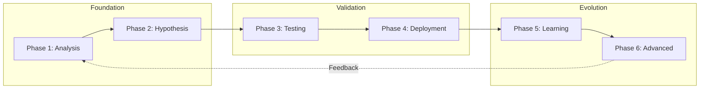

# RSI (Recursive Self-Improvement) Architecture

## Overview

The RSI system enables autonomous graph optimization through performance analysis, hypothesis generation, automated testing, and safe deployment. The architecture implements a complete feedback loop where graphs analyze their own behavior, propose improvements, validate changes, and deploy successful modifications.

## Design Philosophy

### Recursive Self-Improvement

**Core Concept**: Graphs improve themselves by treating optimization as a meta-problem.

```
Production Graph (Target)
        ▼
    Telemetry Data
        ▼
RSI Meta-Graph (Optimizer)
        ▼
   Improved Graph Version
        ▼
Production Graph (Updated)
```

**Key Insight**: The same graph execution framework that runs production workflows can orchestrate the improvement process itself.

### Safety-First Design

**Multiple Safety Layers**:

```
┌─────────────────────────────────────────┐
│  Layer 5: Human Review (Optional)       │
│  High-risk changes require approval     │
└─────────────────────────────────────────┘
              ▼
┌─────────────────────────────────────────┐
│  Layer 4: A/B Testing                   │
│  Statistical validation of improvements │
└─────────────────────────────────────────┘
              ▼
┌─────────────────────────────────────────┐
│  Layer 3: Change Validation             │
│  Semantic preservation checks           │
└─────────────────────────────────────────┘
              ▼
┌─────────────────────────────────────────┐
│  Layer 2: Hypothesis Validation         │
│  LLM-generated changes checked          │
└─────────────────────────────────────────┘
              ▼
┌─────────────────────────────────────────┐
│  Layer 1: Performance Analysis          │
│  Identify real issues from telemetry    │
└─────────────────────────────────────────┘
```

**Design Decision**: Never modify graphs in-place; always create immutable versions.

**Rationale**:
- Enables rollback to any previous version
- Prevents accidental corruption of production graphs
- Supports A/B testing (baseline vs. candidate)
- Complete audit trail of all changes

### Incremental Complexity

**Phase-Based Architecture**:

**Phase 1-2**: Foundation (analysis + hypothesis)
- Performance bottleneck detection
- LLM-powered improvement suggestions
- Simple optimizations (prompts, configs)

**Phase 3-4**: Testing + Deployment
- Automated A/B testing framework
- Statistical validation
- Safe deployment strategies

**Phase 5-6**: Learning + Advanced
- Pattern extraction from history
- Structural optimizations
- Multi-objective optimization

**Rationale**: Start simple (prompt optimization), expand to complex (graph topology changes).

## Six-Phase Architecture

### Phase Overview



## Phase 1: Performance Analysis & Introspection

### PerformanceAnalyzerNode

**Purpose**: Identify performance bottlenecks from telemetry data.

```python
class PerformanceAnalyzerNode(Node):
    def __init__(self, config: PerformanceAnalysisConfig):
        super().__init__()
        self.config = config
        self.telemetry_manager = TelemetryManager.get_instance()

    async def work(self, context: ExecutionContext):
        # Query telemetry for target graph
        traces = await self.telemetry_manager.query_traces(
            attribute_filters={'graph_id': self.config.graph_id},
            start_time_after=self._get_analysis_window_start(),
            limit=self.config.max_traces
        )

        # Skip analysis if insufficient data
        if len(traces) < self.config.min_executions:
            return {'has_issues': False, 'reason': 'Insufficient data'}

        # Analyze traces for issues
        bottlenecks = self._identify_bottlenecks(traces)
        error_patterns = self._identify_error_patterns(traces)
        resource_issues = self._identify_resource_issues(traces)

        # Generate diagnostic report
        report = DiagnosticReport(
            graph_id=self.config.graph_id,
            analysis_window=self.config.analysis_window_hours,
            num_traces_analyzed=len(traces),
            bottlenecks=bottlenecks,
            error_patterns=error_patterns,
            resource_issues=resource_issues,
            severity_score=self._calculate_severity(
                bottlenecks, error_patterns, resource_issues
            )
        )

        return {
            'has_issues': report.severity_score > self.config.severity_threshold,
            'report': report
        }
```

**Analysis Types**:

**1. Bottleneck Detection**:
```python
def _identify_bottlenecks(self, traces: List[Trace]) -> List[Bottleneck]:
    """Find slow nodes via span analysis."""
    bottlenecks = []

    for trace in traces:
        spans = await self.telemetry_manager.query_spans(
            trace_id=trace.trace_id
        )

        for span in spans:
            if span.duration and span.duration > self.config.slow_threshold:
                bottlenecks.append(Bottleneck(
                    node_id=span.attributes.get('node_id'),
                    avg_duration=span.duration,
                    occurrence_rate=self._calculate_rate(span),
                    impact_score=self._calculate_impact(span, trace)
                ))

    return self._aggregate_bottlenecks(bottlenecks)
```

**2. Error Pattern Detection**:
```python
def _identify_error_patterns(self, traces: List[Trace]) -> List[ErrorPattern]:
    """Find recurring errors."""
    errors = defaultdict(list)

    for trace in traces:
        if trace.status == TraceStatus.ERROR:
            error_type = trace.attributes.get('error_type')
            errors[error_type].append(trace)

    patterns = []
    for error_type, occurrences in errors.items():
        if len(occurrences) / len(traces) > self.config.error_rate_threshold:
            patterns.append(ErrorPattern(
                error_type=error_type,
                frequency=len(occurrences),
                rate=len(occurrences) / len(traces),
                example_traces=[t.trace_id for t in occurrences[:3]]
            ))

    return patterns
```

**3. Resource Issue Detection**:
```python
def _identify_resource_issues(self, traces: List[Trace]) -> List[ResourceIssue]:
    """Find resource contention, memory leaks, etc."""
    issues = []

    # Token usage analysis
    token_usage = [
        t.attributes.get('total_tokens', 0)
        for t in traces
        if 'total_tokens' in t.attributes
    ]

    if token_usage:
        avg_tokens = sum(token_usage) / len(token_usage)
        if avg_tokens > self.config.high_token_threshold:
            issues.append(ResourceIssue(
                type='high_token_usage',
                avg_value=avg_tokens,
                recommendation='Consider prompt optimization or caching'
            ))

    return issues
```

### GraphIntrospector

**Purpose**: Analyze graph structure and complexity.

```python
class GraphIntrospector:
    def __init__(self, graph_spec: GraphSpec):
        self.graph_spec = graph_spec

    def analyze(self) -> GraphAnalysis:
        """Comprehensive graph structure analysis."""
        return GraphAnalysis(
            node_count=len(self.graph_spec.nodes),
            edge_count=self._count_edges(),
            max_depth=self._calculate_max_depth(),
            branching_factor=self._calculate_branching_factor(),
            has_cycles=self._detect_cycles(),
            critical_path=self._find_critical_path(),
            parallelization_opportunities=self._find_parallel_opportunities(),
            complexity_score=self._calculate_complexity()
        )

    def _calculate_max_depth(self) -> int:
        """Find longest path from start to any terminal node."""
        visited = set()
        max_depth = [0]

        def dfs(node_id: str, depth: int):
            if node_id in visited:
                return
            visited.add(node_id)
            max_depth[0] = max(max_depth[0], depth)

            node = self._find_node(node_id)
            for edge in node.edges:
                dfs(edge.target, depth + 1)

        dfs(self.graph_spec.start_node, 0)
        return max_depth[0]

    def _find_parallel_opportunities(self) -> List[ParallelizationOpportunity]:
        """Identify independent nodes that could run in parallel."""
        opportunities = []

        for node in self.graph_spec.nodes:
            # Check if node has multiple outgoing edges to independent nodes
            outgoing = [e for e in node.edges]
            if len(outgoing) > 1:
                # Check for data dependencies
                if self._are_independent(outgoing):
                    opportunities.append(ParallelizationOpportunity(
                        parent_node=node.node_id,
                        parallel_nodes=[e.target for e in outgoing],
                        estimated_speedup=self._estimate_speedup(outgoing)
                    ))

        return opportunities
```

### DiagnosticReport

**Structure**:
```python
@dataclass
class DiagnosticReport:
    graph_id: str
    graph_version: str
    analysis_window: str
    num_traces_analyzed: int
    timestamp: float

    # Issues found
    bottlenecks: List[Bottleneck]
    error_patterns: List[ErrorPattern]
    resource_issues: List[ResourceIssue]

    # Severity assessment
    severity_score: float  # 0.0 to 1.0
    priority: Priority     # LOW, MEDIUM, HIGH, CRITICAL

    # Recommendations
    suggested_optimizations: List[str]
```

## Phase 2: Hypothesis Generation & Validation

### HypothesisGeneratorNode

**Purpose**: Generate improvement hypotheses using LLM analysis.

```python
class HypothesisGeneratorNode(Node):
    def __init__(self, config: HypothesisGenerationConfig):
        super().__init__()
        self.config = config
        self.model = config.model

    async def work(self, context: ExecutionContext):
        report: DiagnosticReport = context.inputs.content['report']
        graph_spec: GraphSpec = context.inputs.content['graph_spec']

        # Generate hypotheses using LLM
        hypotheses = await self._generate_hypotheses(report, graph_spec)

        # Rank by expected impact
        ranked = self._rank_hypotheses(hypotheses)

        return {
            'hypotheses': ranked[:self.config.max_hypotheses],
            'total_generated': len(hypotheses)
        }

    async def _generate_hypotheses(
        self,
        report: DiagnosticReport,
        graph_spec: GraphSpec
    ) -> List[Hypothesis]:
        """Use LLM to generate improvement hypotheses."""
        prompt = self._build_generation_prompt(report, graph_spec)

        response = await self.model.get_json(
            messages=[{'role': 'user', 'content': [{'text': prompt}]}],
            system_prompt=HYPOTHESIS_GENERATION_SYSTEM_PROMPT
        )

        return [self._parse_hypothesis(h) for h in response['hypotheses']]
```

**Hypothesis Generation Prompt**:
```python
HYPOTHESIS_GENERATION_SYSTEM_PROMPT = """
You are an expert in optimizing AI workflows. Given performance data and
a graph specification, generate specific, actionable improvement hypotheses.

For each hypothesis, provide:
1. Type: prompt_optimization, config_change, node_replacement, edge_optimization
2. Target: Which node/component to modify
3. Rationale: Why this change should help
4. Expected Impact: Estimated improvement (latency, cost, quality)
5. Risk Level: LOW, MEDIUM, HIGH
6. Concrete Changes: Exact modifications to make
"""

def _build_generation_prompt(
    self,
    report: DiagnosticReport,
    graph_spec: GraphSpec
) -> str:
    """Build prompt for hypothesis generation."""
    return f"""
    Analyze this performance report and graph specification to generate
    improvement hypotheses.

    ## Performance Issues
    {self._format_issues(report)}

    ## Graph Structure
    {self._format_graph_structure(graph_spec)}

    ## Current Configuration
    {self._format_config(graph_spec)}

    Generate 3-5 hypotheses ranked by expected impact.
    """
```

**Hypothesis Types**:

**1. Prompt Optimization**:
```python
@dataclass
class PromptOptimizationHypothesis(Hypothesis):
    type: HypothesisType = HypothesisType.PROMPT_OPTIMIZATION
    target_node: str
    current_prompt: str
    proposed_prompt: str
    rationale: str
    expected_improvement: float  # Percentage
```

**2. Config Change**:
```python
@dataclass
class ConfigChangeHypothesis(Hypothesis):
    type: HypothesisType = HypothesisType.CONFIG_CHANGE
    target_node: str
    config_key: str
    current_value: Any
    proposed_value: Any
    rationale: str
```

**3. Node Replacement**:
```python
@dataclass
class NodeReplacementHypothesis(Hypothesis):
    type: HypothesisType = HypothesisType.NODE_REPLACEMENT
    target_node: str
    replacement_node: str
    replacement_config: Dict[str, Any]
    rationale: str
```

**4. Edge Optimization**:
```python
@dataclass
class EdgeOptimizationHypothesis(Hypothesis):
    type: HypothesisType = HypothesisType.EDGE_OPTIMIZATION
    source_node: str
    target_node: str
    optimization_type: str  # 'remove_redundant', 'add_shortcut', 'simplify_condition'
    rationale: str
```

### ChangeValidatorNode

**Purpose**: Validate hypotheses for safety and correctness.

```python
class ChangeValidatorNode(Node):
    def __init__(self, config: ValidationConfig):
        super().__init__()
        self.config = config

    async def work(self, context: ExecutionContext):
        hypothesis: Hypothesis = context.inputs.content['hypothesis']
        graph_spec: GraphSpec = context.inputs.content['graph_spec']

        # Run validation checks
        validations = [
            self._validate_protected_nodes(hypothesis, graph_spec),
            self._validate_semantic_preservation(hypothesis, graph_spec),
            self._validate_type_compatibility(hypothesis, graph_spec),
            self._validate_no_infinite_loops(hypothesis, graph_spec),
            self._validate_no_data_loss(hypothesis, graph_spec)
        ]

        results = await asyncio.gather(*validations)

        # Aggregate results
        is_valid = all(r.is_valid for r in results)
        issues = [r.issue for r in results if not r.is_valid]

        return {
            'is_valid': is_valid,
            'issues': issues,
            'hypothesis': hypothesis
        }
```

**Validation Checks**:

**1. Protected Nodes**:
```python
def _validate_protected_nodes(
    self,
    hypothesis: Hypothesis,
    graph_spec: GraphSpec
) -> ValidationResult:
    """Prevent modification of critical nodes."""
    protected = self.config.protected_node_ids

    if hypothesis.target_node in protected:
        return ValidationResult(
            is_valid=False,
            issue=f"Cannot modify protected node: {hypothesis.target_node}"
        )

    return ValidationResult(is_valid=True)
```

**2. Semantic Preservation**:
```python
async def _validate_semantic_preservation(
    self,
    hypothesis: Hypothesis,
    graph_spec: GraphSpec
) -> ValidationResult:
    """Ensure change doesn't break graph semantics."""
    if hypothesis.type == HypothesisType.EDGE_OPTIMIZATION:
        # Check if removing edge would disconnect graph
        if hypothesis.optimization_type == 'remove_redundant':
            if self._would_disconnect_graph(hypothesis, graph_spec):
                return ValidationResult(
                    is_valid=False,
                    issue="Removing edge would disconnect graph"
                )

    return ValidationResult(is_valid=True)
```

**3. Type Compatibility**:
```python
def _validate_type_compatibility(
    self,
    hypothesis: Hypothesis,
    graph_spec: GraphSpec
) -> ValidationResult:
    """Validate type compatibility for node replacements."""
    if hypothesis.type == HypothesisType.NODE_REPLACEMENT:
        original = self._find_node(hypothesis.target_node, graph_spec)
        replacement = hypothesis.replacement_node

        # Check input/output compatibility
        if not self._types_compatible(original, replacement):
            return ValidationResult(
                is_valid=False,
                issue=f"Type incompatibility: {original} vs {replacement}"
            )

    return ValidationResult(is_valid=True)
```

## Phase 3: Automated A/B Testing

### HypothesisTesterNode

**Purpose**: Statistically validate hypotheses through A/B testing.

```python
class HypothesisTesterNode(Node):
    def __init__(self, config: TestingConfig):
        super().__init__()
        self.config = config

    async def work(self, context: ExecutionContext):
        hypothesis: Hypothesis = context.inputs.content['hypothesis']
        baseline_graph: GraphSpec = context.inputs.content['baseline_graph']

        # Apply hypothesis to create candidate graph
        candidate_graph = await self._apply_hypothesis(hypothesis, baseline_graph)

        # Run A/B test
        test_result = await self._run_ab_test(baseline_graph, candidate_graph)

        # Statistical analysis
        is_improvement = self._analyze_results(test_result)

        return {
            'passed': is_improvement,
            'test_result': test_result,
            'hypothesis': hypothesis,
            'candidate_graph': candidate_graph if is_improvement else None
        }

    async def _run_ab_test(
        self,
        baseline: GraphSpec,
        candidate: GraphSpec
    ) -> ABTestResult:
        """Run A/B test comparing baseline vs candidate."""
        # Load test data
        test_cases = await self._load_test_cases()

        # Run baseline
        baseline_results = await self._run_test_suite(baseline, test_cases)

        # Run candidate
        candidate_results = await self._run_test_suite(candidate, test_cases)

        # Compare metrics
        comparison = self._compare_metrics(baseline_results, candidate_results)

        return ABTestResult(
            baseline_metrics=baseline_results,
            candidate_metrics=candidate_results,
            comparison=comparison,
            num_test_cases=len(test_cases)
        )
```

**A/B Test Execution**:
```python
async def _run_test_suite(
    self,
    graph_spec: GraphSpec,
    test_cases: List[TestCase]
) -> TestMetrics:
    """Execute test suite and collect metrics."""
    # Instantiate graph from spec
    graph = await self._instantiate_graph(graph_spec)

    results = []
    for test_case in test_cases:
        start_time = time.time()

        try:
            # Run graph with test input
            result = await graph.run(Task(inputs=test_case.inputs))

            # Collect metrics
            duration = time.time() - start_time
            cost = self._calculate_cost(graph)
            quality = self._evaluate_quality(result, test_case.expected)

            results.append(TestResult(
                success=True,
                duration=duration,
                cost=cost,
                quality_score=quality,
                output=result
            ))

        except Exception as e:
            results.append(TestResult(
                success=False,
                error=str(e),
                duration=time.time() - start_time
            ))

    return self._aggregate_results(results)
```

**Statistical Analysis**:
```python
def _analyze_results(self, test_result: ABTestResult) -> bool:
    """Determine if candidate is statistically better than baseline."""
    baseline = test_result.baseline_metrics
    candidate = test_result.candidate_metrics

    # Latency comparison (lower is better)
    latency_improvement = (
        baseline.avg_duration - candidate.avg_duration
    ) / baseline.avg_duration

    latency_significant = self._t_test(
        baseline.durations,
        candidate.durations,
        confidence=self.config.confidence_level
    )

    # Error rate comparison (lower is better)
    error_rate_improved = (
        candidate.error_rate < baseline.error_rate
    )

    # Cost comparison (lower is better)
    cost_improvement = (
        baseline.avg_cost - candidate.avg_cost
    ) / baseline.avg_cost

    # Quality comparison (higher is better)
    quality_improvement = (
        candidate.avg_quality - baseline.avg_quality
    ) / baseline.avg_quality

    # Overall decision
    is_improvement = (
        latency_improvement > self.config.min_latency_improvement
        and latency_significant
        and not error_rate_improved  # No regression
        and quality_improvement >= -self.config.max_quality_degradation
    )

    return is_improvement

def _t_test(
    self,
    sample1: List[float],
    sample2: List[float],
    confidence: float = 0.95
) -> bool:
    """Perform Student's t-test for statistical significance."""
    t_stat, p_value = scipy.stats.ttest_ind(sample1, sample2)
    return p_value < (1 - confidence)
```

**Test Configuration**:
```python
@dataclass
class TestingConfig:
    num_iterations: int = 100              # Test runs per variant
    confidence_level: float = 0.95         # Statistical confidence
    min_latency_improvement: float = 0.1   # 10% improvement required
    max_quality_degradation: float = 0.05  # Allow 5% quality drop
    test_data_source: str                  # Path to test cases
```

## Phase 4: Deployment & Monitoring

### DeploymentControllerNode

**Purpose**: Safely deploy validated improvements with monitoring and rollback.

```python
class DeploymentControllerNode(Node):
    def __init__(self, config: DeploymentConfig):
        super().__init__()
        self.config = config

    async def work(self, context: ExecutionContext):
        hypothesis: Hypothesis = context.inputs.content['hypothesis']
        candidate_graph: GraphSpec = context.inputs.content['candidate_graph']

        # Deploy using configured strategy
        if self.config.deployment_strategy == DeploymentStrategy.DIRECT:
            return await self._deploy_direct(candidate_graph)

        elif self.config.deployment_strategy == DeploymentStrategy.CANARY:
            return await self._deploy_canary(candidate_graph)

        elif self.config.deployment_strategy == DeploymentStrategy.BLUE_GREEN:
            return await self._deploy_blue_green(candidate_graph)

        elif self.config.deployment_strategy == DeploymentStrategy.GRADUAL:
            return await self._deploy_gradual(candidate_graph)
```

**Deployment Strategies**:

**1. Direct Deployment**:
```python
async def _deploy_direct(self, candidate: GraphSpec) -> DeploymentResult:
    """Immediate replacement of production graph."""
    try:
        # Save current version for rollback
        self._save_backup(self.current_graph)

        # Deploy candidate
        self.current_graph = candidate
        self._persist_graph(candidate)

        # Monitor for issues
        monitoring_result = await self._monitor_deployment(
            duration=self.config.monitoring_duration
        )

        if monitoring_result.has_issues:
            # Rollback
            await self._rollback()
            return DeploymentResult(
                success=False,
                rolled_back=True,
                reason=monitoring_result.issues
            )

        return DeploymentResult(success=True)

    except Exception as e:
        await self._rollback()
        return DeploymentResult(
            success=False,
            rolled_back=True,
            reason=str(e)
        )
```

**2. Canary Deployment**:
```python
async def _deploy_canary(self, candidate: GraphSpec) -> DeploymentResult:
    """Gradual rollout starting with small percentage."""
    # Start with 10% of traffic
    await self._route_traffic(candidate, percentage=10)

    # Monitor canary
    canary_metrics = await self._monitor_deployment(duration=300)  # 5 min

    if canary_metrics.has_issues:
        await self._rollback()
        return DeploymentResult(success=False, rolled_back=True)

    # Increase to 50%
    await self._route_traffic(candidate, percentage=50)
    metrics_50 = await self._monitor_deployment(duration=300)

    if metrics_50.has_issues:
        await self._rollback()
        return DeploymentResult(success=False, rolled_back=True)

    # Full deployment
    await self._route_traffic(candidate, percentage=100)

    return DeploymentResult(success=True)
```

**3. Blue-Green Deployment**:
```python
async def _deploy_blue_green(self, candidate: GraphSpec) -> DeploymentResult:
    """Deploy to parallel environment, then switch."""
    # Deploy to green environment
    green_env = await self._deploy_to_environment('green', candidate)

    # Smoke tests on green
    smoke_test_result = await self._run_smoke_tests(green_env)

    if not smoke_test_result.passed:
        await self._teardown_environment('green')
        return DeploymentResult(success=False)

    # Switch traffic from blue to green
    await self._switch_traffic('blue', 'green')

    # Monitor green
    monitoring = await self._monitor_deployment(duration=600)  # 10 min

    if monitoring.has_issues:
        # Switch back to blue
        await self._switch_traffic('green', 'blue')
        return DeploymentResult(success=False, rolled_back=True)

    # Teardown blue
    await self._teardown_environment('blue')

    return DeploymentResult(success=True)
```

**Monitoring and Rollback**:
```python
async def _monitor_deployment(self, duration: float) -> MonitoringResult:
    """Monitor production metrics for issues."""
    start_time = time.time()
    metrics_history = []

    while time.time() - start_time < duration:
        # Collect current metrics
        metrics = await self._collect_metrics()
        metrics_history.append(metrics)

        # Check for issues
        if self._detect_regression(metrics):
            return MonitoringResult(
                has_issues=True,
                issues=['Performance regression detected'],
                metrics=metrics_history
            )

        if metrics.error_rate > self.config.max_error_rate:
            return MonitoringResult(
                has_issues=True,
                issues=[f'Error rate {metrics.error_rate} > threshold'],
                metrics=metrics_history
            )

        await asyncio.sleep(self.config.monitoring_interval)

    return MonitoringResult(has_issues=False, metrics=metrics_history)

def _detect_regression(self, current: Metrics) -> bool:
    """Detect performance regression vs. baseline."""
    baseline = self._get_baseline_metrics()

    latency_regression = (
        current.p95_latency > baseline.p95_latency * 1.2  # 20% worse
    )

    cost_regression = (
        current.avg_cost > baseline.avg_cost * 1.1  # 10% higher
    )

    return latency_regression or cost_regression

async def _rollback(self) -> None:
    """Rollback to previous version."""
    logger.warning("Rolling back deployment")

    previous = self._load_backup()
    self.current_graph = previous
    self._persist_graph(previous)

    # Record rollback event
    self._record_rollback_event()
```

## Phase 5: Pattern Extraction & Learning

### ExperienceDatabase

**Purpose**: Store and query historical improvement attempts.

```python
class ExperienceDatabase:
    def __init__(self, db_path: str = "rsi_experience.db"):
        self.db_path = db_path
        self._connection: Optional[aiosqlite.Connection] = None

    async def record_experiment(self, experiment: Experiment) -> None:
        """Record improvement attempt."""
        await self._ensure_connection()

        await self._connection.execute(
            """
            INSERT INTO experiments VALUES (
                ?, ?, ?, ?, ?, ?, ?, ?, ?, ?
            )
            """,
            (
                experiment.experiment_id,
                experiment.timestamp,
                experiment.graph_id,
                experiment.graph_version,
                experiment.hypothesis_type,
                json.dumps(experiment.hypothesis),
                experiment.test_result,
                experiment.was_deployed,
                json.dumps(experiment.metrics),
                experiment.outcome
            )
        )
        await self._connection.commit()

    async def query_successful_optimizations(
        self,
        hypothesis_type: Optional[HypothesisType] = None
    ) -> List[Experiment]:
        """Query successful optimizations."""
        query = """
            SELECT * FROM experiments
            WHERE test_result = 'PASSED' AND was_deployed = 1
        """

        if hypothesis_type:
            query += f" AND hypothesis_type = '{hypothesis_type.value}'"

        async with self._connection.execute(query) as cursor:
            rows = await cursor.fetchall()
            return [self._row_to_experiment(row) for row in rows]

    async def get_success_rate_by_type(self) -> Dict[str, float]:
        """Calculate success rate by hypothesis type."""
        query = """
            SELECT
                hypothesis_type,
                COUNT(*) as total,
                SUM(CASE WHEN test_result = 'PASSED' THEN 1 ELSE 0 END) as passed
            FROM experiments
            GROUP BY hypothesis_type
        """

        results = {}
        async with self._connection.execute(query) as cursor:
            async for row in cursor:
                hypothesis_type = row[0]
                total = row[1]
                passed = row[2]
                results[hypothesis_type] = passed / total if total > 0 else 0.0

        return results
```

### PatternExtractor

**Purpose**: Learn from historical data to improve future hypotheses.

```python
class PatternExtractor:
    def __init__(self, experience_db: ExperienceDatabase):
        self.experience_db = experience_db

    async def extract_patterns(self) -> List[Pattern]:
        """Extract successful patterns from history."""
        experiments = await self.experience_db.query_successful_optimizations()

        patterns = []

        # Pattern 1: Which hypothesis types work best?
        type_success_rates = await self.experience_db.get_success_rate_by_type()
        patterns.append(Pattern(
            type='hypothesis_effectiveness',
            data=type_success_rates,
            insight=f"Prompt optimizations succeed {type_success_rates.get('prompt', 0):.1%} of time"
        ))

        # Pattern 2: What changes lead to biggest improvements?
        patterns.extend(await self._extract_high_impact_patterns(experiments))

        # Pattern 3: What graph characteristics correlate with optimization success?
        patterns.extend(await self._extract_graph_characteristic_patterns(experiments))

        return patterns

    async def _extract_high_impact_patterns(
        self,
        experiments: List[Experiment]
    ) -> List[Pattern]:
        """Find patterns in high-impact optimizations."""
        # Sort by improvement magnitude
        sorted_experiments = sorted(
            experiments,
            key=lambda e: e.metrics.get('improvement', 0),
            reverse=True
        )

        top_10_percent = sorted_experiments[:len(sorted_experiments)//10]

        # Analyze commonalities
        hypothesis_types = Counter(e.hypothesis_type for e in top_10_percent)

        return [Pattern(
            type='high_impact_hypothesis_types',
            data=dict(hypothesis_types),
            insight=f"High-impact optimizations are often: {hypothesis_types.most_common(1)[0][0]}"
        )]

    async def _extract_graph_characteristic_patterns(
        self,
        experiments: List[Experiment]
    ) -> List[Pattern]:
        """Correlate graph characteristics with optimization success."""
        # Group by graph characteristics
        by_complexity = defaultdict(list)

        for exp in experiments:
            complexity = exp.graph_characteristics.get('complexity_score', 0)
            by_complexity[self._complexity_bucket(complexity)].append(exp)

        # Calculate success rates
        success_by_complexity = {
            bucket: len([e for e in exps if e.test_result == 'PASSED']) / len(exps)
            for bucket, exps in by_complexity.items()
        }

        return [Pattern(
            type='complexity_correlation',
            data=success_by_complexity,
            insight=f"Simpler graphs optimize more successfully"
        )]
```

## Phase 6: Structural Optimization & Multi-Objective

### NodeReplacementAnalyzer

**Purpose**: Identify opportunities to replace nodes with better alternatives.

```python
class NodeReplacementAnalyzer:
    def __init__(self, config: ReplacementAnalysisConfig):
        self.config = config

    async def analyze(
        self,
        graph_spec: GraphSpec,
        performance_data: PerformanceData
    ) -> List[ReplacementOpportunity]:
        """Find node replacement opportunities."""
        opportunities = []

        for node in graph_spec.nodes:
            # Analyze node performance
            node_perf = performance_data.get_node_metrics(node.node_id)

            # Check for LLM model upgrades
            if node.type == 'AgentNode':
                model_upgrade = await self._check_model_upgrade(node, node_perf)
                if model_upgrade:
                    opportunities.append(model_upgrade)

            # Check for caching opportunities
            if self._is_cacheable(node, node_perf):
                opportunities.append(self._create_caching_opportunity(node))

            # Check for batching opportunities
            if self._can_batch(node, node_perf):
                opportunities.append(self._create_batching_opportunity(node))

        return opportunities

    async def _check_model_upgrade(
        self,
        node: NodeSpec,
        performance: NodePerformance
    ) -> Optional[ReplacementOpportunity]:
        """Check if newer model would be better."""
        current_model = node.config.get('model_id')

        # Get available model alternatives
        alternatives = self._get_model_alternatives(current_model)

        for alt_model in alternatives:
            # Estimate performance with alternative
            estimated_perf = await self._estimate_performance(alt_model, node)

            # Check if improvement
            if self._is_improvement(estimated_perf, performance):
                return ReplacementOpportunity(
                    node_id=node.node_id,
                    replacement_type='model_upgrade',
                    current_config={'model_id': current_model},
                    proposed_config={'model_id': alt_model},
                    expected_improvement=self._calculate_improvement(
                        estimated_perf, performance
                    )
                )

        return None
```

### EdgeOptimizer

**Purpose**: Optimize graph topology.

```python
class EdgeOptimizer:
    def analyze(self, graph_spec: GraphSpec) -> List[EdgeOptimization]:
        """Find edge optimization opportunities."""
        optimizations = []

        # Find redundant edges
        redundant = self._find_redundant_edges(graph_spec)
        optimizations.extend([
            EdgeOptimization(
                type='remove_redundant',
                edge=edge,
                rationale='Edge never taken in practice'
            )
            for edge in redundant
        ])

        # Find shortcut opportunities
        shortcuts = self._find_shortcut_opportunities(graph_spec)
        optimizations.extend(shortcuts)

        # Simplify edge conditions
        simplified = self._find_simplifiable_conditions(graph_spec)
        optimizations.extend(simplified)

        return optimizations

    def _find_shortcut_opportunities(
        self,
        graph_spec: GraphSpec
    ) -> List[EdgeOptimization]:
        """Find cases where nodes could skip intermediate steps."""
        shortcuts = []

        for node in graph_spec.nodes:
            # Look for paths: A → B → C where B is simple passthrough
            for edge1 in node.edges:
                intermediate = self._find_node(edge1.target, graph_spec)

                if not self._is_passthrough(intermediate):
                    continue

                for edge2 in intermediate.edges:
                    target = edge2.target

                    # Suggest shortcut: A → C
                    shortcuts.append(EdgeOptimization(
                        type='add_shortcut',
                        source=node.node_id,
                        target=target,
                        rationale=f'Skip passthrough node {intermediate.node_id}'
                    ))

        return shortcuts
```

### MultiObjectiveOptimizer

**Purpose**: Balance competing objectives (latency, cost, quality, reliability).

```python
class MultiObjectiveOptimizer:
    def __init__(self, config: MultiObjectiveConfig):
        self.config = config

    def rank_hypotheses(
        self,
        hypotheses: List[Hypothesis],
        baseline_metrics: Metrics
    ) -> List[ScoredHypothesis]:
        """Rank hypotheses using multi-objective scoring."""
        scored = []

        for hypothesis in hypotheses:
            # Estimate impact on each objective
            estimated_metrics = self._estimate_metrics(hypothesis, baseline_metrics)

            # Calculate score for each objective
            scores = {
                'latency': self._score_latency(estimated_metrics, baseline_metrics),
                'cost': self._score_cost(estimated_metrics, baseline_metrics),
                'quality': self._score_quality(estimated_metrics, baseline_metrics),
                'reliability': self._score_reliability(estimated_metrics, baseline_metrics)
            }

            # Weighted combination
            total_score = sum(
                scores[obj] * self.config.weights[obj]
                for obj in scores.keys()
            )

            scored.append(ScoredHypothesis(
                hypothesis=hypothesis,
                total_score=total_score,
                objective_scores=scores,
                pareto_optimal=False  # Set later
            ))

        # Identify Pareto-optimal solutions
        scored = self._identify_pareto_optimal(scored)

        # Sort by total score
        return sorted(scored, key=lambda s: s.total_score, reverse=True)

    def _identify_pareto_optimal(
        self,
        scored: List[ScoredHypothesis]
    ) -> List[ScoredHypothesis]:
        """Mark Pareto-optimal hypotheses."""
        for i, candidate in enumerate(scored):
            is_dominated = False

            for other in scored:
                if other is candidate:
                    continue

                # Check if other dominates candidate
                if self._dominates(other, candidate):
                    is_dominated = True
                    break

            candidate.pareto_optimal = not is_dominated

        return scored

    def _dominates(
        self,
        h1: ScoredHypothesis,
        h2: ScoredHypothesis
    ) -> bool:
        """Check if h1 dominates h2 (better on all objectives)."""
        better_on_some = False

        for obj in ['latency', 'cost', 'quality', 'reliability']:
            if h1.objective_scores[obj] < h2.objective_scores[obj]:
                return False  # h2 better on this objective
            if h1.objective_scores[obj] > h2.objective_scores[obj]:
                better_on_some = True

        return better_on_some
```

## RSI Meta-Graph Orchestration

### Complete RSI Workflow

```python
class RSIMetaGraph:
    def __init__(self, config: RSIMetaGraphConfig):
        self.config = config

        # Build meta-graph
        self.meta_graph = self._build_rsi_graph()

    def _build_rsi_graph(self) -> Graph:
        """Build complete RSI workflow graph."""
        # Phase 1: Analysis
        analyzer = PerformanceAnalyzerNode(self.config.analyzer_config)
        introspector = GraphIntrospectorNode()
        analysis_gate = AnalysisGateNode()  # Only proceed if issues found

        # Phase 2: Hypothesis Generation
        generator = HypothesisGeneratorNode(self.config.generator_config)
        validator = ChangeValidatorNode(self.config.validator_config)
        validation_gate = ValidationGateNode()  # Only proceed if valid

        # Phase 3: Testing
        tester = HypothesisTesterNode(self.config.tester_config)
        test_gate = TestGateNode()  # Only proceed if test passed

        # Phase 4: Deployment
        deployer = DeploymentControllerNode(self.config.deployment_config)

        # Phase 5: Learning
        pattern_extractor = PatternExtractorNode(self.config.experience_db)

        # Connect nodes
        analyzer >> analysis_gate
        analysis_gate.on(has_issues=True) >> generator
        analysis_gate.on(has_issues=False) >> pattern_extractor  # Learn even if no issues

        generator >> validator
        validator >> validation_gate
        validation_gate.on(is_valid=True) >> tester
        validation_gate.on(is_valid=False) >> pattern_extractor  # Record failure

        tester >> test_gate
        test_gate.on(passed=True) >> deployer
        test_gate.on(passed=False) >> pattern_extractor  # Record failure

        deployer >> pattern_extractor

        # Create graph
        return Graph(start=analyzer)

    async def run_single_cycle(self) -> RSIResult:
        """Run one improvement cycle."""
        task = Task(inputs=NodeMessage(content={
            'target_graph_id': self.config.target_graph_id,
            'target_graph_version': self.config.target_graph_version
        }))

        result = await self.meta_graph.run(task)

        return RSIResult(
            cycle_completed=True,
            improvements_deployed=result.content.get('deployed', False),
            num_hypotheses_generated=result.content.get('num_hypotheses', 0),
            patterns_learned=result.content.get('patterns', [])
        )

    async def run_continuous_improvement(self) -> AsyncGenerator[RSIResult, None]:
        """Run continuous improvement loop."""
        while True:
            result = await self.run_single_cycle()
            yield result

            # Wait before next cycle
            await asyncio.sleep(self.config.cycle_interval)
```

## Summary

The RSI system provides:

1. **Six-Phase Architecture**: Foundation → Validation → Evolution
2. **Safety Layers**: Multiple validation checks before any deployment
3. **Immutable Versions**: Never modify graphs in-place, always create new versions
4. **Statistical Validation**: A/B testing with confidence intervals
5. **Deployment Strategies**: Direct, canary, blue-green, gradual rollout
6. **Autonomous Learning**: Pattern extraction from historical experiments
7. **Multi-Objective Optimization**: Balance latency, cost, quality, reliability
8. **Complete Automation**: End-to-end workflow from analysis to deployment

These architectural choices enable true recursive self-improvement where graphs autonomously optimize themselves based on production telemetry, with safety guarantees and comprehensive auditability.
