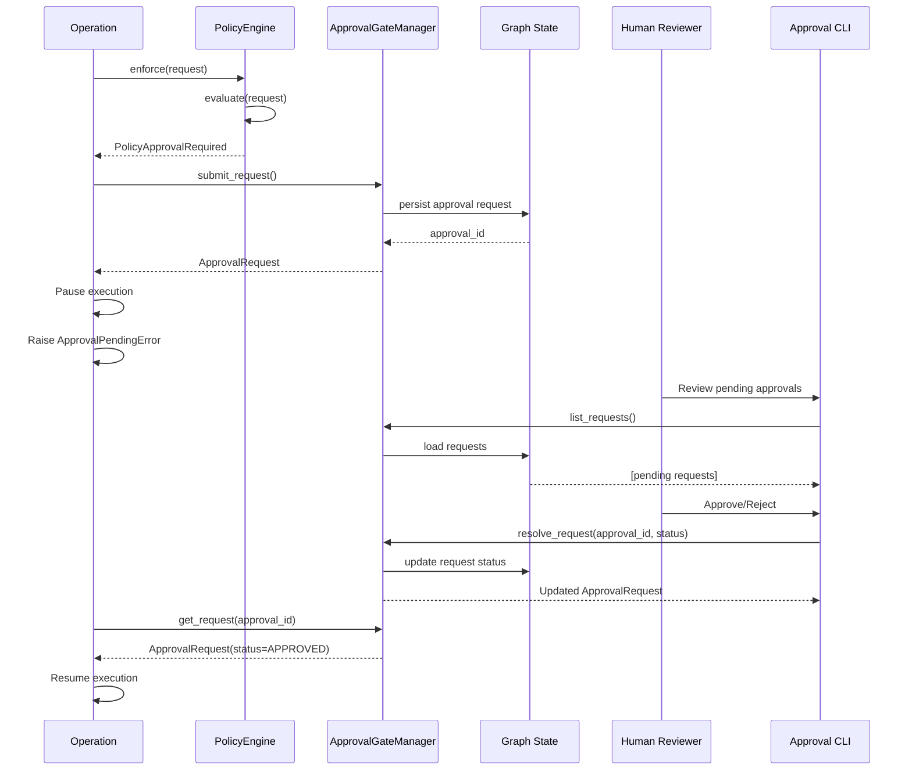

# Approval Workflows
---

This guide covers the human-in-the-loop approval system for governance policies. When a policy rule uses `PolicyEffect.REQUIRE_APPROVAL`, the system captures approval requests and enables human review before operations proceed.

## Table of Contents

- [Overview](#overview)
- [ApprovalGateManager](#approvalgatemanager)
- [Approval Requests](#approval-requests)
- [Integration with Graphs](#integration-with-graphs)
- [Integration with Agents](#integration-with-agents)
- [CLI-Based Approval](#cli-based-approval)
- [Approval Workflows](#approval-workflows)
- [Timeout Handling](#timeout-handling)
- [Approval Delegation](#approval-delegation)
- [Audit Trail](#audit-trail)

## Overview

The approval system provides a structured workflow for human oversight of critical operations:

1. **Policy Evaluation**: A `PolicyRule` with `effect=REQUIRE_APPROVAL` matches a request
2. **Approval Request**: System creates an `ApprovalRequest` with operation details
3. **Request Storage**: Request is persisted in graph state or custom storage
4. **Human Review**: Human reviewer examines request and decides (approve/reject)
5. **Decision Capture**: System records decision with reviewer identity and notes
6. **Execution**: Operation proceeds if approved, blocked if rejected

### Architecture



## ApprovalGateManager

The `ApprovalGateManager` is the central component for managing approval requests. It provides persistence, querying, and resolution of approval requests.

### Creating a Manager

```python
from spark.governance import ApprovalGateManager
from spark.graphs.graph_state import GraphState

# Option 1: With graph state (persisted across graph runs)
graph_state = GraphState()
await graph_state.initialize()

manager = ApprovalGateManager(state=graph_state, storage_key='approval_requests')

# Option 2: In-memory only (for testing)
manager = ApprovalGateManager()
```

### Submitting Approval Requests

```python
from spark.governance import ApprovalGateManager, PolicySubject

manager = ApprovalGateManager(state=graph_state)

# Submit a new approval request
approval = await manager.submit_request(
    action="data:delete",
    resource="dataset://production/customer_data",
    subject={
        "identifier": "user-123",
        "roles": ["developer"],
        "attributes": {"team": "platform"}
    },
    reason="Policy requires approval for production data deletion",
    metadata={
        "policy_rule": "production_deletion_approval",
        "estimated_records": 1500,
        "requested_at": "2025-12-05T10:30:00Z"
    }
)

print(f"Approval ID: {approval.approval_id}")
print(f"Status: {approval.status}")  # PENDING
```

### Querying Approval Requests

```python
# Get all requests (pending and resolved)
all_requests = await manager.list_requests()
for req in all_requests:
    print(f"{req.approval_id}: {req.action} on {req.resource} - {req.status}")

# Get pending requests only
pending = await manager.pending_requests()
print(f"Pending approvals: {len(pending)}")

# Get specific request by ID
approval = await manager.get_request("abc123...")
if approval:
    print(f"Status: {approval.status}")
    print(f"Reason: {approval.reason}")
```

### Resolving Approval Requests

```python
from spark.governance import ApprovalStatus

# Approve a request
approved = await manager.resolve_request(
    approval_id="abc123...",
    status=ApprovalStatus.APPROVED,
    reviewer="alice@example.com",
    notes="Verified deletion is necessary for data cleanup. Approved."
)

print(f"Decided at: {approved.decided_at}")
print(f"Decided by: {approved.decided_by}")

# Reject a request
rejected = await manager.resolve_request(
    approval_id="xyz789...",
    status=ApprovalStatus.REJECTED,
    reviewer="bob@example.com",
    notes="Insufficient justification. Please provide more context."
)
```

## Approval Requests

The `ApprovalRequest` model captures all information about an approval requirement.

### ApprovalRequest Structure

```python
from spark.governance import ApprovalRequest, ApprovalStatus

approval = ApprovalRequest(
    approval_id="a1b2c3d4...",  # Auto-generated UUID
    created_at=1733400000.0,  # Unix timestamp
    action="data:delete",
    resource="dataset://production/orders",
    subject={
        "identifier": "user-123",
        "roles": ["developer"],
        "attributes": {"team": "backend"}
    },
    reason="Policy requires approval for production deletions",
    metadata={
        "policy_rule": "prod_deletion_approval",
        "record_count": 2500,
        "estimated_impact": "high"
    },
    status=ApprovalStatus.PENDING,
    decided_at=None,  # Set when resolved
    decided_by=None,  # Reviewer identifier
    notes=None  # Reviewer notes
)
```

### Fields

| Field | Type | Description |
|-------|------|-------------|
| `approval_id` | str | Unique identifier (auto-generated hex UUID) |
| `created_at` | float | Unix timestamp when request was created |
| `action` | str | Action that requires approval |
| `resource` | str | Resource being acted upon |
| `subject` | dict | Subject (user/agent) requesting the action |
| `reason` | str | Why approval is required (from policy rule) |
| `metadata` | dict | Additional context (policy rule, impact, etc.) |
| `status` | ApprovalStatus | PENDING, APPROVED, or REJECTED |
| `decided_at` | float | Unix timestamp when decision was made |
| `decided_by` | str | Identifier of reviewer who made decision |
| `notes` | str | Reviewer's notes or justification |

### ApprovalStatus Enum

```python
from spark.governance import ApprovalStatus

# Three possible states
ApprovalStatus.PENDING      # Awaiting human decision
ApprovalStatus.APPROVED     # Approved, operation can proceed
ApprovalStatus.REJECTED     # Rejected, operation blocked
```

## Integration with Graphs

Graphs automatically integrate with the approval system when policy rules require approval.

### Basic Graph with Approval Policy

```python
from spark.graphs import Graph
from spark.nodes import Node
from spark.nodes.types import ExecutionContext
from spark.governance import (
    PolicySet, PolicyRule, PolicyEffect,
    PolicyApprovalRequired, ApprovalPendingError
)

class DataDeletionNode(Node):
    """Node that deletes production data."""

    async def process(self, context: ExecutionContext):
        dataset = context.inputs.content.get("dataset")
        # Deletion logic here
        return {"deleted": True, "dataset": dataset}

# Define approval policy
deletion_policy = PolicyRule(
    name="production_deletion_approval",
    description="Production deletions require manager approval",
    effect=PolicyEffect.REQUIRE_APPROVAL,
    actions=["node:execute"],
    resources=["graph://*/nodes/DataDeletionNode"],
    priority=10
)

policy_set = PolicySet(
    default_effect=PolicyEffect.ALLOW,
    rules=[deletion_policy]
)

# Create graph with policy
graph = Graph(start=DataDeletionNode(), policy_set=policy_set)

# Run graph
try:
    result = await graph.run({"dataset": "production/orders"})
except ApprovalPendingError as e:
    approval = e.approval
    print(f"Approval required!")
    print(f"Approval ID: {approval.approval_id}")
    print(f"Action: {approval.action}")
    print(f"Resource: {approval.resource}")
    print(f"Reason: {approval.reason}")

    # Approval request is stored in graph state
    stored_requests = await graph.state.get('approval_requests', [])
    assert len(stored_requests) > 0
```

### Approval Workflow in Graphs

1. Graph evaluates policy before executing node
2. Policy returns `REQUIRE_APPROVAL` decision
3. Graph creates `ApprovalRequest` via `ApprovalGateManager`
4. Request is persisted in `graph.state` under `'approval_requests'` key
5. Graph raises `ApprovalPendingError` with approval details
6. Execution pauses
7. Human reviewer resolves approval (see CLI section below)
8. Graph can be re-run after approval is granted

### Checking Approval Status

```python
from spark.governance import ApprovalGateManager, ApprovalStatus

# Access approval requests from graph state
manager = ApprovalGateManager(state=graph.state)

# Get pending approvals for this graph
pending = await manager.pending_requests()
if pending:
    print(f"{len(pending)} approvals pending")
    for req in pending:
        print(f"  - {req.action} on {req.resource}")

# Check specific approval
approval = await manager.get_request(approval_id)
if approval.status == ApprovalStatus.APPROVED:
    # Re-run graph
    result = await graph.run(inputs)
elif approval.status == ApprovalStatus.REJECTED:
    print(f"Request rejected: {approval.notes}")
```

### Policy Events in Graph State

All policy decisions are recorded in graph state:

```python
# After graph run (even if approval required)
policy_events = await graph.state.get('policy_events', [])

for event in policy_events:
    print(f"Action: {event['action']}")
    print(f"Resource: {event['resource']}")
    print(f"Decision: {event['decision']}")  # 'allow', 'deny', 'require_approval'
    print(f"Rule: {event.get('rule')}")
    print(f"Timestamp: {event['timestamp']}")
    print("---")
```

## Integration with Agents

Agents enforce approval policies before tool execution.

### Agent with Tool Approval Policy

```python
from spark.agents import Agent, AgentConfig
from spark.tools.decorator import tool
from spark.governance import (
    PolicySet, PolicyRule, PolicyEffect,
    PolicyApprovalRequired, ApprovalPendingError
)
from spark.models.openai import OpenAIModel

@tool
def delete_user_data(user_id: str) -> str:
    """Delete all data for a user."""
    # Deletion logic
    return f"Deleted data for user {user_id}"

# Policy: Require approval for deletions
deletion_approval_policy = PolicyRule(
    name="user_deletion_approval",
    description="User data deletion requires compliance team approval",
    effect=PolicyEffect.REQUIRE_APPROVAL,
    actions=["agent:tool_execute"],
    resources=["tool://delete_user_data"],
    priority=5
)

# Configure agent with policy
config = AgentConfig(
    model=OpenAIModel(model_id="gpt-5-mini"),
    tools=[delete_user_data],
    policy_set=PolicySet(
        default_effect=PolicyEffect.ALLOW,
        rules=[deletion_approval_policy]
    )
)

agent = Agent(config=config)

# Run agent
try:
    result = await agent.run("Delete data for user-123")
except ApprovalPendingError as e:
    approval = e.approval
    print(f"Tool execution requires approval: {approval.approval_id}")

    # Approval stored in agent's context.graph_state (if available)
    if agent.context and agent.context.graph_state:
        manager = ApprovalGateManager(state=agent.context.graph_state)
        stored = await manager.get_request(approval.approval_id)
        print(f"Stored status: {stored.status}")
```

### Tool Execution Context

When an agent evaluates a policy for tool execution, the context includes tool details:

```python
# Context map during tool execution policy check:
{
    "action": "agent:tool_execute",
    "resource": "tool://delete_user_data",
    "subject": {
        "identifier": "agent-instance-id",
        "roles": [],
        "attributes": {}
    },
    "tool": {
        "name": "delete_user_data",
        "arguments": {"user_id": "user-123"}
    }
}

# Policy can use constraints on tool arguments:
PolicyConstraint(key="tool.arguments.user_id", any_of=["test-user-1", "test-user-2"])
```

## CLI-Based Approval

While Spark doesn't include a built-in CLI tool, here's how to build one using the ApprovalGateManager API.

### Example Approval CLI

```python
# approval_cli.py
"""CLI for reviewing and resolving approval requests."""

import asyncio
import argparse
from datetime import datetime
from spark.governance import ApprovalGateManager, ApprovalStatus
from spark.graphs.graph_state import GraphState

class ApprovalCLI:
    """Command-line interface for approval management."""

    def __init__(self, state_backend: GraphState):
        self.manager = ApprovalGateManager(state=state_backend)

    async def list_pending(self):
        """List all pending approval requests."""
        pending = await self.manager.pending_requests()

        if not pending:
            print("No pending approval requests.")
            return

        print(f"\nPending Approval Requests ({len(pending)}):")
        print("=" * 80)

        for req in pending:
            age_seconds = datetime.now().timestamp() - req.created_at
            age_minutes = int(age_seconds / 60)

            print(f"\nID: {req.approval_id}")
            print(f"Action: {req.action}")
            print(f"Resource: {req.resource}")
            print(f"Subject: {req.subject.get('identifier', 'unknown')}")
            print(f"Reason: {req.reason}")
            print(f"Age: {age_minutes} minutes ago")
            if req.metadata:
                print(f"Metadata: {req.metadata}")
            print("-" * 80)

    async def show_request(self, approval_id: str):
        """Show details of a specific approval request."""
        req = await self.manager.get_request(approval_id)

        if not req:
            print(f"Approval request '{approval_id}' not found.")
            return

        print(f"\nApproval Request Details:")
        print("=" * 80)
        print(f"ID: {req.approval_id}")
        print(f"Status: {req.status.value}")
        print(f"Action: {req.action}")
        print(f"Resource: {req.resource}")
        print(f"Subject: {req.subject}")
        print(f"Reason: {req.reason}")
        print(f"Metadata: {req.metadata}")
        print(f"Created: {datetime.fromtimestamp(req.created_at)}")

        if req.decided_at:
            print(f"Decided: {datetime.fromtimestamp(req.decided_at)}")
            print(f"Decided by: {req.decided_by}")
            print(f"Notes: {req.notes}")

    async def approve(self, approval_id: str, reviewer: str, notes: str = None):
        """Approve an approval request."""
        try:
            req = await self.manager.resolve_request(
                approval_id=approval_id,
                status=ApprovalStatus.APPROVED,
                reviewer=reviewer,
                notes=notes or "Approved via CLI"
            )
            print(f"✓ Approved: {req.approval_id}")
            print(f"  Action: {req.action}")
            print(f"  Resource: {req.resource}")
            print(f"  Reviewer: {req.decided_by}")
        except KeyError:
            print(f"✗ Error: Approval request '{approval_id}' not found.")

    async def reject(self, approval_id: str, reviewer: str, notes: str):
        """Reject an approval request."""
        try:
            req = await self.manager.resolve_request(
                approval_id=approval_id,
                status=ApprovalStatus.REJECTED,
                reviewer=reviewer,
                notes=notes
            )
            print(f"✗ Rejected: {req.approval_id}")
            print(f"  Action: {req.action}")
            print(f"  Resource: {req.resource}")
            print(f"  Reviewer: {req.decided_by}")
            print(f"  Reason: {req.notes}")
        except KeyError:
            print(f"✗ Error: Approval request '{approval_id}' not found.")

async def main():
    parser = argparse.ArgumentParser(description="Spark Approval CLI")
    parser.add_argument("--state-db", required=True, help="Path to graph state database")

    subparsers = parser.add_subparsers(dest="command", help="Command to execute")

    # List command
    subparsers.add_parser("list", help="List pending approval requests")

    # Show command
    show_parser = subparsers.add_parser("show", help="Show approval request details")
    show_parser.add_argument("approval_id", help="Approval request ID")

    # Approve command
    approve_parser = subparsers.add_parser("approve", help="Approve a request")
    approve_parser.add_argument("approval_id", help="Approval request ID")
    approve_parser.add_argument("--reviewer", required=True, help="Reviewer identifier")
    approve_parser.add_argument("--notes", help="Approval notes")

    # Reject command
    reject_parser = subparsers.add_parser("reject", help="Reject a request")
    reject_parser.add_argument("approval_id", help="Approval request ID")
    reject_parser.add_argument("--reviewer", required=True, help="Reviewer identifier")
    reject_parser.add_argument("--notes", required=True, help="Rejection reason")

    args = parser.parse_args()

    # Initialize state backend (example using SQLite-backed GraphState)
    # You may need to adapt this based on your state storage
    state = GraphState()
    await state.initialize()

    cli = ApprovalCLI(state)

    if args.command == "list":
        await cli.list_pending()
    elif args.command == "show":
        await cli.show_request(args.approval_id)
    elif args.command == "approve":
        await cli.approve(args.approval_id, args.reviewer, args.notes)
    elif args.command == "reject":
        await cli.reject(args.approval_id, args.reviewer, args.notes)
    else:
        parser.print_help()

if __name__ == "__main__":
    asyncio.run(main())
```

### CLI Usage

```bash
# List pending approvals
python approval_cli.py --state-db /path/to/state.db list

# Show details
python approval_cli.py --state-db /path/to/state.db show abc123...

# Approve
python approval_cli.py --state-db /path/to/state.db approve abc123... \
    --reviewer alice@example.com \
    --notes "Verified necessity. Approved."

# Reject
python approval_cli.py --state-db /path/to/state.db reject xyz789... \
    --reviewer bob@example.com \
    --notes "Insufficient justification."
```

## Approval Workflows

### Basic Workflow

```python
from spark.governance import (
    ApprovalGateManager, ApprovalStatus, ApprovalPendingError
)
from spark.graphs import Graph
from spark.graphs.graph_state import GraphState

async def run_with_approval_workflow():
    """Complete workflow including approval handling."""

    # 1. Set up graph with policy
    graph = Graph(start=my_node, policy_set=approval_policy_set)

    # 2. Initialize approval manager
    manager = ApprovalGateManager(state=graph.state)

    # 3. Attempt to run graph
    try:
        result = await graph.run(inputs)
        print("Operation completed successfully")
        return result

    except ApprovalPendingError as e:
        approval = e.approval
        print(f"Approval required: {approval.approval_id}")

        # 4. Wait for human approval (in production, this would be async)
        # Human uses CLI or web interface to approve/reject

        # 5. Poll for approval status
        while True:
            await asyncio.sleep(5)  # Check every 5 seconds

            current = await manager.get_request(approval.approval_id)

            if current.status == ApprovalStatus.APPROVED:
                print("Approval granted! Retrying operation...")
                # Re-run with approved context
                result = await graph.run(inputs)
                return result

            elif current.status == ApprovalStatus.REJECTED:
                print(f"Approval rejected: {current.notes}")
                raise PermissionError(f"Operation rejected: {current.notes}")

            # Still pending
            print("Still waiting for approval...")

# Run workflow
result = await run_with_approval_workflow()
```

### Multi-Step Workflow

For workflows with multiple approval points:

```python
async def multi_approval_workflow():
    """Workflow with multiple approval gates."""

    approval_ids = []

    # Step 1: Data access approval
    try:
        data = await load_production_data()
    except ApprovalPendingError as e:
        approval_ids.append(e.approval.approval_id)
        print(f"Data access approval required: {e.approval.approval_id}")
        # Wait for approval...

    # Step 2: Processing approval
    try:
        processed = await process_data(data)
    except ApprovalPendingError as e:
        approval_ids.append(e.approval.approval_id)
        print(f"Processing approval required: {e.approval.approval_id}")
        # Wait for approval...

    # Step 3: Export approval
    try:
        exported = await export_results(processed)
    except ApprovalPendingError as e:
        approval_ids.append(e.approval.approval_id)
        print(f"Export approval required: {e.approval.approval_id}")
        # Wait for approval...

    print(f"Workflow complete. Required {len(approval_ids)} approvals.")
    return exported
```

### Conditional Approval

Some operations may require approval only under certain conditions:

```python
# Policy with conditional approval
conditional_approval_policy = PolicyRule(
    name="high_volume_approval",
    description="High-volume operations require approval",
    effect=PolicyEffect.REQUIRE_APPROVAL,
    actions=["data:export"],
    resources=["dataset://*"],
    constraints=[
        # Only require approval if record count > 10,000
        PolicyConstraint(key="record_count_high", equals=True)
    ],
    priority=10
)

# In operation:
record_count = count_records(dataset)
high_volume = record_count > 10000

request = PolicyRequest(
    subject=subject,
    action="data:export",
    resource=f"dataset://{dataset}",
    context={
        "record_count": record_count,
        "record_count_high": high_volume
    }
)

# Only creates approval request if high_volume is True
```

## Timeout Handling

Implement timeouts for approval requests to prevent indefinite blocking:

```python
import asyncio
from datetime import datetime, timedelta

async def run_with_approval_timeout(timeout_seconds: int = 3600):
    """Run operation with approval timeout (default: 1 hour)."""

    try:
        result = await graph.run(inputs)
        return result

    except ApprovalPendingError as e:
        approval = e.approval
        print(f"Approval required: {approval.approval_id}")

        manager = ApprovalGateManager(state=graph.state)
        start_time = datetime.now()
        timeout_at = start_time + timedelta(seconds=timeout_seconds)

        while datetime.now() < timeout_at:
            current = await manager.get_request(approval.approval_id)

            if current.status == ApprovalStatus.APPROVED:
                print("Approved!")
                result = await graph.run(inputs)
                return result

            elif current.status == ApprovalStatus.REJECTED:
                raise PermissionError(f"Rejected: {current.notes}")

            # Still pending
            remaining = (timeout_at - datetime.now()).total_seconds()
            print(f"Waiting for approval... ({remaining:.0f}s remaining)")
            await asyncio.sleep(10)

        # Timeout reached
        raise TimeoutError(f"Approval timeout after {timeout_seconds}s")

# Usage:
try:
    result = await run_with_approval_timeout(timeout_seconds=1800)  # 30 min
except TimeoutError as e:
    print(f"Operation timed out: {e}")
```

## Approval Delegation

Implement approval delegation where certain users can approve on behalf of others:

```python
class DelegatingApprovalManager:
    """Approval manager with delegation support."""

    def __init__(self, manager: ApprovalGateManager):
        self.manager = manager
        self.delegations = {}  # approver -> [delegates]

    def add_delegation(self, approver: str, delegate: str):
        """Allow delegate to approve on behalf of approver."""
        if approver not in self.delegations:
            self.delegations[approver] = []
        self.delegations[approver].append(delegate)

    def can_approve(self, request: ApprovalRequest, reviewer: str) -> bool:
        """Check if reviewer can approve the request."""
        # Check if reviewer is the designated approver
        required_approver = request.metadata.get("required_approver")
        if required_approver == reviewer:
            return True

        # Check if reviewer is a delegate
        if required_approver in self.delegations:
            if reviewer in self.delegations[required_approver]:
                return True

        return False

    async def approve_with_delegation(
        self,
        approval_id: str,
        reviewer: str,
        notes: str = None
    ):
        """Approve with delegation check."""
        request = await self.manager.get_request(approval_id)

        if not self.can_approve(request, reviewer):
            raise PermissionError(
                f"{reviewer} is not authorized to approve this request"
            )

        # Add delegation info to notes
        required = request.metadata.get("required_approver")
        if required and required != reviewer:
            delegation_note = f"Approved by delegate {reviewer} on behalf of {required}."
            notes = f"{delegation_note} {notes or ''}".strip()

        return await self.manager.resolve_request(
            approval_id=approval_id,
            status=ApprovalStatus.APPROVED,
            reviewer=reviewer,
            notes=notes
        )

# Usage:
manager = ApprovalGateManager(state=graph.state)
delegating_manager = DelegatingApprovalManager(manager)

# Set up delegation
delegating_manager.add_delegation(approver="alice@example.com", delegate="bob@example.com")

# Bob can now approve on behalf of Alice
await delegating_manager.approve_with_delegation(
    approval_id="abc123...",
    reviewer="bob@example.com",
    notes="Approved during Alice's absence"
)
```

## Audit Trail

The approval system automatically creates a complete audit trail:

### Query Approval History

```python
from spark.governance import ApprovalGateManager

manager = ApprovalGateManager(state=graph.state)

# Get all approvals (for audit report)
all_requests = await manager.list_requests()

print("Approval Audit Trail:")
print("=" * 100)

for req in all_requests:
    print(f"\nID: {req.approval_id}")
    print(f"Action: {req.action}")
    print(f"Resource: {req.resource}")
    print(f"Subject: {req.subject.get('identifier')}")
    print(f"Requested: {datetime.fromtimestamp(req.created_at)}")

    if req.status != ApprovalStatus.PENDING:
        print(f"Status: {req.status.value}")
        print(f"Decided: {datetime.fromtimestamp(req.decided_at)}")
        print(f"Reviewer: {req.decided_by}")
        print(f"Notes: {req.notes}")

    print(f"Metadata: {req.metadata}")
    print("-" * 100)
```

### Export Audit Log

```python
import json
from datetime import datetime

async def export_audit_log(output_file: str):
    """Export approval audit log to JSON."""

    manager = ApprovalGateManager(state=graph.state)
    requests = await manager.list_requests()

    audit_log = []
    for req in requests:
        audit_log.append({
            "approval_id": req.approval_id,
            "action": req.action,
            "resource": req.resource,
            "subject": req.subject,
            "reason": req.reason,
            "metadata": req.metadata,
            "status": req.status.value,
            "created_at": datetime.fromtimestamp(req.created_at).isoformat(),
            "decided_at": datetime.fromtimestamp(req.decided_at).isoformat() if req.decided_at else None,
            "decided_by": req.decided_by,
            "notes": req.notes
        })

    with open(output_file, 'w') as f:
        json.dump(audit_log, f, indent=2)

    print(f"Exported {len(audit_log)} approval records to {output_file}")

# Export audit log
await export_audit_log("approval_audit_log.json")
```

### Compliance Reporting

```python
from collections import Counter
from datetime import datetime, timedelta

async def generate_compliance_report(days: int = 30):
    """Generate compliance report for last N days."""

    manager = ApprovalGateManager(state=graph.state)
    all_requests = await manager.list_requests()

    # Filter to last N days
    cutoff = datetime.now().timestamp() - (days * 86400)
    recent = [r for r in all_requests if r.created_at >= cutoff]

    # Calculate statistics
    total = len(recent)
    approved = len([r for r in recent if r.status == ApprovalStatus.APPROVED])
    rejected = len([r for r in recent if r.status == ApprovalStatus.REJECTED])
    pending = len([r for r in recent if r.status == ApprovalStatus.PENDING])

    # Average response time
    decided = [r for r in recent if r.decided_at]
    if decided:
        response_times = [r.decided_at - r.created_at for r in decided]
        avg_response_time = sum(response_times) / len(response_times)
    else:
        avg_response_time = 0

    # Most common actions
    actions = Counter(r.action for r in recent)

    print(f"\nCompliance Report (Last {days} Days)")
    print("=" * 80)
    print(f"Total Approval Requests: {total}")
    print(f"  Approved: {approved} ({approved/total*100:.1f}%)")
    print(f"  Rejected: {rejected} ({rejected/total*100:.1f}%)")
    print(f"  Pending: {pending} ({pending/total*100:.1f}%)")
    print(f"Average Response Time: {avg_response_time/60:.1f} minutes")
    print(f"\nMost Common Actions:")
    for action, count in actions.most_common(5):
        print(f"  {action}: {count}")

# Generate report
await generate_compliance_report(days=30)
```

## Best Practices

### 1. Clear Approval Reasons

Always provide clear, actionable reasons in approval requests:

```python
# Good
reason="Production data deletion requires manager approval per security policy SOP-123"

# Bad
reason="Approval required"
```

### 2. Include Rich Metadata

Add context to help reviewers make informed decisions:

```python
metadata={
    "policy_rule": "production_deletion_approval",
    "estimated_records": 2500,
    "data_classification": "confidential",
    "impact": "high",
    "requested_by_team": "platform",
    "justification": "Cleaning up test data accidentally written to production",
    "reference_ticket": "JIRA-12345"
}
```

### 3. Implement Timeouts

Always use timeouts to prevent indefinite blocking:

```python
# Default: 1 hour timeout
result = await run_with_approval_timeout(timeout_seconds=3600)
```

### 4. Provide Approval Context

When requiring approval, give reviewers easy access to context:

```python
approval_policy = PolicyRule(
    name="high_cost_approval",
    description="Operations > $10 require finance team approval. Contact: finance@example.com",
    effect=PolicyEffect.REQUIRE_APPROVAL,
    # ...
    metadata={
        "approver_group": "finance",
        "sla_hours": 4,
        "escalation_contact": "cfo@example.com"
    }
)
```

### 5. Audit Everything

Maintain comprehensive audit logs for compliance:

```python
# Regular audit exports
async def daily_audit_export():
    await export_audit_log(f"audit_log_{datetime.now().date()}.json")

# Schedule daily
# (use your task scheduler of choice)
```

## Next Steps

- [Governance Patterns](patterns.md) - Enterprise governance architectures
- [Policy Types](policy-types.md) - Common policy patterns
- [Governance Overview](overview.md) - Core concepts and architecture
