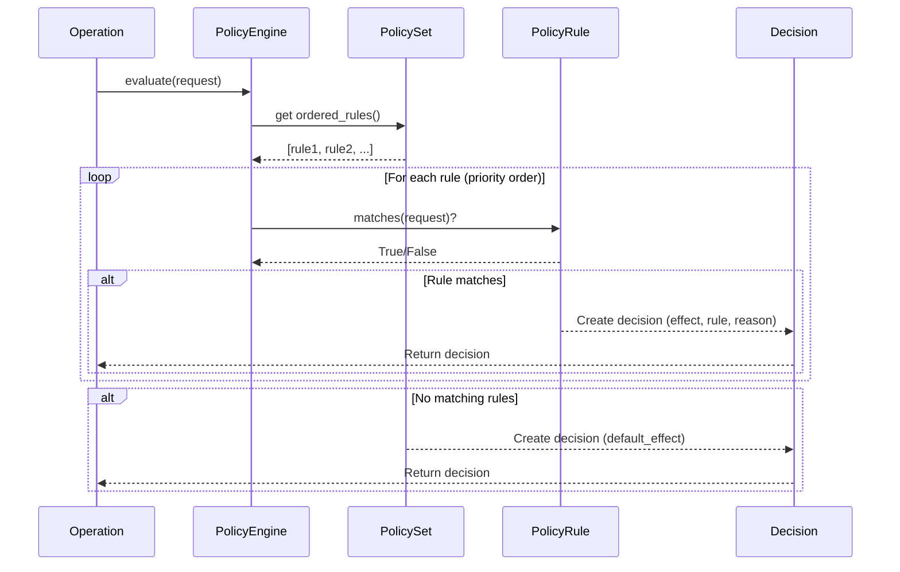

# Governance Overview

Spark's governance system provides policy-based control over agent and graph behavior, enabling organizations to enforce security, compliance, and operational policies at runtime. The system uses a declarative approach where policies are defined as rules that are evaluated before critical operations execute.

## Table of Contents

- [Core Concepts](#core-concepts)
- [Use Cases](#use-cases)
- [Architecture](#architecture)
- [Integration Points](#integration-points)
- [Quick Start](#quick-start)
- [Related Documentation](#related-documentation)

## Core Concepts

### Policy-Based Governance

Spark's governance system operates on a **request/decision model**:

1. **Request**: An operation that requires policy evaluation (e.g., tool execution, node execution, model invocation)
2. **Policy Evaluation**: The PolicyEngine evaluates registered rules against the request
3. **Decision**: The engine returns a decision with one of three effects:
   - `ALLOW`: Permit the operation to proceed
   - `DENY`: Block the operation immediately
   - `REQUIRE_APPROVAL`: Pause execution pending human approval

### Key Components

```
┌─────────────────┐
│  PolicyEngine   │ ← Evaluates requests against rules
└────────┬────────┘
         │
         ├── PolicySet (ordered rules)
         │   └── PolicyRule × N
         │       ├── Effect (ALLOW/DENY/REQUIRE_APPROVAL)
         │       ├── Patterns (actions, resources, subjects)
         │       └── Constraints (conditions)
         │
         └── Decision (effect + metadata)
```

**PolicyEngine**: Central evaluation engine that processes policy requests
- Evaluates rules in priority order (lower numbers first)
- Returns first matching rule's effect
- Falls back to default effect if no rules match

**PolicyRule**: Declarative rule defining what to allow/deny/approve
- Target selectors: actions, resources, subjects (glob patterns)
- Constraints: fine-grained conditions on request context
- Priority: controls evaluation order
- Metadata: attach custom information to decisions

**PolicySet**: Collection of rules with shared default behavior
- Named collection for organizational purposes
- Default effect when no rules match
- Ordered evaluation by priority

## Use Cases

### 1. Cost Control

Prevent expensive operations or enforce budget limits:

```python
from spark.governance import PolicyRule, PolicyEffect, PolicyConstraint

# Require approval for expensive models
expensive_model_rule = PolicyRule(
    name="expensive_model_approval",
    effect=PolicyEffect.REQUIRE_APPROVAL,
    actions=["agent:tool_execute", "agent:model_invoke"],
    resources=["model://gpt-4*", "model://claude-opus*"],
    constraints=[
        PolicyConstraint(key="estimated_cost", any_of=[])  # No specific constraint
    ],
    priority=10
)

# Deny requests exceeding cost threshold
cost_cap_rule = PolicyRule(
    name="cost_cap",
    effect=PolicyEffect.DENY,
    actions=["agent:*"],
    resources=["*"],
    constraints=[
        PolicyConstraint(key="estimated_cost", equals=None)  # Custom validation needed
    ],
    priority=5  # Higher priority than approval rule
)
```

### 2. Security

Restrict access to dangerous operations or sensitive data:

```python
# Block execution of dangerous tools
security_rule = PolicyRule(
    name="block_dangerous_tools",
    effect=PolicyEffect.DENY,
    actions=["agent:tool_execute"],
    resources=["tool://shell_execute", "tool://eval_code"],
    subjects=["role:untrusted_user"]
)

# Require approval for data access
data_access_rule = PolicyRule(
    name="sensitive_data_approval",
    effect=PolicyEffect.REQUIRE_APPROVAL,
    actions=["node:execute"],
    resources=["graph://*/nodes/DatabaseQuery*"],
    constraints=[
        PolicyConstraint(key="query.contains_pii", equals=True)
    ]
)
```

### 3. Compliance

Enforce regulatory requirements and audit trails:

```python
# Ensure data residency requirements
compliance_rule = PolicyRule(
    name="data_residency_eu",
    effect=PolicyEffect.DENY,
    actions=["agent:tool_execute"],
    resources=["tool://s3_upload"],
    constraints=[
        PolicyConstraint(key="tool.arguments.region", not_any_of=["eu-west-1", "eu-central-1"])
    ]
)

# Require approval for actions on regulated data
hipaa_rule = PolicyRule(
    name="hipaa_approval",
    effect=PolicyEffect.REQUIRE_APPROVAL,
    actions=["node:execute", "agent:tool_execute"],
    resources=["*"],
    constraints=[
        PolicyConstraint(key="data_classification", equals="PHI")
    ]
)
```

### 4. Access Control

Limit who can perform specific operations:

```python
# Allow only admins to execute privileged operations
admin_only_rule = PolicyRule(
    name="admin_only",
    effect=PolicyEffect.DENY,
    actions=["graph:deploy", "graph:delete"],
    resources=["graph://production/*"],
    subjects=["role:admin"],  # Deny if NOT admin (inverted logic via default)
)

# Require approval for cross-tenant access
tenant_isolation_rule = PolicyRule(
    name="cross_tenant_approval",
    effect=PolicyEffect.REQUIRE_APPROVAL,
    actions=["*"],
    resources=["*"],
    constraints=[
        PolicyConstraint(key="subject.tenant_id", equals=None),  # Different from resource.tenant_id
    ]
)
```

## Architecture

### Request/Decision Model

The governance system uses a structured request/decision flow:



### PolicyEngine

The `PolicyEngine` is the central component that evaluates requests:

```python
from spark.governance import PolicyEngine, PolicySet, PolicyRequest, PolicySubject

# Create engine with policy set
policy_set = PolicySet(
    name="production_policies",
    default_effect=PolicyEffect.ALLOW,  # Default when no rules match
    rules=[rule1, rule2, rule3]
)

engine = PolicyEngine(policy_set=policy_set)

# Evaluate request (returns decision without raising)
request = PolicyRequest(
    subject=PolicySubject(identifier="user-123", roles=["developer"]),
    action="agent:tool_execute",
    resource="tool://web_search",
    context={"tool": {"arguments": {"query": "example"}}}
)

decision = engine.evaluate(request)

if decision.effect == PolicyEffect.DENY:
    print(f"Denied: {decision.reason}")
elif decision.effect == PolicyEffect.REQUIRE_APPROVAL:
    print(f"Approval required: {decision.reason}")
else:
    print("Allowed")

# Enforce request (raises exception on DENY or REQUIRE_APPROVAL)
try:
    decision = engine.enforce(request)
    # Proceed with operation
except PolicyViolationError as e:
    print(f"Policy denied: {e}")
except PolicyApprovalRequired as e:
    print(f"Approval needed: {e.approval}")
```

### Policy Evaluation Flow

Rules are evaluated in **priority order** (lower numbers first):

1. Engine retrieves ordered rules from PolicySet
2. For each rule (in priority order):
   - Check if action pattern matches request.action
   - Check if resource pattern matches request.resource
   - Check if subject pattern matches request.subject
   - Evaluate all constraints against request context
   - If ALL checks pass, return rule's effect
3. If no rules match, return PolicySet's default_effect

**Key Principle**: First matching rule wins. Lower priority rules are never evaluated once a match is found.

## Integration Points

### Graph Integration

Graphs automatically enforce policies before executing nodes:

```python
from spark.graphs import Graph
from spark.governance import PolicySet, PolicyRule, PolicyEffect, PolicyConstraint

# Define policy
node_policy = PolicyRule(
    name="block_sensitive_nodes",
    effect=PolicyEffect.DENY,
    actions=["node:execute"],
    resources=["graph://*/nodes/*"],
    constraints=[
        PolicyConstraint(key="node.type", equals="SensitiveNode")
    ]
)

policy_set = PolicySet(
    default_effect=PolicyEffect.ALLOW,
    rules=[node_policy]
)

# Create graph with policy
graph = Graph(start=my_node, policy_set=policy_set)

# Policy is enforced automatically on graph.run()
try:
    result = await graph.run()
except PolicyViolationError as e:
    print(f"Graph execution blocked: {e}")
    print(f"Rule: {e.decision.rule}")
```

Policy events are recorded in graph state:

```python
# Check policy evaluation history
events = await graph.state.get('policy_events', [])
for event in events:
    print(f"Action: {event['action']}, Decision: {event['decision']}")
```

### Agent Integration

Agents enforce policies before tool execution:

```python
from spark.agents import Agent, AgentConfig
from spark.tools.decorator import tool
from spark.governance import PolicySet, PolicyRule, PolicyEffect

@tool
def sensitive_operation(data: str) -> str:
    """Perform a sensitive operation."""
    return f"Processed: {data}"

# Define tool policy
tool_policy = PolicyRule(
    name="require_approval_sensitive",
    effect=PolicyEffect.REQUIRE_APPROVAL,
    actions=["agent:tool_execute"],
    resources=["tool://sensitive_operation"]
)

# Configure agent with policy
config = AgentConfig(
    model=my_model,
    tools=[sensitive_operation],
    policy_set=PolicySet(
        default_effect=PolicyEffect.ALLOW,
        rules=[tool_policy]
    )
)

agent = Agent(config=config)

# Policy is enforced during agent execution
try:
    result = await agent.run("Execute sensitive operation")
except PolicyApprovalRequired as e:
    approval = e.approval
    print(f"Approval ID: {approval.approval_id}")
    print(f"Action: {approval.action}")
    print(f"Resource: {approval.resource}")
    # Handle approval workflow
```

### Node Integration

Individual nodes can enforce policies in their process methods:

```python
from spark.nodes import Node
from spark.nodes.types import ExecutionContext
from spark.governance import PolicyEngine, PolicyRequest, PolicySubject

class GovernedNode(Node):
    def __init__(self, policy_engine: PolicyEngine, **kwargs):
        super().__init__(**kwargs)
        self.policy_engine = policy_engine

    async def process(self, context: ExecutionContext):
        # Enforce policy before processing
        request = PolicyRequest(
            subject=PolicySubject(identifier="system"),
            action="node:process",
            resource=f"node://{self.__class__.__name__}",
            context={"inputs": context.inputs.model_dump()}
        )

        self.policy_engine.enforce(request)

        # Proceed with processing
        result = await self._do_processing(context)
        return {"result": result}
```

## Quick Start

### Basic Setup

```python
from spark.governance import (
    PolicyEngine, PolicySet, PolicyRule, PolicyEffect,
    PolicyRequest, PolicySubject, PolicyConstraint
)

# Step 1: Define rules
rules = [
    PolicyRule(
        name="allow_read_operations",
        effect=PolicyEffect.ALLOW,
        actions=["data:read", "data:list"],
        resources=["dataset://*"],
        priority=10
    ),
    PolicyRule(
        name="require_approval_for_writes",
        effect=PolicyEffect.REQUIRE_APPROVAL,
        actions=["data:write", "data:delete"],
        resources=["dataset://production/*"],
        priority=5  # Higher priority than read rule
    ),
    PolicyRule(
        name="deny_sensitive_data",
        effect=PolicyEffect.DENY,
        actions=["*"],
        resources=["dataset://pii/*"],
        subjects=["role:intern"],
        priority=1  # Highest priority
    )
]

# Step 2: Create policy set
policy_set = PolicySet(
    name="data_governance",
    default_effect=PolicyEffect.DENY,  # Deny by default
    rules=rules
)

# Step 3: Create engine
engine = PolicyEngine(policy_set=policy_set)

# Step 4: Evaluate requests
request = PolicyRequest(
    subject=PolicySubject(
        identifier="user-alice",
        roles=["developer", "data_analyst"]
    ),
    action="data:read",
    resource="dataset://production/sales",
    context={"timestamp": "2025-12-05T10:00:00Z"}
)

decision = engine.evaluate(request)
print(f"Decision: {decision.effect}")
print(f"Rule: {decision.rule}")
print(f"Reason: {decision.reason}")
```

### Testing Policies

```python
import pytest
from spark.governance import (
    PolicyEngine, PolicySet, PolicyRule, PolicyEffect,
    PolicyRequest, PolicySubject, PolicyViolationError
)

def test_policy_denies_unauthorized_access():
    """Test that unauthorized users cannot access sensitive resources."""
    rule = PolicyRule(
        name="deny_unauthorized",
        effect=PolicyEffect.DENY,
        actions=["resource:access"],
        resources=["resource://sensitive/*"],
        subjects=["role:guest"]
    )

    engine = PolicyEngine(PolicySet(
        default_effect=PolicyEffect.ALLOW,
        rules=[rule]
    ))

    request = PolicyRequest(
        subject=PolicySubject(identifier="guest-123", roles=["guest"]),
        action="resource:access",
        resource="resource://sensitive/data"
    )

    with pytest.raises(PolicyViolationError):
        engine.enforce(request)

@pytest.mark.asyncio
async def test_graph_enforces_policy():
    """Test that graphs enforce policies during execution."""
    from spark.graphs import Graph
    from spark.nodes import Node

    class TestNode(Node):
        async def process(self, context):
            return {"done": True}

    rule = PolicyRule(
        name="deny_test_nodes",
        effect=PolicyEffect.DENY,
        actions=["node:execute"],
        resources=["graph://*/nodes/*"],
        constraints=[
            PolicyConstraint(key="node.type", equals="TestNode")
        ]
    )

    graph = Graph(
        start=TestNode(),
        policy_set=PolicySet(
            default_effect=PolicyEffect.ALLOW,
            rules=[rule]
        )
    )

    with pytest.raises(PolicyViolationError):
        await graph.run()
```

## Related Documentation

- [Policy Rules & Effects](policies.md) - Detailed guide to PolicyRule structure and effects
- [Policy Types](policy-types.md) - Common policy patterns for different use cases
- [Approval Workflows](approvals.md) - Human-in-the-loop approval integration
- [Governance Patterns](patterns.md) - Best practices and enterprise patterns

## Best Practices

### 1. Use Priority Effectively

Assign priorities based on specificity:
- **1-10**: Security and safety rules (most restrictive)
- **11-50**: Compliance and approval rules
- **51-100**: Access control and resource rules
- **101+**: Permissive rules

### 2. Start with Deny-by-Default

For production systems, use `default_effect=PolicyEffect.DENY` and explicitly allow operations:

```python
policy_set = PolicySet(
    name="production",
    default_effect=PolicyEffect.DENY,  # Safe default
    rules=[
        # Explicitly allow safe operations
        PolicyRule(name="allow_safe_reads", effect=PolicyEffect.ALLOW, ...),
        PolicyRule(name="allow_safe_tools", effect=PolicyEffect.ALLOW, ...)
    ]
)
```

### 3. Test Policies Thoroughly

Create comprehensive test suites for your policies:

```python
def test_policy_matrix():
    """Test all combinations of subjects, actions, and resources."""
    test_cases = [
        (subject_admin, "data:write", "dataset://prod", PolicyEffect.ALLOW),
        (subject_intern, "data:write", "dataset://prod", PolicyEffect.DENY),
        (subject_admin, "data:delete", "dataset://prod", PolicyEffect.REQUIRE_APPROVAL),
    ]

    for subject, action, resource, expected_effect in test_cases:
        request = PolicyRequest(subject=subject, action=action, resource=resource)
        decision = engine.evaluate(request)
        assert decision.effect == expected_effect
```

### 4. Use Descriptive Names and Reasons

Make policies self-documenting:

```python
PolicyRule(
    name="pci_compliance_card_data_encryption",
    description="PCI-DSS requirement: All card data must be encrypted at rest and in transit",
    effect=PolicyEffect.DENY,
    # ... rest of rule
)
```

### 5. Monitor Policy Decisions

Track policy evaluations for audit and debugging:

```python
# In production, log all policy decisions
decision = engine.evaluate(request)
logger.info(
    "Policy decision",
    effect=decision.effect,
    rule=decision.rule,
    subject=request.subject.identifier,
    action=request.action,
    resource=request.resource
)
```

## Performance Considerations

- **Rule Evaluation**: Rules are evaluated sequentially in priority order. First match wins.
- **Optimization**: Place most commonly matched rules with lower priority numbers
- **Constraints**: Constraint evaluation is fast (simple dict lookups and comparisons)
- **Caching**: Consider caching decisions for identical requests if evaluating frequently

## Next Steps

1. **Learn the details**: Read [Policy Rules & Effects](policies.md) to understand rule structure
2. **Explore examples**: See [Policy Types](policy-types.md) for common patterns
3. **Add approvals**: Learn about [Approval Workflows](approvals.md) for human-in-the-loop
4. **Scale up**: Study [Governance Patterns](patterns.md) for enterprise deployment
