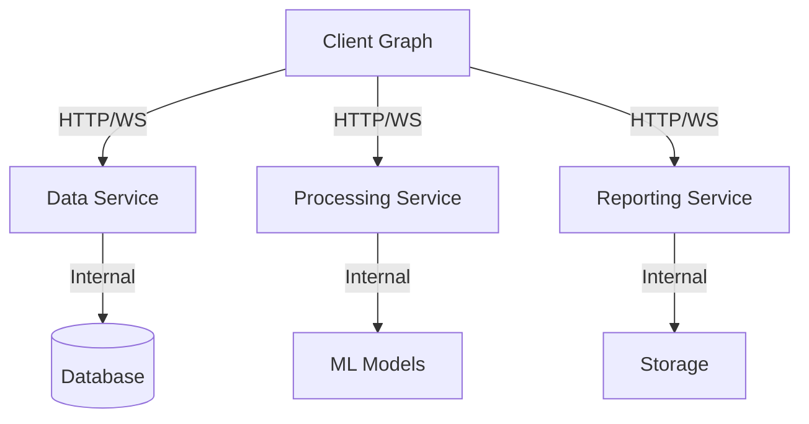

# RPC and Distributed Workflows

This guide covers building distributed workflows using Spark's RPC system, including service decomposition, state management across services, error handling, and testing strategies.

## Table of Contents

- [Overview](#overview)
- [Distributed Graph Architecture](#distributed-graph-architecture)
- [Service Decomposition Patterns](#service-decomposition-patterns)
- [Local-Remote Node Mixing](#local-remote-node-mixing)
- [State Management Across Services](#state-management-across-services)
- [Error Handling in Distributed Systems](#error-handling-in-distributed-systems)
- [Testing Distributed Workflows](#testing-distributed-workflows)

## Overview

Spark's RPC system enables building distributed workflows where nodes can run as independent services across multiple machines. This provides scalability, fault isolation, and independent deployment.

**Key Components**:
- **RpcNode**: JSON-RPC 2.0 server exposing nodes as remote services
- **RemoteRpcProxyNode**: Client that calls remote services from local graphs
- **Transport Layer**: HTTP and WebSocket support with SSL/TLS
- **Notifications**: Server-to-client push messages for events

## Distributed Graph Architecture

### Monolithic vs. Distributed

```python
# Monolithic (single process)
node1 = ProcessingNode()
node2 = AnalysisNode()
node3 = ReportNode()

node1 >> node2 >> node3
graph = Graph(start=node1)

# Distributed (multiple services)
local_node1 = ProcessingNode()
remote_node2 = RemoteRpcProxyNode(config=RemoteRpcProxyConfig(
    endpoint="http://analysis-service:8000"
))
remote_node3 = RemoteRpcProxyNode(config=RemoteRpcProxyConfig(
    endpoint="http://report-service:8000"
))

local_node1 >> remote_node2 >> remote_node3
graph = Graph(start=local_node1)
```

### Service-Oriented Architecture



## Service Decomposition Patterns

### By Domain Boundary

Separate services by business domain:

```python
# Customer Service
class CustomerRpcNode(RpcNode):
    """Customer management service."""

    async def rpc_get_customer(self, params, context):
        """Get customer information."""
        customer_id = params.get('customer_id')
        return await self.db.get_customer(customer_id)

    async def rpc_update_customer(self, params, context):
        """Update customer information."""
        customer_id = params.get('customer_id')
        updates = params.get('updates')
        return await self.db.update_customer(customer_id, updates)

# Order Service
class OrderRpcNode(RpcNode):
    """Order management service."""

    async def rpc_create_order(self, params, context):
        """Create new order."""
        customer_id = params.get('customer_id')
        items = params.get('items')
        return await self.order_system.create(customer_id, items)

    async def rpc_get_order(self, params, context):
        """Get order details."""
        order_id = params.get('order_id')
        return await self.order_system.get(order_id)

# Inventory Service
class InventoryRpcNode(RpcNode):
    """Inventory management service."""

    async def rpc_check_availability(self, params, context):
        """Check product availability."""
        sku = params.get('sku')
        quantity = params.get('quantity', 1)
        return await self.inventory.check_available(sku, quantity)

    async def rpc_reserve_inventory(self, params, context):
        """Reserve inventory for order."""
        order_id = params.get('order_id')
        items = params.get('items')
        return await self.inventory.reserve(order_id, items)
```

### By Capability

Separate services by technical capability:

```python
# Data Processing Service
class DataProcessingRpcNode(RpcNode):
    """Heavy data processing service."""

    async def rpc_transform_data(self, params, context):
        """Transform large datasets."""
        data = params.get('data')
        transform_type = params.get('transform_type')
        return await self.processor.transform(data, transform_type)

    async def rpc_aggregate_data(self, params, context):
        """Aggregate data."""
        data = params.get('data')
        aggregation = params.get('aggregation')
        return await self.processor.aggregate(data, aggregation)

# ML Inference Service
class MLInferenceRpcNode(RpcNode):
    """Machine learning inference service."""

    async def rpc_predict(self, params, context):
        """Run ML model prediction."""
        model_name = params.get('model_name')
        features = params.get('features')
        model = self.models[model_name]
        return await model.predict(features)

# Cache Service
class CacheRpcNode(RpcNode):
    """Distributed caching service."""

    async def rpc_get(self, params, context):
        """Get cached value."""
        key = params.get('key')
        return await self.cache.get(key)

    async def rpc_set(self, params, context):
        """Set cached value."""
        key = params.get('key')
        value = params.get('value')
        ttl = params.get('ttl', 3600)
        return await self.cache.set(key, value, ttl)
```

### By Scale Requirements

Isolate high-load components:

```python
# High-volume logging service
class LoggingRpcNode(RpcNode):
    """High-throughput logging service."""

    def __init__(self, **kwargs):
        super().__init__(**kwargs)
        self.log_buffer = []
        self.buffer_size = 1000

    async def rpc_log(self, params, context):
        """Log message (async, non-blocking)."""
        self.log_buffer.append(params)

        if len(self.log_buffer) >= self.buffer_size:
            await self._flush_logs()

        return {'status': 'queued'}

    async def _flush_logs(self):
        """Batch write logs."""
        if self.log_buffer:
            await self.db.bulk_insert(self.log_buffer)
            self.log_buffer = []

# Analytics service (separate from real-time path)
class AnalyticsRpcNode(RpcNode):
    """Analytics processing (can be slower)."""

    async def rpc_compute_analytics(self, params, context):
        """Compute analytics (long-running)."""
        date_range = params.get('date_range')
        metrics = params.get('metrics')

        # Can take minutes - doesn't block other services
        return await self.analytics.compute(date_range, metrics)
```

## Local-Remote Node Mixing

Combine local and remote nodes in the same graph:

### Hybrid Graph Pattern

```python
from spark.nodes.rpc_client import RemoteRpcProxyNode, RemoteRpcProxyConfig
from spark.nodes import Node
from spark.graphs import Graph

# Local preprocessing
class LocalPreprocessor(Node):
    """Fast local preprocessing."""

    async def process(self, context):
        data = context.inputs.content.get('raw_data')

        # Quick local processing
        cleaned = self.clean_data(data)
        validated = self.validate_data(cleaned)

        return {
            'preprocessed_data': validated,
            'preprocessing_time': 0.05
        }

# Remote heavy processing
remote_processor_config = RemoteRpcProxyConfig(
    endpoint="http://processing-cluster:8000",
    transport="http",
    request_timeout=300.0  # 5 minutes for heavy work
)

remote_processor = RemoteRpcProxyNode(
    config=remote_processor_config,
    name="RemoteProcessor"
)

# Local postprocessing
class LocalPostprocessor(Node):
    """Fast local postprocessing."""

    async def process(self, context):
        result = context.inputs.content.get('processed_data')

        # Format for output
        formatted = self.format_result(result)

        return {'final_result': formatted}

# Build hybrid graph
preprocessor = LocalPreprocessor(name="LocalPrep")
postprocessor = LocalPostprocessor(name="LocalPost")

preprocessor >> remote_processor >> postprocessor

graph = Graph(start=preprocessor)
```

### Smart Routing

Route requests based on characteristics:

```python
class SmartRouterNode(Node):
    """Routes to local or remote processing based on load."""

    def __init__(self, local_processor, remote_proxy, **kwargs):
        super().__init__(**kwargs)
        self.local = local_processor
        self.remote = remote_proxy
        self.local_queue_size = 0

    async def process(self, context):
        data_size = len(context.inputs.content.get('data', []))

        # Small data or queue not full -> local
        if data_size < 1000 and self.local_queue_size < 10:
            self.local_queue_size += 1
            try:
                result = await self.local.process(context)
                return {'result': result, 'processed_by': 'local'}
            finally:
                self.local_queue_size -= 1

        # Large data or local busy -> remote
        else:
            # Call remote service
            remote_result = await self.call_remote_service(context)
            return {'result': remote_result, 'processed_by': 'remote'}

    async def call_remote_service(self, context):
        """Call remote RPC service."""
        # RemoteRpcProxyNode does this automatically
        # This is just for illustration
        return await self.remote.process(context)
```

## State Management Across Services

Managing state in distributed workflows:

### Stateless Services

Design services to be stateless:

```python
class StatelessProcessingRpcNode(RpcNode):
    """Stateless processing service (horizontally scalable)."""

    async def rpc_process(self, params, context):
        """Process data without maintaining state."""
        # All state comes from params
        data = params.get('data')
        config = params.get('config', {})

        # Pure function - no side effects
        result = self.transform(data, config)

        return {'result': result}

    def transform(self, data, config):
        """Stateless transformation."""
        # Only uses input parameters
        return f"Processed: {data} with {config}"

# Can run multiple instances
# Each request is independent
```

### Shared State via Database

Use database for shared state:

```python
class StatefulServiceRpcNode(RpcNode):
    """Service that uses database for shared state."""

    def __init__(self, db_connection_string, **kwargs):
        super().__init__(**kwargs)
        self.db = Database(db_connection_string)

    async def rpc_update_and_get(self, params, context):
        """Update shared state and return new value."""
        key = params.get('key')
        increment = params.get('increment', 1)

        # Atomic update via database
        async with self.db.transaction() as tx:
            current = await tx.get(key) or 0
            new_value = current + increment
            await tx.set(key, new_value)

        return {'key': key, 'value': new_value}

# Multiple service instances share state via DB
# Database handles consistency
```

### State Passing Pattern

Pass state through request/response:

```python
# Service 1: Enriches state
class EnrichmentRpcNode(RpcNode):
    async def rpc_enrich(self, params, context):
        """Enrich data and pass state forward."""
        data = params.get('data')
        state = params.get('state', {})

        # Add enrichment to state
        state['enrichment'] = self.enrich(data)
        state['enriched_at'] = time.time()

        return {
            'data': data,
            'state': state  # Pass state forward
        }

# Service 2: Uses state from previous service
class ProcessingRpcNode(RpcNode):
    async def rpc_process(self, params, context):
        """Process using state from previous service."""
        data = params.get('data')
        state = params.get('state', {})

        # Use enrichment from previous service
        enrichment = state.get('enrichment', {})
        result = self.process(data, enrichment)

        # Update state
        state['processed'] = True
        state['processed_at'] = time.time()

        return {
            'result': result,
            'state': state  # Continue passing state
        }

# Client graph passes state through chain
proxy1 = RemoteRpcProxyNode(config=RemoteRpcProxyConfig(
    endpoint="http://enrichment:8000"
))
proxy2 = RemoteRpcProxyNode(config=RemoteRpcProxyConfig(
    endpoint="http://processing:8000"
))

class StatePassingNode(Node):
    async def process(self, context):
        # Initial request with empty state
        return {
            'method': 'enrich',
            'data': context.inputs.content,
            'state': {}  # Start with empty state
        }

state_node = StatePassingNode()
state_node >> proxy1 >> proxy2
```

### Distributed GraphState

Share GraphState across services (requires shared backend):

```python
from spark.graphs.graph_state import GraphState, SQLiteBackend

# Shared SQLite backend (or PostgreSQL for production)
shared_backend = SQLiteBackend("/shared/graph_state.db")

# Service 1
class Service1RpcNode(RpcNode):
    def __init__(self, **kwargs):
        super().__init__(**kwargs)
        self.graph_state = GraphState(backend=shared_backend)

    async def rpc_update_state(self, params, context):
        """Update shared graph state."""
        key = params.get('key')
        value = params.get('value')

        await self.graph_state.set(key, value)
        return {'updated': True}

# Service 2
class Service2RpcNode(RpcNode):
    def __init__(self, **kwargs):
        super().__init__(**kwargs)
        self.graph_state = GraphState(backend=shared_backend)

    async def rpc_read_state(self, params, context):
        """Read shared graph state."""
        key = params.get('key')
        value = await self.graph_state.get(key)
        return {'value': value}

# Both services share state via backend
```

## Error Handling in Distributed Systems

Robust error handling for distributed workflows:

### Retry with Backoff

```python
from spark.nodes.rpc_client import RemoteRpcProxyConfig

# Configure automatic retry
config = RemoteRpcProxyConfig(
    endpoint="http://unreliable-service:8000",
    request_timeout=30.0,
    max_retries=3,
    retry_backoff_factor=2.0,  # 1s, 2s, 4s
    retry_on_timeout=True
)

proxy = RemoteRpcProxyNode(config=config)
```

### Circuit Breaker Pattern

```python
class CircuitBreakerProxy(Node):
    """Proxy with circuit breaker for failing services."""

    def __init__(self, remote_proxy, **kwargs):
        super().__init__(**kwargs)
        self.proxy = remote_proxy
        self.failure_count = 0
        self.circuit_open = False
        self.circuit_open_time = None
        self.threshold = 5
        self.reset_timeout = 60.0

    async def process(self, context):
        # Check if circuit should close
        if self.circuit_open:
            if time.time() - self.circuit_open_time > self.reset_timeout:
                self.circuit_open = False
                self.failure_count = 0
            else:
                return {
                    'error': 'Circuit breaker open',
                    'success': False
                }

        # Try remote call
        try:
            result = await self.proxy.process(context)
            # Success - reset counter
            self.failure_count = 0
            return result

        except Exception as e:
            # Failure - increment counter
            self.failure_count += 1

            if self.failure_count >= self.threshold:
                # Open circuit
                self.circuit_open = True
                self.circuit_open_time = time.time()

            return {
                'error': str(e),
                'success': False
            }
```

### Fallback Services

```python
class FallbackProxyNode(Node):
    """Proxy with fallback to alternate service."""

    def __init__(self, primary_proxy, fallback_proxy, **kwargs):
        super().__init__(**kwargs)
        self.primary = primary_proxy
        self.fallback = fallback_proxy

    async def process(self, context):
        try:
            # Try primary service
            result = await self.primary.process(context)
            return {'result': result, 'service': 'primary'}

        except Exception as e:
            # Primary failed - try fallback
            try:
                result = await self.fallback.process(context)
                return {
                    'result': result,
                    'service': 'fallback',
                    'primary_error': str(e)
                }

            except Exception as fallback_error:
                # Both failed
                return {
                    'error': 'Both services failed',
                    'primary_error': str(e),
                    'fallback_error': str(fallback_error),
                    'success': False
                }
```

### Timeout Handling

```python
import asyncio

class TimeoutProxyNode(Node):
    """Proxy with configurable timeout and fallback."""

    async def process(self, context):
        try:
            # 5 second timeout
            result = await asyncio.wait_for(
                self.proxy.process(context),
                timeout=5.0
            )
            return {'result': result, 'timed_out': False}

        except asyncio.TimeoutError:
            # Return cached result or error
            cached = await self.get_cached_result(context)
            if cached:
                return {
                    'result': cached,
                    'timed_out': True,
                    'source': 'cache'
                }
            else:
                return {
                    'error': 'Request timed out and no cache available',
                    'timed_out': True,
                    'success': False
                }
```

## Testing Distributed Workflows

Strategies for testing distributed systems:

### Local Testing with Mock Services

```python
# Mock RPC service for testing
class MockRpcNode(Node):
    """Mock remote service for local testing."""

    def __init__(self, mock_response, **kwargs):
        super().__init__(**kwargs)
        self.mock_response = mock_response

    async def process(self, context):
        # Return mock response
        return self.mock_response

# Replace remote proxies with mocks
def create_test_graph():
    """Create graph with mock services for testing."""
    local_node = ProcessingNode()

    # Mock instead of remote proxy
    mock_service = MockRpcNode(
        mock_response={'result': 'mocked'},
        name="MockRemote"
    )

    local_node >> mock_service

    return Graph(start=local_node)

# Test
async def test_workflow():
    graph = create_test_graph()
    result = await graph.run({'data': 'test'})
    assert result.content['result'] == 'mocked'
```

### Integration Testing with Test Services

```python
# Start test RPC service
async def start_test_service():
    """Start RPC service for integration testing."""
    service = TestRpcNode(host="127.0.0.1", port=8001)
    await service.start_server()
    return service

# Test with real RPC calls
async def test_rpc_integration():
    # Start service
    service = await start_test_service()

    try:
        # Create proxy
        proxy = RemoteRpcProxyNode(config=RemoteRpcProxyConfig(
            endpoint="http://127.0.0.1:8001"
        ))

        # Test RPC call
        context = ExecutionContext(
            inputs=NodeMessage(content={'method': 'test', 'data': 'value'}),
            state={}
        )

        result = await proxy.process(context)
        assert result['success'] is True

    finally:
        # Cleanup
        await service.stop_server()
```

### End-to-End Testing

```python
async def test_distributed_workflow_e2e():
    """End-to-end test of distributed workflow."""

    # Start all services
    services = []
    try:
        service1 = await start_service(ServiceA, port=8001)
        service2 = await start_service(ServiceB, port=8002)
        service3 = await start_service(ServiceC, port=8003)
        services = [service1, service2, service3]

        # Create client graph
        proxy1 = RemoteRpcProxyNode(config=RemoteRpcProxyConfig(
            endpoint="http://localhost:8001"
        ))
        proxy2 = RemoteRpcProxyNode(config=RemoteRpcProxyConfig(
            endpoint="http://localhost:8002"
        ))
        proxy3 = RemoteRpcProxyNode(config=RemoteRpcProxyConfig(
            endpoint="http://localhost:8003"
        ))

        proxy1 >> proxy2 >> proxy3
        graph = Graph(start=proxy1)

        # Run workflow
        result = await graph.run({'data': 'test'})

        # Verify end-to-end
        assert result.content['success'] is True

    finally:
        # Cleanup all services
        for service in services:
            await service.stop_server()
```

## Best Practices

1. **Design for Failure**: Assume services can fail, implement retries and fallbacks
2. **Stateless Services**: Make services stateless for horizontal scaling
3. **Idempotent Operations**: Design operations to be safely retryable
4. **Timeout Everything**: Always set timeouts on remote calls
5. **Monitor Latency**: Track network overhead and service latency
6. **Version APIs**: Version RPC methods for backward compatibility
7. **Use Circuit Breakers**: Prevent cascading failures
8. **Centralized Logging**: Collect logs from all services for debugging
9. **Health Checks**: Implement health check endpoints
10. **Graceful Degradation**: Provide fallback behavior when services are unavailable

## Related Documentation

- [RPC System Reference](/docs/rpc/overview.md) - Complete RPC guide
- [RPC Server](/docs/rpc/server.md) - RpcNode documentation
- [RPC Client](/docs/rpc/client.md) - RemoteRpcProxyNode documentation
- [Error Handling](/docs/best-practices/error-handling.md) - Error handling strategies
- [Testing Strategies](/docs/best-practices/testing.md) - Testing approaches
