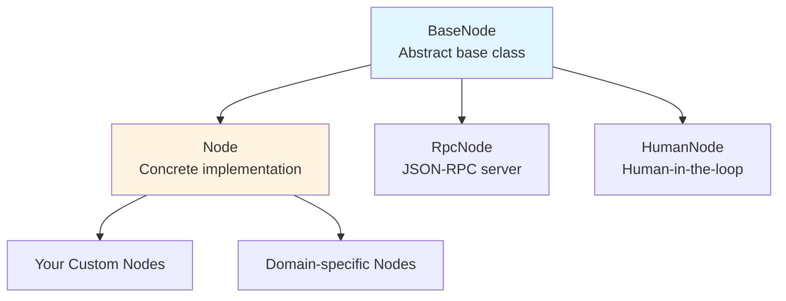
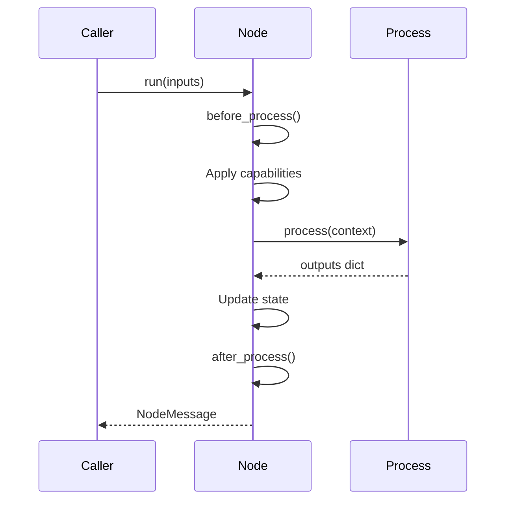
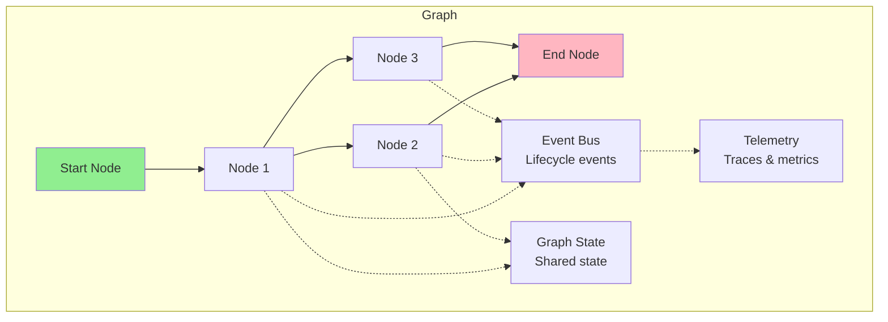
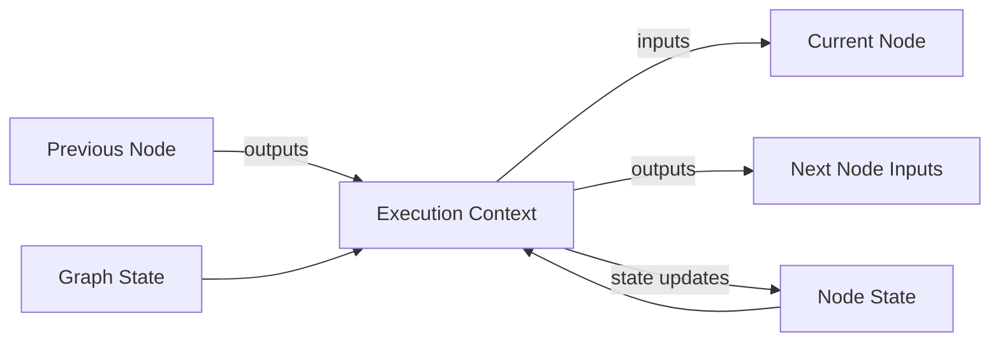
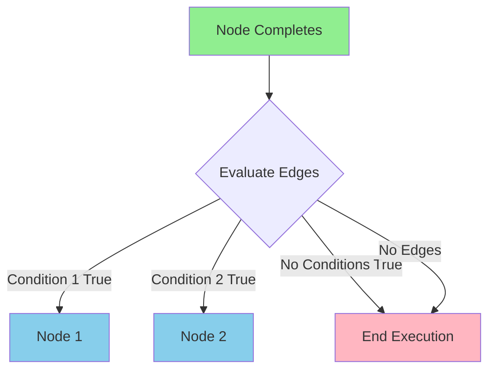
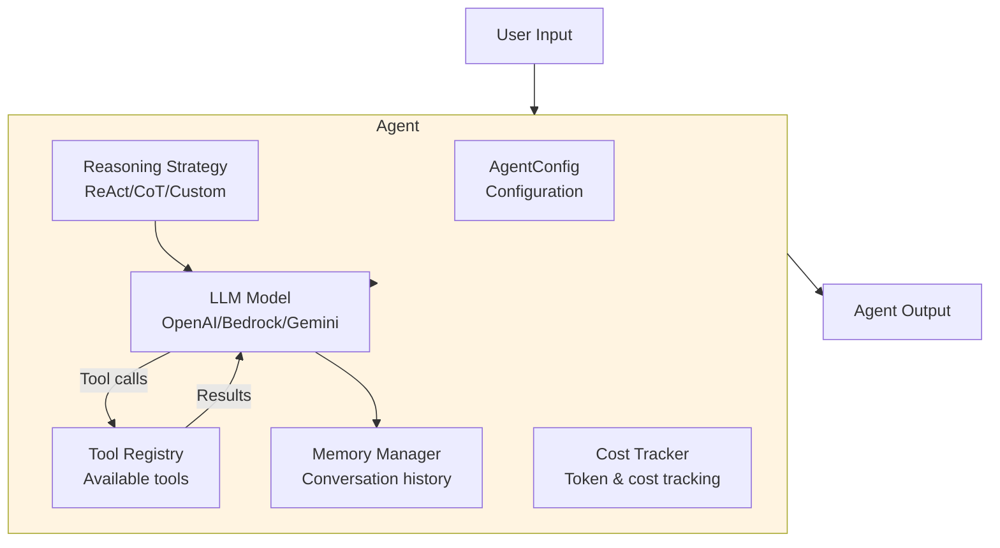
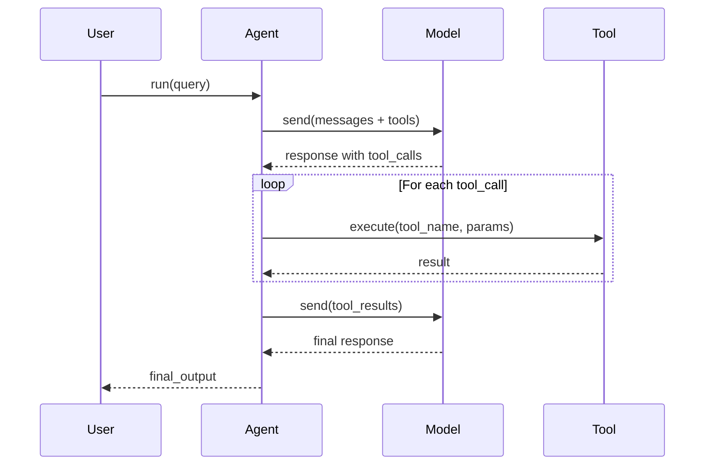
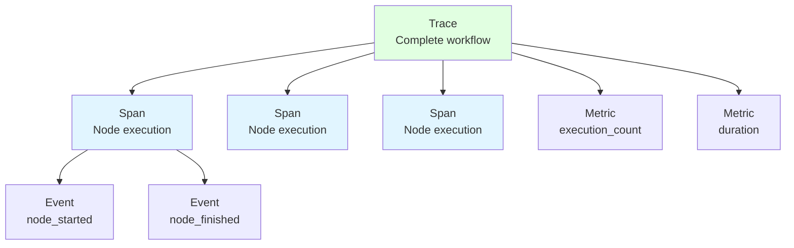

# Core Concepts

This guide provides a deep dive into Spark's architecture and fundamental concepts. Understanding these concepts will help you build sophisticated AI workflows effectively.

## Table of Contents

- [Actor Model and Node Architecture](#actor-model-and-node-architecture)
- [Graphs and Workflow Orchestration](#graphs-and-workflow-orchestration)
- [Execution Contexts](#execution-contexts)
- [State Management](#state-management)
- [Edges and Flow Control](#edges-and-flow-control)
- [Channels and Messaging](#channels-and-messaging)
- [Agents and Autonomy](#agents-and-autonomy)
- [Tools and Capabilities](#tools-and-capabilities)
- [Telemetry and Observability](#telemetry-and-observability)
- [Governance and Policies](#governance-and-policies)

## Actor Model and Node Architecture

Spark is built on the **Actor Model**, where each node is an independent processing unit that:
- Has its own state and lifecycle
- Processes messages asynchronously
- Communicates via message passing (not shared memory)
- Can be composed into larger systems

### Node Hierarchy



### BaseNode

The abstract base class (`spark/nodes/base.py`) provides:

**Core Functionality**:
- Edge management (`goto()`, `on()` methods)
- State container (`NodeState`)
- Lifecycle hooks (`before_process()`, `after_process()`)
- Message handling for long-running mode

**Properties**:
- `outputs`: Results from last execution
- `edges`: List of outgoing edges to other nodes
- `mailbox`: Channel for receiving messages

### Node

The concrete implementation (`spark/nodes/nodes.py`) adds:

**Capabilities System**:
- Retry policies with exponential backoff
- Timeouts with configurable limits
- Rate limiting per resource key
- Circuit breakers for fault tolerance
- Idempotency for duplicate prevention
- Batching for efficient processing

**Configuration**:
- `NodeConfig` for declarative setup
- `keep_in_state` for state persistence
- Continuous execution via `go()` method

**Example**:

```python
from spark.nodes import Node, NodeConfig
from spark.nodes.capabilities import RetryCapability, TimeoutCapability

class RobustNode(Node):
    def __init__(self):
        config = NodeConfig(
            retry_capability=RetryCapability(
                max_attempts=3,
                backoff_factor=2.0
            ),
            timeout_capability=TimeoutCapability(
                timeout_seconds=10.0
            ),
            keep_in_state=['important_data']
        )
        super().__init__(config=config)

    async def process(self, context):
        # Access previous state
        previous_data = context.state.get('important_data', [])

        # Do work
        new_data = await fetch_data()

        # Update state
        return {
            'important_data': previous_data + [new_data],
            'success': True
        }
```

### Node Lifecycle



## Graphs and Workflow Orchestration

Graphs are complete workflows composed of connected nodes. They handle orchestration, state management, and lifecycle events.

### Graph Architecture



### Execution Modes

Spark graphs support two execution modes:

#### 1. Standard Sequential Flow

Default mode for request/response workflows:

```python
from spark.graphs import Graph, Task

# Create graph
graph = Graph(start=start_node)

# Run with inputs
result = await graph.run({'data': 'input'})

# Access outputs
print(result.content)
```

**Characteristics**:
- Nodes execute sequentially
- Each node waits for previous to complete
- Outputs flow as inputs to next node
- Simple and predictable execution order

#### 2. Long-Running Mode

For continuous, concurrent workflows (agent systems):

```python
from spark.graphs import Graph, Task, TaskType
from spark.graphs.tasks import Budget

task = Task(
    inputs={'query': 'Hello'},
    type=TaskType.LONG_RUNNING,
    budget=Budget(max_seconds=60, max_tokens=10000)
)

graph = Graph(start=agent_node)
result = await graph.run(task)
```

**Characteristics**:
- All nodes start concurrently as workers
- Communication via channels (mailboxes)
- Each node processes messages from mailbox
- Continues until timeout or completion condition

### Graph Discovery

Graphs automatically discover nodes via BFS traversal:

```python
# Just specify start node
start = NodeA()
start >> NodeB() >> NodeC()

# Graph discovers all connected nodes automatically
graph = Graph(start=start)
```

**Discovery process**:
1. Start from `start` node
2. Use BFS to traverse all reachable edges
3. Collect unique nodes
4. Validate graph structure (no isolated nodes)

## Execution Contexts

The `ExecutionContext` is passed to every node's `process()` method, providing access to inputs, state, and metadata.

### Context Structure

```python
from spark.nodes.types import ExecutionContext

# ExecutionContext attributes:
context.inputs         # Inputs from previous node (NodeMessage)
context.state          # Node's persistent state (dict)
context.metadata       # Execution metadata (dict)
context.outputs        # Current node's outputs (dict)
context.graph_state    # Shared graph state (GraphState or None)
```

### Using Context

```python
class DataProcessor(Node):
    async def process(self, context):
        # Access inputs
        data = context.inputs.content.get('data')
        user_id = context.inputs.content.get('user_id')

        # Access node state
        cache = context.state.get('cache', {})

        # Access graph state
        total_processed = await context.graph_state.get('total', 0)
        await context.graph_state.set('total', total_processed + 1)

        # Access metadata
        execution_id = context.metadata.get('execution_id')

        # Process data
        result = transform(data)

        # Update node state via outputs
        cache[user_id] = result

        # Return outputs
        return {
            'result': result,
            'cache': cache,  # Saved to state if in keep_in_state
            'success': True
        }
```

### Context Lifecycle



## State Management

Spark provides two levels of state: node-level and graph-level.

### Node State

Each node maintains its own state via `NodeState`:

```python
class StatefulNode(Node):
    def __init__(self):
        config = NodeConfig(
            keep_in_state=['counter', 'history']  # Persist these keys
        )
        super().__init__(config=config)

    async def process(self, context):
        # Read from state
        counter = context.state.get('counter', 0)
        history = context.state.get('history', [])

        # Update state
        counter += 1
        history.append(f"Execution #{counter}")

        # Return - keys in keep_in_state are persisted
        return {
            'counter': counter,
            'history': history,
            'last_result': 'some value'  # Not persisted
        }
```

**State persistence**:
- Only keys listed in `keep_in_state` persist across executions
- State stored in `context.state` dict
- Accessible via `context.state.get()` in `process()` method

### Graph State (Global Shared State)

Graph state is shared across all nodes in a workflow:

```python
from spark.graphs import Graph

# Create graph with initial state
graph = Graph(
    start=start_node,
    initial_state={'counter': 0, 'results': []}
)

# Nodes access via context.graph_state
class WorkerNode(Node):
    async def process(self, context):
        # Thread-safe read
        counter = await context.graph_state.get('counter', 0)

        # Thread-safe write
        await context.graph_state.set('counter', counter + 1)

        # Batch update
        await context.graph_state.update({
            'counter': counter + 1,
            'last_worker': 'worker_1'
        })

        # Atomic transaction (read-modify-write)
        async with context.graph_state.transaction() as state:
            state['counter'] = state.get('counter', 0) + 1
            state['results'].append('result')

        return {'done': True}

# After execution, access from graph
result = await graph.run()
final_counter = await graph.get_state('counter')
snapshot = graph.get_state_snapshot()

# Reset between runs
graph.reset_state({'counter': 0})
```

**Thread safety**:
- Sequential mode: No locking (maximum performance)
- Long-running mode: Automatic locking for all operations
- Transactions: Always use for atomic read-modify-write

**Use cases**:
- Counters across workflow execution
- Aggregating results from multiple nodes
- Coordination flags and thresholds
- Global configuration or context

## Edges and Flow Control

Edges connect nodes and determine workflow flow. They can have conditional logic for branching.

### Edge Types

#### 1. Unconditional Edges

Simple connections without conditions:

```python
node1 >> node2 >> node3  # Chain nodes
```

#### 2. Conditional Edges

Edges with conditions based on node outputs:

```python
from spark.nodes import EdgeCondition

# Shorthand syntax
node1.on(status='success') >> node2
node1.on(status='failure') >> error_handler

# Full syntax with lambda
node1.goto(
    node2,
    condition=EdgeCondition(lambda n: n.outputs.content.get('value') > 100)
)
```

#### 3. Multiple Edges

One node can have multiple outgoing edges:

```python
router = RouterNode()

router.on(route='A') >> handler_a
router.on(route='B') >> handler_b
router.on(route='C') >> handler_c
```

### Edge Evaluation



**Evaluation rules**:
1. Conditions evaluated in order edges were added
2. First matching condition determines next node
3. If no conditions match, execution ends
4. If no edges exist, execution ends

### Looping

Create loops by connecting nodes back to themselves or earlier nodes:

```python
class LoopNode(Node):
    async def process(self, context):
        count = await context.graph_state.get('count', 0)
        count += 1
        await context.graph_state.set('count', count)

        print(f"Iteration {count}")

        return {'continue': count < 5}

loop_node = LoopNode()
loop_node.on(continue=True) >> loop_node  # Loop back to self

graph = Graph(start=loop_node, initial_state={'count': 0})
```

## Channels and Messaging

In long-running mode, nodes communicate via **channels** - asynchronous message queues.

### Channel Architecture

```python
from spark.nodes.channels import ChannelMessage, InMemoryChannel

# Each node has a mailbox
node.mailbox = InMemoryChannel()

# Send message
await node.mailbox.send(ChannelMessage(
    payload={'data': 'value'},
    metadata={'sender': 'node1'}
))

# Receive message
message = await node.mailbox.receive()
data = message.payload.get('data')

# Acknowledge processing
if message.ack:
    await message.ack()
```

### Message Structure

```python
from spark.nodes.channels import ChannelMessage

message = ChannelMessage(
    payload={'key': 'value'},      # Message data
    metadata={'timestamp': '...'},  # Message metadata
    ack=async_callback,             # Acknowledgment callback
    shutdown=False                  # Shutdown signal
)
```

### Channel Types

#### InMemoryChannel

Default implementation using `asyncio.Queue`:

```python
from spark.nodes.channels import InMemoryChannel

channel = InMemoryChannel(maxsize=100)
```

#### ForwardingChannel

Broadcasts messages to multiple downstream channels:

```python
from spark.nodes.channels import ForwardingChannel

# Broadcast to multiple nodes
forwarder = ForwardingChannel()
forwarder.add_downstream(node1.mailbox)
forwarder.add_downstream(node2.mailbox)

await forwarder.send(message)  # Both nodes receive
```

## Agents and Autonomy

Agents are autonomous AI entities that use LLMs to reason, make decisions, and take actions.

### Agent Architecture



### Agent Components

#### 1. Model

The LLM provider:

```python
from spark.models.openai import OpenAIModel
from spark.models.bedrock import BedrockModel

# OpenAI
model = OpenAIModel(model_id="gpt-4o")

# Bedrock
model = BedrockModel(model_id="us.anthropic.claude-sonnet-4-5-20250929-v1:0")
```

#### 2. Tools

Functions the agent can call:

```python
from spark.tools.decorator import tool

@tool
def search(query: str) -> str:
    """Search for information."""
    return search_web(query)

@tool
def calculate(expression: str) -> float:
    """Evaluate math expression."""
    return eval(expression)
```

#### 3. Memory

Conversation history management:

```python
from spark.agents import AgentConfig

config = AgentConfig(
    model=model,
    max_conversation_history=20,  # Keep last 20 messages
    memory_truncation_strategy='sliding_window'
)
```

#### 4. Reasoning Strategy

How the agent thinks:

```python
from spark.agents import ReActStrategy, ChainOfThoughtStrategy

# ReAct: Reasoning + Acting
strategy = ReActStrategy(verbose=True)

# Chain-of-Thought
strategy = ChainOfThoughtStrategy()
```

#### 5. Cost Tracking

Monitor token usage and costs:

```python
agent = Agent(config=config)

# Automatically tracked during execution
result = agent.run("Query")

# Get statistics
stats = agent.get_cost_stats()
print(f"Total cost: ${stats.total_cost:.4f}")
print(f"Total tokens: {stats.total_tokens:,}")
```

### Agent Execution Flow



## Tools and Capabilities

### Tools

Tools extend agent capabilities with external functions:

**Creating tools**:

```python
from spark.tools.decorator import tool

@tool
def fetch_data(source: str, limit: int = 10) -> dict:
    """Fetch data from a source.

    Args:
        source: Data source identifier
        limit: Maximum number of items to fetch

    Returns:
        Dictionary containing fetched data
    """
    data = fetch_from_source(source, limit)
    return {'items': data, 'count': len(data)}
```

**Tool system features**:
- Automatic schema generation from type hints and docstrings
- Support for sync and async functions
- Optional `context` parameter for tool execution context
- Central registry for tool discovery

### Capabilities

Capabilities enhance nodes with cross-cutting concerns:

#### RetryCapability

```python
from spark.nodes.capabilities import RetryCapability

capability = RetryCapability(
    max_attempts=3,
    backoff_factor=2.0,  # Exponential backoff
    exceptions_to_retry=(ConnectionError, TimeoutError)
)
```

#### TimeoutCapability

```python
from spark.nodes.capabilities import TimeoutCapability

capability = TimeoutCapability(timeout_seconds=30.0)
```

#### RateLimitCapability

```python
from spark.nodes.capabilities import RateLimitCapability

capability = RateLimitCapability(
    rate_limit=100,      # Max 100 operations
    period_seconds=60.0  # Per 60 seconds
)
```

#### CircuitBreakerCapability

```python
from spark.nodes.capabilities import CircuitBreakerCapability

capability = CircuitBreakerCapability(
    failure_threshold=5,  # Open after 5 failures
    recovery_timeout=60.0 # Try closing after 60 seconds
)
```

#### IdempotencyCapability

```python
from spark.nodes.capabilities import IdempotencyCapability

capability = IdempotencyCapability(
    key_generator=lambda ctx: hash(ctx.inputs.content)
)
```

#### BatchCapability

```python
from spark.nodes.capabilities import BatchCapability

capability = BatchCapability(
    batch_size=10,
    batch_timeout=5.0
)
```

## Telemetry and Observability

Telemetry provides comprehensive observability for all graph and node execution.

### Telemetry Data Model



### Telemetry Components

#### Trace

Complete workflow execution:

```python
trace = Trace(
    trace_id="uuid",
    name="workflow_name",
    start_time=datetime.utcnow(),
    end_time=None,
    status="running",
    attributes={'user': 'alice'}
)
```

#### Span

Individual operation within a trace:

```python
span = Span(
    span_id="uuid",
    trace_id="parent_trace_uuid",
    parent_span_id="parent_uuid",
    name="node_execution",
    kind=SpanKind.INTERNAL,
    start_time=datetime.utcnow(),
    attributes={'node_type': 'ProcessNode'}
)
```

#### Event

Discrete lifecycle moment:

```python
event = Event(
    event_id="uuid",
    type="node_finished",
    name="ProcessNode finished",
    timestamp=datetime.utcnow(),
    attributes={'duration': 1.23}
)
```

#### Metric

Numerical measurement:

```python
metric = Metric(
    name="execution_duration",
    value=1.23,
    unit="seconds",
    timestamp=datetime.utcnow(),
    attributes={'node': 'ProcessNode'}
)
```

### Using Telemetry

```python
from spark.telemetry import TelemetryConfig, TelemetryManager
from spark.graphs import Graph

# Configure telemetry
config = TelemetryConfig.create_sqlite(
    db_path="telemetry.db",
    sampling_rate=1.0,
    enable_metrics=True,
    enable_events=True
)

# Create graph with telemetry
graph = Graph(start=my_node, telemetry_config=config)

# Run graph (automatically instrumented)
await graph.run()

# Query telemetry
manager = TelemetryManager.get_instance()
await manager.flush()

traces = await manager.query_traces(limit=10)
for trace in traces:
    print(f"Trace: {trace.name}, Duration: {trace.duration:.2f}s")
```

## Governance and Policies

Governance provides policy-based control over agent and graph behavior.

### Policy Engine

```python
from spark.governance import PolicyEngine, PolicyRule, PolicyEffect

engine = PolicyEngine()

# Define policy rule
rule = PolicyRule(
    name="require_approval_for_expensive_models",
    effect=PolicyEffect.REQUIRE_APPROVAL,
    conditions={
        "model": {"in": ["gpt-4", "claude-opus"]},
        "estimated_cost": {"gt": 1.0}
    },
    constraints={
        "max_cost": 10.0,
        "require_justification": True
    }
)

engine.add_rule(rule)
```

### Policy Evaluation

```python
from spark.governance.policy import PolicyRequest

request = PolicyRequest(
    subject={"user": "alice", "role": "developer"},
    action="model.invoke",
    resource={"model": "gpt-4", "estimated_cost": 2.5}
)

decision = await engine.evaluate(request)

if decision.effect == PolicyEffect.ALLOW:
    # Proceed
    pass
elif decision.effect == PolicyEffect.DENY:
    # Block
    raise PermissionError("Policy denied")
elif decision.effect == PolicyEffect.REQUIRE_APPROVAL:
    # Request approval
    await request_human_approval(request, decision)
```

### Policy Types

- **Resource policies**: Control model usage, API access, cost limits
- **Security policies**: Restrict dangerous operations, data access
- **Compliance policies**: Enforce regulatory requirements
- **Approval policies**: Require human review

## Summary

This guide covered Spark's core concepts:

1. **Actor Model**: Nodes as independent processing units
2. **Graphs**: Workflow orchestration with two execution modes
3. **Execution Contexts**: Access to inputs, state, and metadata
4. **State Management**: Node-level and graph-level state
5. **Edges**: Flow control with conditional branching
6. **Channels**: Message passing in long-running mode
7. **Agents**: Autonomous AI with reasoning and tools
8. **Tools & Capabilities**: Extensibility through decoration
9. **Telemetry**: Comprehensive observability
10. **Governance**: Policy-based control

## Next Steps

Now that you understand Spark's concepts:

- **[Node Guide](../guides/nodes.md)**: Master node development
- **[Graph Guide](../guides/graphs.md)**: Build complex workflows
- **[Agent Guide](../guides/agents.md)**: Create sophisticated agents
- **[Tutorials](../tutorials/README.md)**: Step-by-step learning
- **[API Reference](../api/README.md)**: Complete API documentation

## Further Reading

- [Installation](installation.md) - Set up dependencies
- [Quick Start](quickstart.md) - Build first application
- [Examples](../../examples/) - Working code examples
- [Troubleshooting](../guides/troubleshooting.md) - Common issues
