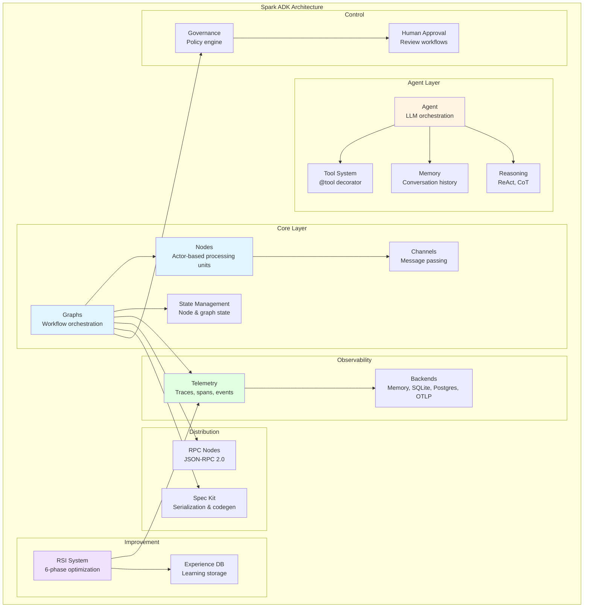

# Overview

## What is Spark ADK?

Spark is a Python AI Development Kit (ADK) for building agentic workflows using a **node-and-graph architecture**. It provides a comprehensive set of abstractions for creating autonomous AI agents that can be composed into complex workflows, with production-ready features for observability, reliability, and continuous improvement.

Spark is designed for developers who need to build sophisticated AI-powered systems that go beyond simple LLM calls - systems that require orchestration, state management, error handling, and the ability to autonomously improve over time.

## Key Features

### Node & Graph System
- **Actor-based architecture**: Each node is an independent processing unit with its own state and lifecycle
- **Declarative workflow composition**: Connect nodes with edges to create complex workflows
- **Two execution modes**: Standard sequential flow and long-running concurrent mode for agent systems
- **Flexible flow control**: Conditional branching, loops, and dynamic routing based on node outputs
- **State management**: Per-node state and global graph state with thread-safe operations

### Agent System
- **Production-ready LLM agents**: Multi-turn conversations, tool calling, and autonomous decision-making
- **Reasoning strategies**: Pluggable strategies including ReAct, Chain-of-Thought, and custom patterns
- **Memory management**: Configurable conversation history with intelligent truncation
- **Tool integration**: Decorator-based tool creation with automatic schema generation
- **Cost tracking**: Built-in token usage and API cost monitoring
- **Checkpointing**: Save and restore agent state for resilience

### Telemetry
- **Comprehensive observability**: Traces, spans, events, and metrics for all graph and node execution
- **Multiple backends**: In-memory (development), SQLite (local persistence), PostgreSQL (production), OTLP (observability platforms)
- **Query API**: Rich query interface for analyzing execution patterns and performance
- **Low overhead**: Configurable sampling and buffering for production use
- **Foundation for RSI**: Telemetry data drives autonomous improvement

### Recursive Self-Improvement (RSI)
- **Autonomous optimization**: Graphs analyze their own performance and deploy improvements
- **6-phase system**: Performance analysis, hypothesis generation, validation, A/B testing, deployment, pattern learning
- **Safety-first**: Multiple validation layers prevent unsafe changes
- **Immutable versions**: Improvements create new graph versions, never modify in-place
- **Multi-objective optimization**: Balance latency, cost, quality, and reliability
- **Human-in-the-loop**: Optional human review for high-risk changes

### Governance
- **Policy-based control**: Declarative rules for controlling agent and graph behavior
- **Multiple policy types**: Resource limits, security restrictions, compliance rules, approval workflows
- **Hierarchical policies**: Priority-based policy sets with inheritance
- **Audit trail**: Complete record of policy decisions and approvals

### RPC Nodes
- **Distributed workflows**: JSON-RPC 2.0 server and client nodes for remote execution
- **Multiple transports**: HTTP and WebSocket support with SSL/TLS
- **Bidirectional communication**: Request/response and server-initiated notifications
- **Seamless integration**: Remote nodes work like local nodes in graph workflows

### Spec Kit
- **Graph serialization**: Full-fidelity JSON specifications for all Spark features
- **Code generation**: Generate Python code from JSON specs with multiple styles
- **Validation**: Semantic and structural validation of graph specifications
- **Analysis tools**: Complexity metrics, cyclic detection, optimization suggestions
- **CLI tooling**: Command-line interface for spec operations

### Tool System
- **Decorator-based creation**: Simple `@tool` decorator transforms functions into LLM-callable tools
- **Automatic schema generation**: Extract metadata from function signatures and docstrings
- **Registry management**: Central tool registry with discovery and validation
- **Async support**: Both sync and async tool functions work seamlessly

## Use Cases and Applications

### Autonomous Agents
Build intelligent agents that can:
- Research and analyze information by calling search and analysis tools
- Write and execute code to solve problems
- Interact with external APIs and services
- Make multi-step decisions with reasoning strategies
- Learn from experience and improve over time

### Complex Workflows
Orchestrate sophisticated workflows that:
- Process data through multiple transformation stages
- Branch based on conditions and business rules
- Handle errors gracefully with retry policies
- Scale to long-running operations with concurrent execution
- Maintain state across distributed services

### Research and Development
- Experiment with different LLM models and prompting strategies
- A/B test workflow variations with statistical rigor
- Analyze performance bottlenecks with comprehensive telemetry
- Iterate rapidly with serialized specifications and code generation

### Production Systems
- Deploy reliable AI systems with governance and policy controls
- Monitor execution with distributed tracing
- Optimize costs with token tracking and budget enforcement
- Enable continuous improvement with autonomous RSI

## When to Use Spark

**Use Spark when you need:**
- Complex multi-step AI workflows with orchestration
- Autonomous agents that can reason and use tools
- Production-grade observability and reliability features
- Continuous optimization and self-improvement
- Distributed execution across services
- Governance and policy controls

**Consider alternatives when:**
- You need simple single-shot LLM calls (use SDK directly)
- Your workflow is purely linear with no branching (simpler frameworks may suffice)
- You don't need observability or autonomous improvement features

## High-Level Architecture

## Core Concepts at a Glance

### Nodes
Independent processing units that implement a `process()` method. Nodes can be synchronous or asynchronous, maintain their own state, and can be enhanced with capabilities like retry, timeout, and rate limiting.

### Graphs
Complete workflows composed of connected nodes. Graphs handle execution orchestration, state management, event emission, and telemetry collection.

### Execution Context
A context object passed to each node's `process()` method, containing inputs from the previous node, shared state, metadata, and outputs from the current node.

### Edges
Connections between nodes that define workflow flow. Edges can have conditional logic to enable branching and dynamic routing.

### Agents
Autonomous AI agents powered by LLMs that can reason, use tools, maintain conversation history, and make multi-turn decisions.

### Tools
Functions decorated with `@tool` that become callable by LLM agents. Tools define capabilities like web search, code execution, or API calls.

### Telemetry
Comprehensive observability system that automatically instruments graphs and nodes, collecting traces, spans, events, and metrics.

### RSI (Recursive Self-Improvement)
Autonomous system where graphs analyze their own performance, generate improvement hypotheses, test changes safely, and deploy successful modifications.

## Getting Started

Ready to dive in? Here's your path forward:

1. **[Installation](installation.md)**: Set up Spark and its dependencies
2. **[Quick Start](quickstart.md)**: Build your first node, graph, and agent
3. **[Core Concepts](concepts.md)**: Deep dive into Spark's architecture and abstractions
4. **[Tutorials](../tutorials/README.md)**: Step-by-step guides for common patterns
5. **[Examples](../../examples/)**: Complete working examples in the repository

## Project Status

Spark is under active development with all major features implemented:
- ✅ Node & Graph system (complete)
- ✅ Agent system with reasoning strategies (complete)
- ✅ Telemetry system with multiple backends (complete)
- ✅ RSI system with 6 phases (complete)
- ✅ Governance and policy engine (complete)
- ✅ RPC nodes and distributed workflows (complete)
- ✅ Spec Kit with CLI tooling (complete)

The project follows semantic versioning and maintains backward compatibility for public APIs.

## Community and Support

- **Repository**: [GitHub](https://github.com/yourusername/spark)
- **Issues**: Report bugs and request features via GitHub Issues
- **Examples**: 17+ working examples in the `examples/` directory
- **Tests**: 200+ tests with comprehensive coverage

## Next Steps

Continue to [Installation](installation.md) to set up Spark, or jump to [Quick Start](quickstart.md) to start building immediately.
