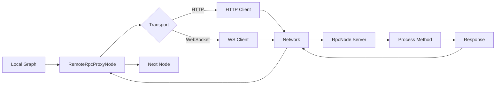

# RPC System Overview

The Spark RPC system enables distributed workflow architectures by exposing nodes as remote services via JSON-RPC 2.0. This allows graphs to span multiple processes, machines, or data centers while maintaining the simplicity of Spark's node-based programming model.

## What is JSON-RPC 2.0?

JSON-RPC is a lightweight remote procedure call protocol that uses JSON for data exchange. Version 2.0 is a stateless, transport-agnostic protocol that supports:

- **Request/Response**: Client sends request, server sends response
- **Notifications**: One-way messages with no response expected
- **Batch Requests**: Multiple requests in a single message
- **Error Handling**: Standardized error codes and messages

**Specification**: [https://www.jsonrpc.org/specification](https://www.jsonrpc.org/specification)

### Example JSON-RPC 2.0 Request/Response

```json
// Request
{
  "jsonrpc": "2.0",
  "method": "add",
  "params": {"a": 5, "b": 3},
  "id": 1
}

// Response
{
  "jsonrpc": "2.0",
  "result": {"sum": 8},
  "id": 1
}

// Error Response
{
  "jsonrpc": "2.0",
  "error": {
    "code": -32601,
    "message": "Method not found"
  },
  "id": 1
}
```

## Spark RPC Components

Spark provides two main components for distributed workflows:

### RpcNode - Server Side

**RpcNode** exposes a Spark node as a JSON-RPC 2.0 server that can be called remotely. It handles HTTP and WebSocket transports, request routing, and lifecycle management.

```python
from spark.nodes.rpc import RpcNode

class MyService(RpcNode):
    async def rpc_processData(self, params, context):
        """Handle 'processData' RPC method."""
        data = params.get('data')
        result = self.process(data)
        return {'result': result}

# Start server
node = MyService(host="0.0.0.0", port=8000)
await node.start_server()
```

### RemoteRpcProxyNode - Client Side

**RemoteRpcProxyNode** allows local graphs to call remote RPC services as if they were local nodes. It handles request formatting, transport, and response handling transparently.

```python
from spark.nodes.rpc_client import RemoteRpcProxyNode, RemoteRpcProxyConfig

# Configure proxy to remote service
config = RemoteRpcProxyConfig(
    endpoint="http://remote-server:8000",
    transport="http"
)
proxy = RemoteRpcProxyNode(config=config)

# Use in graph like any other node
local_node >> proxy >> next_node
```

## Use Cases

### 1. Microservices Architecture

Decompose monolithic graphs into independent services:

```
┌─────────────┐     ┌──────────────┐     ┌─────────────┐
│ API Service │────▶│ Data Service │────▶│ ML Service  │
│  (Python)   │     │  (Python)    │     │ (Python/C++)│
└─────────────┘     └──────────────┘     └─────────────┘
```

Each service is an RpcNode that can be deployed, scaled, and updated independently.

### 2. Distributed Agents

Coordinate multiple agents across different machines:

```python
# Agent 1: Research agent on Machine A
research_agent = AgentNode(tools=[web_search, arxiv_search])

# Agent 2: Analysis agent on Machine B (via RPC)
analysis_proxy = RemoteRpcProxyNode(
    config=RemoteRpcProxyConfig(endpoint="http://machine-b:8000")
)

# Agent 3: Writing agent on Machine C (via RPC)
writer_proxy = RemoteRpcProxyNode(
    config=RemoteRpcProxyConfig(endpoint="http://machine-c:8000")
)

# Workflow spans multiple machines
research_agent >> analysis_proxy >> writer_proxy
```

### 3. Multi-Datacenter Workflows

Execute workflows across geographically distributed data centers:

- Process data close to where it's stored
- Route sensitive operations to compliant regions
- Load balance across regions

### 4. Heterogeneous Systems

Integrate services written in different languages or frameworks:

- Python Spark graph calls Java service
- Node.js service calls Python ML model
- Go service calls Python agent

### 5. Service-Oriented Architecture (SOA)

Build reusable services that can be composed into different workflows:

```
┌─────────────┐
│ Auth Service│
└──────┬──────┘
       │
┌──────▼──────┐     ┌──────────────┐
│ API Gateway │────▶│ Data Service │
└──────┬──────┘     └──────────────┘
       │
┌──────▼──────┐     ┌──────────────┐
│ User Service│────▶│Cache Service │
└─────────────┘     └──────────────┘
```

## Architecture

### High-Level Architecture



### Transport Layer

Spark RPC supports two transport protocols:

#### HTTP Transport

- **Protocol**: HTTP/1.1 or HTTP/2
- **Method**: POST
- **Endpoint**: `http://host:port/`
- **Content-Type**: `application/json`
- **Use Case**: Request/response, stateless operations

**Advantages**:
- Simple, well-understood
- Works through firewalls and proxies
- Easy to debug with curl/Postman
- Load balancer friendly

**Limitations**:
- No server-initiated notifications
- Higher latency (connection overhead)
- No streaming

#### WebSocket Transport

- **Protocol**: WebSocket (ws:// or wss://)
- **Endpoint**: `ws://host:port/ws`
- **Use Case**: Bidirectional communication, server notifications

**Advantages**:
- Persistent connection (lower latency)
- Server can push notifications to client
- Full-duplex communication
- Efficient for high-frequency messaging

**Limitations**:
- More complex to debug
- Requires connection management
- May not work through all proxies

### Security Model

#### Transport Security

- **HTTP**: Use HTTPS with TLS 1.2+
- **WebSocket**: Use WSS (WebSocket Secure)
- **Certificates**: Support for custom SSL certificates and CA chains

```python
node = RpcNode(
    host="0.0.0.0",
    port=8443,
    ssl_certfile="/path/to/cert.pem",
    ssl_keyfile="/path/to/key.pem",
    ssl_ca_certs="/path/to/ca-bundle.crt"  # Optional
)
```

#### Application Security

- **Authentication**: Implement in `before_request` hook
- **Authorization**: Validate permissions per method
- **Rate Limiting**: Throttle requests per client
- **Input Validation**: Validate all RPC parameters
- **Audit Logging**: Log all requests and responses

See [RPC Security](./security.md) for detailed guidance.

## Performance Considerations

### Latency

- **HTTP**: ~10-50ms per request (connection setup + request/response)
- **WebSocket**: ~1-5ms per request (persistent connection)
- **Local node**: ~0.01-0.1ms per node execution

**Optimization Strategies**:
1. Use WebSocket for high-frequency calls
2. Batch multiple operations when possible
3. Cache responses on client side
4. Use connection pooling for HTTP
5. Deploy services close to each other (same datacenter)

### Throughput

- **HTTP**: Limited by connection pool size
- **WebSocket**: Limited by concurrent message handling
- **Bottleneck**: Usually network bandwidth or service processing time

**Scaling Strategies**:
1. Deploy multiple RpcNode instances (horizontal scaling)
2. Use load balancer for HTTP (nginx, HAProxy)
3. Implement request queuing and backpressure
4. Use async processing for long-running operations

### Reliability

- **Network Failures**: Implement retry with exponential backoff
- **Service Failures**: Use circuit breaker pattern
- **Timeout Handling**: Set appropriate request timeouts
- **Health Checks**: Use `/health` endpoint for monitoring

```python
# Client-side timeout
config = RemoteRpcProxyConfig(
    endpoint="http://service:8000",
    request_timeout=30.0  # 30 second timeout
)
```

## Error Handling

### Standard JSON-RPC Error Codes

| Code | Message | Meaning |
|------|---------|---------|
| -32700 | Parse error | Invalid JSON |
| -32600 | Invalid Request | Missing required fields |
| -32601 | Method not found | Method doesn't exist |
| -32602 | Invalid params | Invalid parameters |
| -32603 | Internal error | Server error |

### Custom Error Codes

Spark RPC adds application-specific errors:

| Code | Message | Meaning |
|------|---------|---------|
| -32000 | Server error | Generic server error |
| -32001 | Timeout error | Request timeout |
| -32002 | Rate limit error | Too many requests |

### Error Response Example

```json
{
  "jsonrpc": "2.0",
  "error": {
    "code": -32602,
    "message": "Invalid params: Missing required parameter 'id'",
    "data": {
      "parameter": "id",
      "expected_type": "string"
    }
  },
  "id": 1
}
```

## Health Checks and Monitoring

Every RpcNode provides a health check endpoint:

```bash
curl http://localhost:8000/health
```

Response:
```json
{
  "status": "ok",
  "node": "MyServiceNode",
  "websocket_clients": 3,
  "pending_requests": 5
}
```

**Monitoring Metrics**:
- Request rate (requests/second)
- Error rate (errors/requests)
- Latency (p50, p95, p99)
- Active connections
- Queue depth

Integrate with telemetry system for comprehensive monitoring:

```python
from spark.telemetry import TelemetryConfig

config = TelemetryConfig.create_sqlite("rpc_telemetry.db")
graph = Graph(start=proxy_node, telemetry_config=config)
```

## Best Practices

### Server-Side

1. **Keep methods focused**: Each RPC method should do one thing well
2. **Validate inputs**: Always validate parameters before processing
3. **Use async**: Implement methods as async for better concurrency
4. **Set timeouts**: Configure `request_timeout` appropriately
5. **Log everything**: Use hooks for comprehensive logging
6. **Handle errors gracefully**: Return meaningful error messages
7. **Version your API**: Include version in method names or headers

### Client-Side

1. **Handle network failures**: Implement retry logic with backoff
2. **Set timeouts**: Don't wait forever for responses
3. **Cache responses**: Cache when data doesn't change frequently
4. **Batch requests**: Group multiple operations when possible
5. **Use WebSocket for notifications**: Subscribe to real-time updates
6. **Monitor health**: Check `/health` endpoint regularly
7. **Load balance**: Distribute load across multiple service instances

## Next Steps

- [RPC Server (RpcNode)](./server.md) - Learn how to create RPC servers
- [Server Notifications](./notifications.md) - Implement server-to-client notifications
- [RPC Client (RemoteRpcProxyNode)](./client.md) - Call remote services from graphs
- [RPC Security](./security.md) - Secure your RPC services
- [RPC Examples & Patterns](./patterns.md) - Common patterns and best practices
