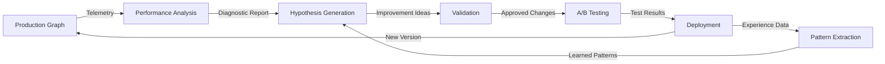

# RSI System Overview

## Introduction

The Recursive Self-Improvement (RSI) system is Spark's autonomous graph optimization framework that enables workflows to analyze their own performance, generate improvement hypotheses, test changes safely, and deploy successful modifications automatically.

RSI creates a feedback loop where graphs become progressively more capable over time by:
- Learning from telemetry data
- Generating evidence-based improvement hypotheses
- Testing changes with statistical rigor
- Deploying improvements safely with automatic rollback
- Extracting patterns from historical attempts

## Core Concept

RSI treats graph improvement as a meta-workflow problem. Rather than requiring manual optimization, RSI provides a complete autonomous system that continuously monitors production graphs, identifies opportunities for improvement, and safely applies validated changes.



## Architecture Principles

The RSI system is built on six foundational principles:

### 1. Immutable Versions
Graphs are never modified in-place. Every improvement creates a new immutable version with complete lineage tracking. This enables:
- Safe rollback to any previous version
- A/B testing between versions
- Complete audit trails
- Reproducible workflows

### 2. Safety First
Multiple validation layers prevent unsafe changes:
- Static analysis of proposed changes
- Semantic preservation checks
- Type compatibility verification
- Protected node enforcement
- Risk assessment and classification
- Human review gates for high-risk changes

### 3. Observable
Every decision and change is tracked and auditable:
- All hypotheses stored with rationale
- Test results with statistical analysis
- Deployment records with monitoring data
- Experience database for learning
- Complete provenance tracking

### 4. Reversible
Automatic rollback on performance regression:
- Continuous monitoring after deployment
- Configurable rollback triggers
- Automatic version switching
- No data loss on rollback
- Rollback history and analysis

### 5. Incremental
Start simple, expand gradually:
- Phase 1: Prompt optimizations (lowest risk)
- Phase 2: Configuration tuning
- Phase 3: Node replacement
- Phase 4: Edge optimization
- Phase 5: Structural transformations
- Phase 6: Multi-objective optimization

### 6. Separation of Concerns
RSI runs as a separate meta-graph, not embedded in production:
- Independent deployment and scaling
- No production overhead
- Can be stopped without affecting production
- Clear boundary between production and optimization
- Modular architecture

## Six-Phase Architecture

The RSI system is implemented in six progressive phases, each building on the previous:

### Phase 1: Foundation - Performance Analysis & Introspection

**Purpose**: Establish data-driven foundation for improvement decisions

**Components**:
- `PerformanceAnalyzerNode`: Analyzes telemetry to detect bottlenecks
- `GraphIntrospector`: Introspects graph structure and complexity
- `ExperienceDatabase`: Stores learning data from improvement attempts

**Key Capabilities**:
- Bottleneck detection (high latency, high error rate)
- Failure pattern identification
- Structural complexity analysis
- Diagnostic report generation

**See**: [Phase 1: Performance Analysis & Introspection](phase1-analysis.md)

### Phase 2: Intelligence - Hypothesis Generation & Validation

**Purpose**: Generate and validate improvement hypotheses using LLM reasoning

**Components**:
- `HypothesisGeneratorNode`: Uses LLMs to propose improvements
- `ChangeValidatorNode`: Validates hypotheses for safety

**Key Capabilities**:
- Evidence-based hypothesis generation
- Risk assessment and classification
- Safety validation (protected nodes, semantic preservation)
- Multiple hypothesis types (prompt, config, structural)

**See**: [Phase 2: Hypothesis Generation & Validation](phase2-hypothesis.md)

### Phase 3: Testing - Automated A/B Testing

**Purpose**: Rigorously test hypotheses with statistical confidence

**Components**:
- `HypothesisTesterNode`: Automated A/B testing framework

**Key Capabilities**:
- Baseline vs. candidate comparison
- Statistical significance testing
- Multiple metric comparison (latency, errors, cost, quality)
- Configurable test iterations and confidence levels

**See**: [Phase 3: Automated A/B Testing](phase3-testing.md)

### Phase 4: Deployment - Safe Rollout & Monitoring

**Purpose**: Deploy validated changes with continuous monitoring and automatic rollback

**Components**:
- `ChangeApplicator`: Applies changes to graph specifications
- `DeploymentControllerNode`: Orchestrates safe deployment

**Key Capabilities**:
- Multiple deployment strategies (direct, canary, blue-green, gradual)
- Continuous monitoring after deployment
- Automatic rollback on regression
- Deployment audit trail

**See**: [Phase 4: Safe Deployment](phase4-deployment.md)

### Phase 5: Learning - Pattern Extraction & Meta-Graph

**Purpose**: Learn from historical attempts and orchestrate complete RSI workflow

**Components**:
- `PatternExtractor`: Learns from improvement history
- `RSIMetaGraph`: Complete autonomous RSI workflow orchestration

**Key Capabilities**:
- Success pattern and anti-pattern extraction
- Correlation analysis between graph characteristics and improvements
- Recommendations for future hypotheses
- Continuous improvement loop

**See**: [Phase 5: Pattern Extraction](phase5-patterns.md)

### Phase 6: Advanced - Structural Optimization & Multi-Objective

**Purpose**: Advanced structural transformations and multi-objective optimization

**Components**:
- `NodeReplacementAnalyzer`: Identifies better node alternatives
- `EdgeOptimizer`: Optimizes graph topology
- `ParallelizationAnalyzer`: Converts sequential to parallel execution
- `HumanReviewNode`: Human-in-the-loop for high-risk changes
- `GraphDiffer`: Visualizes graph changes
- `MultiObjectiveOptimizer`: Balances competing objectives

**Key Capabilities**:
- Node replacement with compatibility analysis
- Edge optimization (shortcuts, redundancy removal)
- Parallelization opportunities
- Human review workflows
- Multi-objective trade-off analysis (latency, cost, quality, reliability)

**See**: [Phase 6: Advanced Optimization](phase6-advanced.md)

## Use Cases

### 1. Automatic Prompt Optimization
RSI can automatically improve agent prompts based on quality metrics:
- Detects low accuracy or quality issues
- Generates improved prompt variations
- A/B tests prompts against baseline
- Deploys winning prompts

**Example**: Agent answering quality improves from 75% to 90% accuracy through iterative prompt refinement.

### 2. Latency Reduction
RSI identifies and optimizes slow nodes:
- Analyzes telemetry to find high-latency nodes
- Proposes caching, parallelization, or node replacement
- Tests latency improvements
- Deploys optimizations

**Example**: Workflow latency reduced from 5s to 2s through targeted optimization.

### 3. Cost Reduction
RSI optimizes LLM usage costs:
- Identifies expensive model calls
- Proposes cheaper model alternatives or caching
- Tests cost vs. quality trade-offs
- Deploys cost-effective solutions

**Example**: Monthly LLM costs reduced by 40% while maintaining quality.

### 4. Reliability Improvement
RSI addresses failure patterns:
- Detects high error rates
- Proposes retry policies or error handling
- Tests reliability improvements
- Deploys more robust configurations

**Example**: Success rate improved from 85% to 99% through better error handling.

### 5. Topology Optimization
RSI improves graph structure:
- Identifies sequential bottlenecks
- Proposes parallel execution
- Removes redundant paths
- Adds shortcuts for common patterns

**Example**: Workflow throughput increased 3x through parallelization.

### 6. Continuous Adaptation
RSI adapts workflows to changing conditions:
- Monitors performance over time
- Detects degradation
- Generates adaptive improvements
- Maintains optimal performance

**Example**: Workflow automatically adapts to increased load and API rate limits.

## Prerequisites

### Telemetry Required
RSI requires telemetry to be enabled on the target graph:

```python
from spark.telemetry import TelemetryConfig
from spark.graphs import Graph

# Enable telemetry on production graph
telemetry_config = TelemetryConfig.create_sqlite(
    db_path="telemetry.db",
    sampling_rate=1.0,  # Sample 100% of traces
    enable_metrics=True,
    enable_events=True
)

production_graph = Graph(
    start=my_node,
    telemetry_config=telemetry_config
)
```

### Minimum Data Requirements
- At least 10-100 executions for meaningful analysis
- 24+ hours of historical data recommended
- Sufficient variety to capture different execution paths

### Model for Hypothesis Generation
An LLM model is required for Phase 2 (hypothesis generation):

```python
from spark.models.openai import OpenAIModel

model = OpenAIModel(model_id="gpt-4o")
```

## When to Use RSI

### Good Use Cases
- Production workflows with consistent execution patterns
- Graphs with measurable quality/performance metrics
- Workflows requiring ongoing optimization
- Systems with changing workload patterns
- Teams wanting to reduce manual tuning effort

### Not Recommended For
- Graphs with < 10 executions (insufficient data)
- Critical systems requiring manual approval for all changes
- Workflows without telemetry
- One-time execution graphs
- Graphs with highly variable execution patterns

## Getting Started

### Quick Start Example

```python
from spark.rsi import RSIMetaGraph, RSIMetaGraphConfig, ExperienceDatabase
from spark.models.openai import OpenAIModel
from spark.graphs import Graph

# Step 1: Enable telemetry on your production graph
telemetry_config = TelemetryConfig.create_sqlite("telemetry.db")
production_graph = Graph(start=my_node, telemetry_config=telemetry_config)

# Run production graph to collect telemetry
for i in range(100):
    await production_graph.run()

# Step 2: Create experience database
experience_db = ExperienceDatabase()
await experience_db.initialize()

# Step 3: Configure RSI meta-graph
model = OpenAIModel(model_id="gpt-4o")
rsi_config = RSIMetaGraphConfig(
    graph_id="production_workflow",
    graph_version="1.0.0",
    analysis_window_hours=24,
    max_hypotheses=3,
    enable_pattern_learning=True,
    deployment_strategy="direct",
    auto_deploy=True
)

# Step 4: Create and run RSI meta-graph
rsi_graph = RSIMetaGraph(
    config=rsi_config,
    experience_db=experience_db,
    model=model
)

# Run single improvement cycle
result = await rsi_graph.run(target_graph=production_graph)

# Or run continuous improvement
results = await rsi_graph.run_continuous(
    interval_seconds=3600,  # Run every hour
    max_iterations=None  # Run forever
)
```

### Next Steps

1. **Phase 1**: Learn about [Performance Analysis & Introspection](phase1-analysis.md)
2. **Phase 2**: Understand [Hypothesis Generation & Validation](phase2-hypothesis.md)
3. **Phase 3**: Explore [Automated A/B Testing](phase3-testing.md)
4. **Phase 4**: Set up [Safe Deployment](phase4-deployment.md)
5. **Phase 5**: Enable [Pattern Extraction](phase5-patterns.md)
6. **Phase 6**: Use [Advanced Optimization](phase6-advanced.md)
7. **Meta-Graph**: Configure the [RSI Meta-Graph](meta-graph.md)
8. **CLI**: Use [RSI CLI & Tools](cli.md)

## Key Features Summary

| Feature | Description | Phase |
|---------|-------------|-------|
| Bottleneck Detection | Identifies slow nodes and high error rates | Phase 1 |
| Structural Analysis | Analyzes graph complexity and structure | Phase 1 |
| Experience Learning | Stores and learns from improvement attempts | Phase 1 |
| LLM-Powered Hypotheses | Generates evidence-based improvements | Phase 2 |
| Safety Validation | Prevents unsafe changes | Phase 2 |
| Statistical A/B Testing | Rigorous hypothesis testing | Phase 3 |
| Safe Deployment | Multiple deployment strategies with rollback | Phase 4 |
| Pattern Extraction | Learns successful patterns | Phase 5 |
| Complete Orchestration | End-to-end autonomous workflow | Phase 5 |
| Node Replacement | Finds better node alternatives | Phase 6 |
| Edge Optimization | Optimizes graph topology | Phase 6 |
| Parallelization | Converts sequential to parallel | Phase 6 |
| Human Review | Human-in-the-loop gates | Phase 6 |
| Multi-Objective Optimization | Balances competing objectives | Phase 6 |

## Related Documentation

- **Architecture**: [RSI Architecture](../architecture/rsi-architecture.md)
- **Telemetry**: [Telemetry System](../telemetry/overview.md)
- **Integration**: [Telemetry and RSI](../integration/telemetry-rsi.md)
- **API Reference**: [RSI Classes](../api/rsi.md)
- **Configuration**: [RSI Configuration](../config/rsi-config.md)
