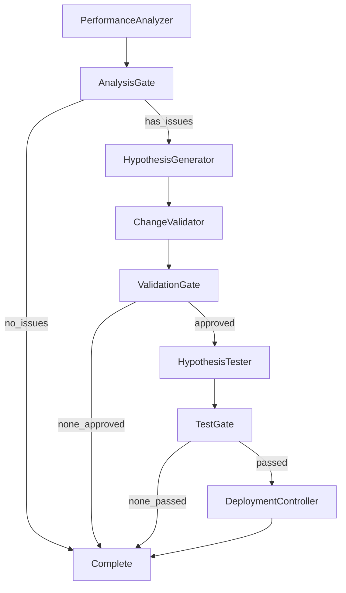

# Phase 5: Pattern Extraction & Meta-Graph

## Overview

Phase 5 enables learning from historical improvement attempts and provides complete autonomous RSI workflow orchestration through the RSI Meta-Graph.

**Key Components**:
- `PatternExtractor`: Learns from historical improvement attempts
- `RSIMetaGraph`: Complete autonomous RSI workflow orchestration

## PatternExtractor

Extracts success patterns and anti-patterns from the experience database.

### Purpose

- Learn from historical improvement attempts
- Identify success patterns and anti-patterns
- Analyze correlations between graph characteristics and improvements
- Provide recommendations for future hypotheses

### Usage

```python
from spark.rsi import PatternExtractor, ExperienceDatabase

# Create experience database
experience_db = ExperienceDatabase()
await experience_db.initialize()

# Create pattern extractor
pattern_extractor = PatternExtractor(experience_db)

# Extract patterns
patterns = await pattern_extractor.extract_patterns(
    graph_id="production_workflow",
    min_occurrences=3,
    min_success_rate=0.6
)

for pattern in patterns:
    print(f"\nPattern: {pattern.name}")
    print(f"  Type: {pattern.pattern_type}")
    print(f"  Success Rate: {pattern.success_rate:.1%}")
    print(f"  Avg Improvement: {pattern.avg_improvement:.2f}")
    print(f"  Occurrences: {pattern.occurrences}")
    print(f"  Confidence: {pattern.confidence:.2f}")
    print(f"  Recommendation: {pattern.recommendation}")
```

### ExtractedPattern Structure

```python
@dataclass
class ExtractedPattern:
    name: str
    pattern_type: str  # 'success', 'anti-pattern', 'correlation'
    description: str
    success_rate: float
    avg_improvement: float
    occurrences: int
    confidence: float
    characteristics: Dict[str, Any]
    recommendation: str
    examples: List[str]
```

### Pattern Types

**Success Patterns**: Consistently successful approaches
- Prompt clarity improvements
- Parameter tuning strategies
- Successful node replacements
- Effective edge optimizations

**Anti-Patterns**: Consistently unsuccessful approaches
- Changes that frequently fail
- Approaches that cause regressions
- Risky modifications

**Correlations**: Relationships between characteristics and outcomes
- Graph complexity vs. improvement type
- Node type vs. successful optimizations
- Hypothesis type vs. success rate

### Pattern Influence on Hypothesis Generation

Patterns feed back into the `HypothesisGeneratorNode`:

```python
from spark.rsi import HypothesisGeneratorNode, PatternExtractor

pattern_extractor = PatternExtractor(experience_db)

generator = HypothesisGeneratorNode(
    model=model,
    pattern_extractor=pattern_extractor,
    enable_pattern_learning=True
)

# Generator uses patterns to inform hypothesis creation
result = await generator.run({
    'diagnostic_report': report,
    'graph': graph
})

# See which patterns influenced generation
for pattern in result['patterns_used']:
    print(f"Used pattern: {pattern.name}")
```

## RSI Meta-Graph

Complete autonomous RSI workflow orchestration.

### Purpose

The `RSIMetaGraph` orchestrates the entire RSI loop:
1. Analyze performance
2. Generate hypotheses
3. Validate changes
4. Test hypotheses
5. Deploy successful changes
6. Learn from outcomes

### Configuration

```python
from spark.rsi import RSIMetaGraph, RSIMetaGraphConfig, ExperienceDatabase
from spark.models.openai import OpenAIModel

# Create experience database
experience_db = ExperienceDatabase()
await experience_db.initialize()

# Create model for hypothesis generation
model = OpenAIModel(model_id="gpt-5-mini")

# Configure RSI meta-graph
config = RSIMetaGraphConfig(
    graph_id="production_workflow",
    graph_version="1.0.0",
    analysis_window_hours=24,
    max_hypotheses=3,
    hypothesis_types=["prompt_optimization", "parameter_tuning"],
    enable_pattern_learning=True,
    deployment_strategy="direct",
    auto_deploy=True,
    enable_mock_mode=False
)

# Create RSI meta-graph
rsi_graph = RSIMetaGraph(
    config=config,
    experience_db=experience_db,
    model=model
)
```

### RSIMetaGraphConfig

```python
@dataclass
class RSIMetaGraphConfig:
    graph_id: str
    graph_version: str = "1.0.0"
    analysis_window_hours: int = 24
    max_hypotheses: int = 3
    hypothesis_types: List[str] = ["prompt_optimization"]
    enable_pattern_learning: bool = True
    deployment_strategy: str = "direct"
    auto_deploy: bool = True
    enable_mock_mode: bool = False
```

### Usage Modes

#### Single Cycle

Run RSI loop once:

```python
result = await rsi_graph.run(target_graph=production_graph)

if result['success']:
    print(f"RSI cycle completed for {result['graph_id']}")
    if 'deployments' in result:
        print(f"Deployed {result['hypotheses_deployed']} improvements")
```

#### Continuous Mode

Run RSI loop continuously:

```python
results = await rsi_graph.run_continuous(
    target_graph=production_graph,
    interval_seconds=3600,     # Run every hour
    max_iterations=None        # Run forever (or set limit)
)

# Review results from all iterations
for i, result in enumerate(results):
    print(f"Iteration {i+1}: {result['hypotheses_deployed']} deployed")
```

### RSI Meta-Graph Architecture

The meta-graph connects all RSI components with gate nodes:



### Gate Nodes

**AnalysisGate**: Checks if issues were found
- Continues if bottlenecks or failures detected
- Stops if no issues found

**ValidationGate**: Filters approved hypotheses
- Continues with approved hypotheses
- Stops if none approved

**TestGate**: Filters passed tests
- Continues with passed hypotheses
- Stops if none passed

### Complete RSI Example

```python
from spark.rsi import RSIMetaGraph, RSIMetaGraphConfig, ExperienceDatabase
from spark.models.openai import OpenAIModel
from spark.telemetry import TelemetryConfig
from spark.graphs import Graph

# Step 1: Enable telemetry on production graph
telemetry_config = TelemetryConfig.create_sqlite(
    db_path="telemetry.db",
    sampling_rate=1.0
)

production_graph = Graph(
    start=my_node,
    telemetry_config=telemetry_config
)

# Run production graph to collect telemetry
print("Collecting telemetry...")
for i in range(100):
    await production_graph.run()
print("Telemetry collection complete")

# Step 2: Initialize experience database
experience_db = ExperienceDatabase()
await experience_db.initialize()

# Step 3: Configure RSI meta-graph
model = OpenAIModel(model_id="gpt-5-mini")

rsi_config = RSIMetaGraphConfig(
    graph_id="production_workflow",
    graph_version="1.0.0",
    analysis_window_hours=24,
    max_hypotheses=5,
    hypothesis_types=["prompt_optimization", "parameter_tuning"],
    enable_pattern_learning=True,
    deployment_strategy="direct",
    auto_deploy=True
)

# Step 4: Create RSI meta-graph
rsi_graph = RSIMetaGraph(
    config=rsi_config,
    experience_db=experience_db,
    model=model
)

# Step 5: Run RSI loop (single cycle)
print("\nRunning RSI improvement cycle...")
result = await rsi_graph.run(target_graph=production_graph)

if result['success']:
    print("\n✓ RSI cycle completed successfully")
    print(f"  Graph: {result['graph_id']}")
    print(f"  Version: {result['graph_version']}")

    if 'deployments' in result:
        print(f"\nDeployments: {result['hypotheses_deployed']}")
        for deployment in result['deployments']:
            print(f"  - {deployment['hypothesis_id']}")
            print(f"    Type: {deployment.get('hypothesis_type', 'unknown')}")
            print(f"    Status: {deployment.get('status', 'unknown')}")
else:
    print("\n✗ RSI cycle failed")
    print(f"  Error: {result.get('error')}")

# Step 6: Run continuous improvement (optional)
print("\nStarting continuous RSI...")
results = await rsi_graph.run_continuous(
    target_graph=production_graph,
    interval_seconds=3600,
    max_iterations=10  # Run 10 iterations
)

total_deployments = sum(
    r.get('hypotheses_deployed', 0) for r in results
)
print(f"\n✓ Continuous RSI completed")
print(f"  Total iterations: {len(results)}")
print(f"  Total deployments: {total_deployments}")
```

## Best Practices

### Pattern Extraction

1. **Sufficient Data**: Need at least 10-20 attempts per pattern
2. **Clean Data**: Ensure experience database is accurate
3. **Regular Extraction**: Run pattern extraction periodically
4. **Review Patterns**: Manually review extracted patterns
5. **Update Patterns**: Retrain as system evolves

### Meta-Graph Configuration

1. **Start Simple**: Begin with prompt_optimization only
2. **Expand Gradually**: Add hypothesis types as confidence grows
3. **Conservative Deployment**: Use direct strategy initially
4. **Human Review**: Set `auto_deploy=False` for HIGH risk
5. **Monitor Continuously**: Review RSI outcomes regularly

### Continuous Improvement

1. **Appropriate Intervals**: 1-24 hours between cycles
2. **Stop Conditions**: Set max_iterations or time limits
3. **Alert on Failures**: Monitor RSI meta-graph health
4. **Resource Limits**: Ensure adequate compute resources
5. **Cost Management**: Monitor LLM API costs

## Troubleshooting

### No Patterns Extracted

- Verify experience database has data
- Check min_occurrences threshold
- Lower min_success_rate
- Run more improvement cycles first

### Meta-Graph Stops Early

- Review gate node logic
- Check if analysis found issues
- Verify hypotheses are being approved
- Ensure tests are passing

### Continuous Mode Issues

- Check interval_seconds is appropriate
- Monitor resource usage
- Review max_iterations setting
- Verify target_graph is accessible

## Next Steps

**Phase 6**: [Advanced Optimization](phase6-advanced.md) - Structural optimization and multi-objective balancing

## Related Documentation

- [Phase 4: Safe Deployment](phase4-deployment.md)
- [Phase 6: Advanced Optimization](phase6-advanced.md)
- [RSI Meta-Graph](meta-graph.md)
- [RSI Overview](overview.md)
- [API Reference: RSI](../api/rsi.md)
