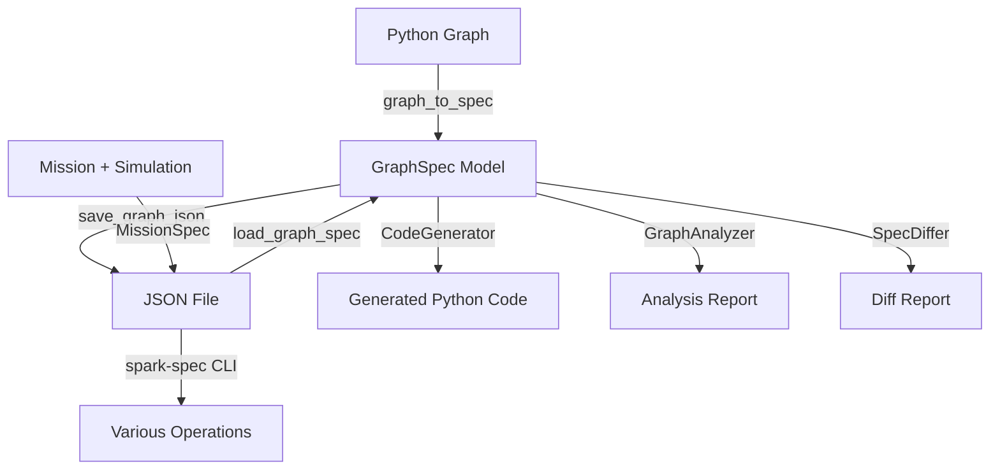

# Specification System

The Spark Spec Kit provides a comprehensive specification and code generation system for serializing, validating, and manipulating graph workflows. At its core, the Spec Kit enables graphs to be represented as structured JSON documents that can be version controlled, shared across environments, and programmatically generated or modified.

## Overview

The Spec Kit transforms Spark's runtime Python objects (graphs, nodes, agents, tools) into declarative specifications using Pydantic models. These specifications can be:

- **Serialized** to JSON for storage and transmission
- **Validated** against schemas to ensure correctness
- **Analyzed** for complexity and optimization opportunities
- **Compiled** back into executable Python code
- **Diffed** to compare versions and track changes
- **Optimized** through automated suggestions

This enables powerful workflows including:

- **Version Control**: Store graph definitions as JSON in git
- **Portability**: Move workflows between environments without code changes
- **Code Generation**: Generate Python implementations from specifications
- **CI/CD Integration**: Validate graph structures in deployment pipelines
- **Documentation**: Auto-generate documentation from specifications
- **Specification-Driven Development**: Design workflows declaratively

## Architecture

The Spec Kit consists of several interconnected components:



### Core Components

**Specification Models** (`spark/nodes/spec.py`):
- Pydantic models providing full-fidelity representation of Spark objects
- Complete type safety and validation
- Support for all Spark features: agents, tools, capabilities, state, telemetry

**Serialization** (`spark/nodes/serde.py`):
- Bidirectional conversion between Python objects and specifications
- JSON serialization with version tracking
- Validation during deserialization

**CLI Tool** (`spark/kit/spec_cli.py`):
- Command-line interface for all spec operations
- Graph, mission, simulation, schema, plan, approval, and policy commands
- Extensible command framework

**Code Generator** (`spark/kit/codegen.py`):
- Reverse-compiles specifications to Python code
- Multiple generation styles (simple, production, documented)
- Import optimization and project structure support

**Graph Analyzer** (`spark/kit/analysis.py`):
- Complexity metrics and topology analysis
- Cycle detection and bottleneck identification
- Optimization recommendations

**Differ** (`spark/kit/diff.py`):
- Compare specifications and highlight changes
- Multiple output formats (text, unified, JSON, HTML)
- Semantic diff understanding

## Specification Lifecycle

A typical workflow with specifications:

```python
from spark.nodes.serde import graph_to_spec, save_graph_json, load_graph_spec
from spark.graphs import Graph

# 1. Create graph in Python
graph = Graph(start=my_node)
# ... connect nodes, configure ...

# 2. Export to specification
spec = graph_to_spec(graph, spark_version="2.0")

# 3. Save to JSON file
save_graph_json("workflow.json", graph, indent=2)

# 4. Later: Load from JSON
loaded_spec = load_graph_spec("workflow.json")

# 5. Validate, analyze, compile as needed
# spark-spec validate workflow.json
# spark-spec analyze workflow.json
# spark-spec compile workflow.json -o ./generated
```

## Use Cases

### Version Control for Workflows

Store graph definitions as JSON in your repository:

```bash
# Export graph to JSON
spark-spec export myapp.workflows:production_graph -o graphs/production.json

# Commit to git
git add graphs/production.json
git commit -m "Add production workflow specification"

# Review changes in PRs
spark-spec diff graphs/production.json graphs/production-v2.json
```

### Portability Across Environments

Move workflows between development, staging, and production without code changes:

```bash
# Export from development
spark-spec export dev.workflows:test_graph -o test_graph.json

# Load in production (different environment, dependencies, etc.)
spark-spec compile test_graph.json -o prod/workflows --style production
```

### Code Generation from Specifications

Generate Python implementations from declarative specifications:

```bash
# Create spec from description
spark-spec generate "Multi-step approval workflow with 3 agents" -o approval.json

# Generate production-ready code
spark-spec compile approval.json -o ./generated --style production --tests

# Output includes:
# - generated/nodes.py (node implementations)
# - generated/graph.py (graph assembly)
# - generated/tests/ (test suite)
```

### CI/CD Validation

Validate graph structures before deployment:

```bash
# In CI pipeline
spark-spec validate workflow.json --semantic --strict
spark-spec test workflow.json --round-trip
spark-spec analyze workflow.json --fail-on complexity>10
```

### Documentation Generation

Extract documentation from specifications:

```bash
# Analyze and generate report
spark-spec analyze workflow.json --report docs/workflow-analysis.html

# Introspect Python graph
spark-spec introspect myapp.workflows:graph --format markdown > docs/graph.md
```

### Optimization and Refactoring

Automatically identify and apply optimizations:

```bash
# Get optimization suggestions
spark-spec optimize workflow.json

# Apply suggested optimizations
spark-spec optimize workflow.json --auto-fix -o workflow-optimized.json

# Compare results
spark-spec diff workflow.json workflow-optimized.json
```

## Graph Specifications vs. Mission Specifications

The Spec Kit supports two levels of specification:

**GraphSpec**: Core workflow structure
- Nodes, edges, state, event bus
- Focus on execution logic
- Suitable for library-style graphs

**MissionSpec**: Complete deployable package
- Includes GraphSpec + metadata + configuration
- Mission plans, strategies, state schemas
- Deployment readiness checks
- Simulation configurations
- Suitable for production deployments

See [Mission System](./missions.md) for details on MissionSpec.

## Key Benefits

**Type Safety**: All specifications are validated against Pydantic schemas, catching errors early.

**Version Compatibility**: Specifications include version metadata, enabling migration between Spark versions.

**Full Fidelity**: All Spark features are representable in specifications - nothing is lost in translation.

**Tooling Ecosystem**: Rich CLI provides operations for common workflows without writing code.

**Extensibility**: Specification models can be extended for custom node types and features.

**Human Readable**: JSON format is easy to read, edit, and diff in version control.

## Integration with Spark Systems

The Spec Kit integrates deeply with other Spark systems:

**Telemetry**: Specifications capture telemetry configuration for observability.

**RSI**: Recursive Self-Improvement uses specifications to represent and apply graph modifications.

**Governance**: Policy rules can reference and validate specifications.

**RPC**: Remote nodes can be described in specifications for distributed workflows.

**Missions**: High-level orchestration packages include graph specs, plans, and deployment metadata.

**Simulation**: Tool overrides and mock configurations enable testing without external dependencies.

## Performance Considerations

**Serialization**: Graph serialization is fast, typically sub-second for graphs with hundreds of nodes.

**Validation**: Pydantic validation adds minimal overhead during deserialization.

**Code Generation**: Generation time scales linearly with graph size; large graphs (>1000 nodes) may take seconds.

**Storage**: JSON specifications are compact; typical graphs are 1-100KB.

## Best Practices

**Version Specifications**: Always include `spark_version` in specifications for compatibility tracking.

**Validate Early**: Use `spark-spec validate` in CI to catch issues before deployment.

**Semantic Validation**: Enable `--semantic` flag for deeper validation beyond schema checks.

**Use Missions for Production**: Wrap graphs in MissionSpec for complete deployment packages.

**Test Round-Trips**: Use `spark-spec test --round-trip` to verify serialization fidelity.

**Organize by Environment**: Keep separate spec files for dev/staging/prod with appropriate configurations.

## Next Steps

- **[Specification Models](./models.md)**: Complete reference of all specification models
- **[Serialization & Deserialization](./serde.md)**: Guide to converting between Python and JSON
- **[Spec CLI Tool](./cli.md)**: Complete command reference
- **[Code Generation](./codegen.md)**: Generating Python code from specifications
- **[Graph Analysis](./analysis.md)**: Analyzing and optimizing graph structures
- **[Mission System](./missions.md)**: High-level orchestration and deployment
- **[Simulation System](./simulation.md)**: Testing workflows without external dependencies

## Related Documentation

- [Architecture: System Architecture](../architecture/system-architecture.md)
- [Integration: Specification-Driven Development](../integration/spec-driven-dev.md)
- [Best Practices: Production Deployment](../best-practices/production.md)
